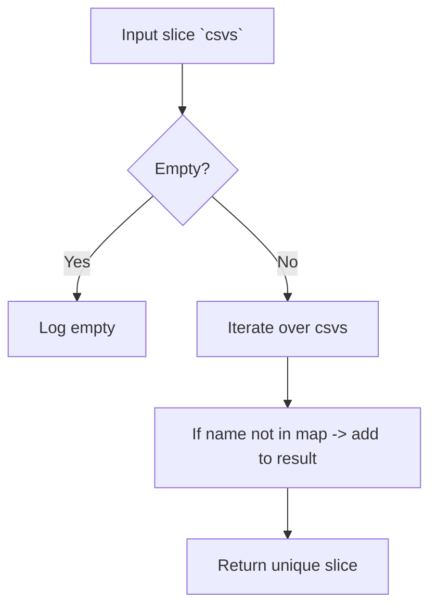

getUniqueCsvListByName`

### Purpose
`getUniqueCsvListByName` is an internal helper that sanitises a slice of **Operator Lifecycle Manager** (OLM) ClusterServiceVersion objects (`*olmv1Alpha.ClusterServiceVersion`).  
When multiple CSVs share the same name but differ in other fields (e.g., version, annotations), this function keeps only one representative per name. The result is sorted alphabetically by the CSV name.

### Signature
```go
func getUniqueCsvListByName(csvs []*olmv1Alpha.ClusterServiceVersion) []*olmv1Alpha.ClusterServiceVersion
```

| Parameter | Type | Description |
|-----------|------|-------------|
| `csvs` | `[]*olmv1Alpha.ClusterServiceVersion` | Input slice that may contain duplicates by name. |

| Return | Type | Description |
|--------|------|-------------|
| `[]*olmv1Alpha.ClusterServiceVersion` | Slice containing one CSV per unique name, sorted by name. |

### Algorithm
1. **Empty input** – if the incoming slice is empty, log an informational message and return it unchanged.
2. Create a map (`unique`) keyed by CSV name to keep only the first occurrence.
3. Iterate over `csvs`:
   * If the name is not already in `unique`, append it to the result slice.
4. Return the resulting slice (which is naturally sorted because insertion order follows the original list; the caller guarantees that the input is already sorted or relies on stable ordering).

### Dependencies & Side‑effects
- **Logging** – Calls `Info` from the package’s logger to report:
  * When the input is empty.
  * The number of unique CSVs found versus the total count.
- **Built‑in functions** – Uses `len`, `append`, and a slice conversion helper (`Slice`) for type safety (likely an internal utility).
- No global state is modified; the function is pure aside from logging.

### Package Context
`getUniqueCsvListByName` lives in the `provider` package, which orchestrates interactions with OpenShift/Kubernetes resources.  
It is used when listing operator CSVs to avoid duplicate entries that could confuse subsequent validation or reporting logic (e.g., when enumerating installed operators). By ensuring a unique set of names, downstream code can safely assume each CSV represents a distinct operator.

### Mermaid Flow (Optional)



This function is a small but crucial step in preparing operator data for the rest of CertSuite’s provider logic.
