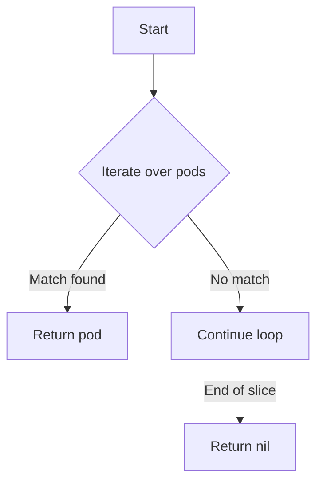

searchPodInSlice`

| | |
|-|-|
| **Package** | `provider` (`github.com/redhat-best-practices-for-k8s/certsuite/pkg/provider`) |
| **Visibility** | Unexported – used only inside the provider package |
| **Signature** | `func searchPodInSlice(name, namespace string, pods []*Pod) *Pod` |

#### Purpose
`searchPodInSlice` is a small helper that locates a specific pod in an in‑memory slice of `*Pod`.  
It is used by higher‑level functions that receive lists of pods (e.g., from the Kubernetes API or from cached state) and need to quickly determine whether a pod with a given name and namespace exists.

#### Parameters
| Name | Type | Description |
|------|------|-------------|
| `name` | `string` | The pod’s metadata `Name`. |
| `namespace` | `string` | The pod’s metadata `Namespace`. |
| `pods` | `[]*Pod` | Slice of pod pointers that will be searched. |

#### Return Value
- `*Pod`: the first pod in `pods` whose `Metadata.Name == name` **and** `Metadata.Namespace == namespace`.  
  If no match is found, returns `nil`.

#### Implementation sketch (not shown in source)
```go
func searchPodInSlice(name, namespace string, pods []*Pod) *Pod {
    for _, p := range pods {
        if p.Metadata.Name == name && p.Metadata.Namespace == namespace {
            return p
        }
    }
    return nil
}
```
The function performs a linear scan; no additional data structures are required.

#### Side effects & dependencies
- **No side effects** – the slice is read only, and the returned pod is not modified.
- Relies on the `Pod` type defined in the same package (likely a wrapper around Kubernetes corev1.Pod).
- No global variables or external packages are accessed.

#### Role within the package
`searchPodInSlice` is a utility used by operator‑related logic (`operators.go`) to correlate runtime pod information with static definitions, e.g., when validating that required pods are running on worker nodes.  
Because it operates purely on in‑memory data, it keeps the rest of the provider logic decoupled from the Kubernetes client and allows easier unit testing.

---

#### Suggested Mermaid diagram (search flow)



This visualizes the linear search pattern employed by `searchPodInSlice`.
