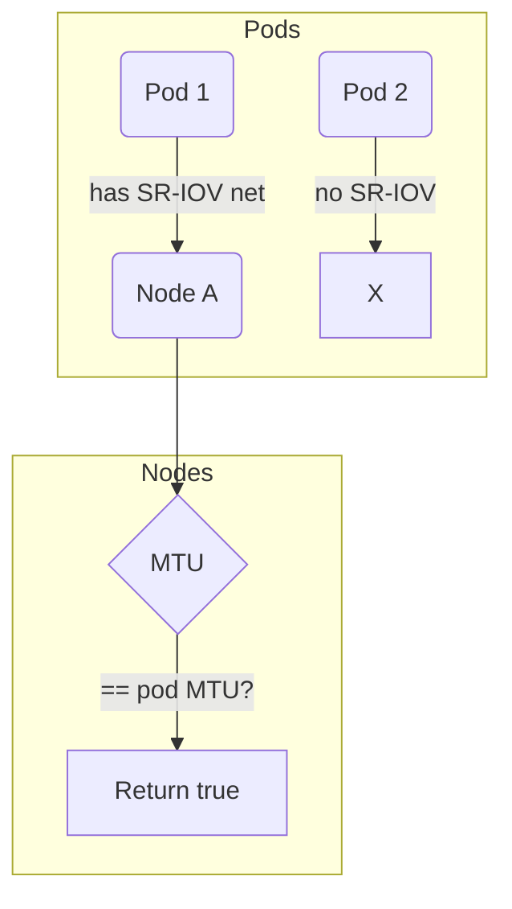

sriovNetworkUsesMTU`

### Purpose
` s riovNetworkUsesMTU` determines whether a given SR‑I/O Virtualization (SR‑IOV) network interface is configured to use the MTU (Maximum Transmission Unit) of the pod that owns it.

The function is used during pod health checks where the provider must verify that pods using SR‑IOV NICs honour the MTU advertised by the node. If a pod does not match the expected MTU, the test fails and an error is logged.

### Signature
```go
func sriovNetworkUsesMTU(pods []unstructured.Unstructured,
                         nodes []unstructured.Unstructured,
                         networkName string) bool
```

| Parameter | Type                                   | Description |
|-----------|----------------------------------------|-------------|
| `pods`    | `[]unstructured.Unstructured`         | All pod objects in the cluster (retrieved via client-go). |
| `nodes`   | `[]unstructured.Unstructured`         | All node objects in the cluster. |
| `networkName` | `string`                         | The name of the SR‑IOV network that should be checked. |

### Return Value
- **`true`** – at least one pod using the specified SR‑IOV network is running on a node whose MTU matches the pod’s network interface MTU.
- **`false`** – no such matching configuration was found.

### Core Algorithm

1. **Iterate over pods**  
   For each pod:
   * Log its name (`Debug`).
   * Retrieve the pod’s namespace and name via `GetNamespace`, `GetName`.

2. **Inspect pod containers**  
   The function looks at each container’s `resources.limits.sriovNetDevice.<networkName>` field to detect SR‑IOV usage.
   * Uses `NestedMap` / `NestedString` helpers from the Kubernetes API machinery.

3. **Find the node hosting the pod**  
   By matching the pod’s `spec.nodeName` with a node in the `nodes` slice:
   * Retrieve the node’s MTU annotation (via `NestedInt64` on `metadata.annotations["kubernetes.io/mtu"]`).

4. **Compare MTUs**  
   If the node’s MTU equals the pod’s SR‑IOV interface MTU (`spec.containers[*].resources.limits.sriovNetDevice.<networkName>`), return `true`.

5. **Return false** if no match is found after exhausting all pods.

### Dependencies

| Called Function | Purpose |
|-----------------|---------|
| `GetName`       | Retrieves an object's name from its metadata. |
| `GetNamespace`  | Retrieves the namespace of a pod or node. |
| `NestedMap`, `NestedString`, `NestedInt64` | Safely navigate nested maps in unstructured objects (e.g., accessing annotations, limits). |
| `Debug`         | Logs diagnostic information at debug level. |

These helpers come from the Kubernetes client‑go library (`k8s.io/apimachinery/pkg/apis/meta/v1/unstructured`). The function itself is pure – it only reads data and logs; no global state or side effects are modified.

### Placement in Package

The `provider` package implements the CertSuite provider logic for interacting with a Kubernetes cluster.  
` sriovNetworkUsesMTU` lives in `pods.go`, alongside other pod‑related utilities (e.g., checking huge pages, Istio sidecar presence). It is an internal helper used by higher‑level checks that validate SR‑IOV network configuration and connectivity.

### Mermaid Flow



The function returns `true` as soon as a matching pod–node pair is found; otherwise it completes the search and returns `false`.
