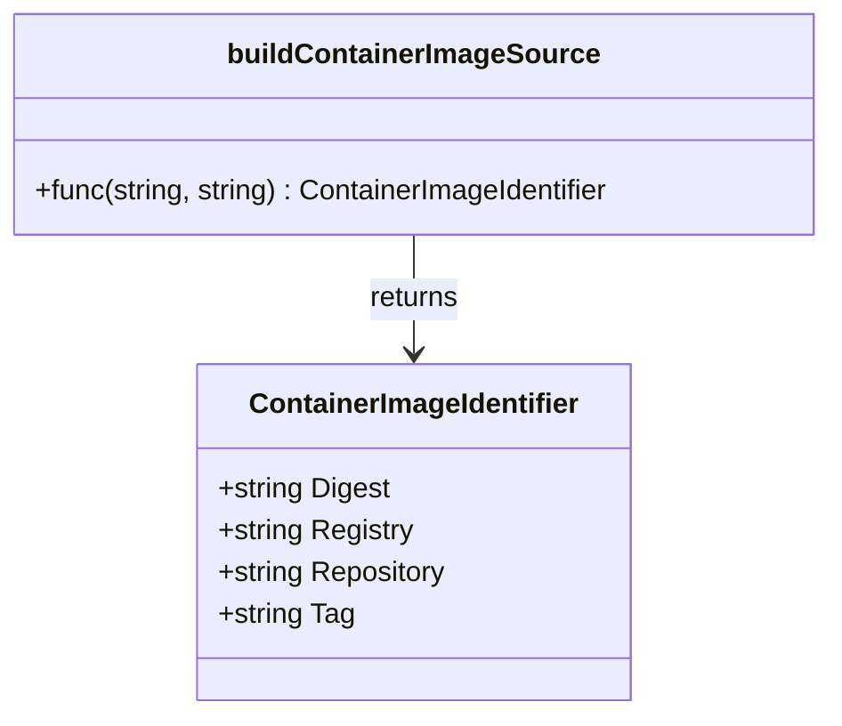

ContainerImageIdentifier` (pkg/provider)

| Item | Detail |
|------|--------|
| **File** | `containers.go:44` |
| **Package** | `github.com/redhat-best-practices-for-k8s/certsuite/pkg/provider` |
| **Exported?** | Yes |
| **Docstring** | *Tag and Digest should not be populated at the same time. Digest takes precedence if both are populated* |

## Purpose

`ContainerImageIdentifier` is a lightweight value type that represents a fully‑qualified reference to a container image.  
It is used throughout the `provider` package when:

| Where it appears | Why |
|------------------|-----|
| `buildContainerImageSource()` (line 497) | Parses an image string into its registry, repository, tag and digest components for later lookup or validation. |
| Various provider configuration helpers | Allows callers to pass a single struct instead of four separate strings. |

## Fields

| Field | Type | Notes |
|-------|------|-------|
| `Digest` | `string` | The image’s SHA256 digest (`sha256:<hash>`). When present, it overrides any tag value. |
| `Registry` | `string` | Hostname of the container registry (e.g., `quay.io`). |
| `Repository` | `string` | Path inside the registry (e.g., `operator-framework/operator-registry`). |
| `Tag` | `string` | Human‑readable tag such as `v4.5`. Ignored if `Digest` is set. |

> **Important**: The struct enforces *mutual exclusivity* between `Tag` and `Digest`. Functions that consume this type typically check `if id.Digest != ""` first, falling back to the tag only when the digest is empty.

## Typical Use‑Case

```go
id := ContainerImageIdentifier{
    Registry:   "quay.io",
    Repository: "operator-framework/operator-registry",
    Tag:        "v4.5", // optional; omitted if Digest is used
}

// Build a source reference string for the provider.
source := buildContainerImageSource(id.Registry, id.Repository)
```

1. **Parsing** – `buildContainerImageSource` splits an input string (e.g., `"quay.io/operator-framework/operator-registry:v4.5"`) into this struct.  
2. **Validation** – downstream code may check that the digest is a valid SHA256 hash, or that the tag matches semantic‑versioning rules.  
3. **Lookup** – the identifier is passed to image registry clients to pull the exact image.

## Dependencies

* **`buildContainerImageSource`** – only function in this package that directly manipulates the struct. It uses `regexp.MustCompile` and `FindStringSubmatch` to decompose an image string.
* No external packages modify the fields; all logic is encapsulated in provider helpers.

## Side Effects & Constraints

* **No side effects**: The struct holds only data; it has no methods that mutate global state.  
* **Immutability by convention**: Once a `ContainerImageIdentifier` is created, callers should treat its fields as read‑only.  

## Mermaid Diagram (Suggested)



---

**Summary:**  
`ContainerImageIdentifier` is a canonical representation of a container image reference used by the provider package. It captures registry, repository, and either a tag or digest (with digest taking precedence). The struct serves as the bridge between raw string inputs and higher‑level image operations throughout the codebase.
