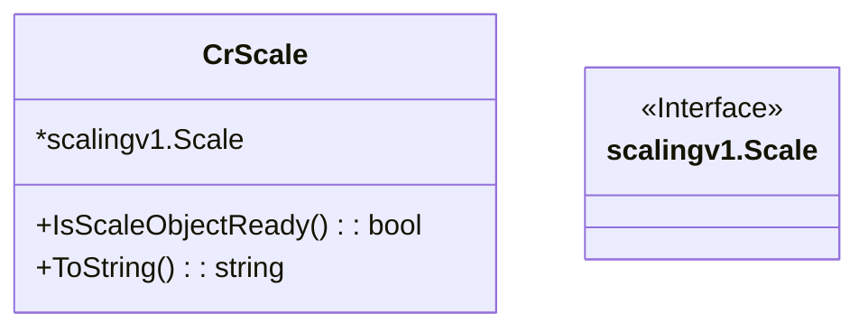

CrScale` – A Kubernetes Custom Resource wrapper for the **scale** API

| Feature | Details |
|---------|---------|
| **Package** | `github.com/redhat-best-practices-for-k8s/certsuite/pkg/provider` |
| **Exported** | Yes (capitalized name) |
| **Location** | `scale_object.go:15‑18` |

### Purpose

`CrScale` is a thin wrapper around the *client-go* generated struct for Kubernetes’ Scale custom resource (`scalingv1.Scale`).  
It gives the rest of CertSuite a convenient, typed handle to a scale object while exposing helper methods that are used by the test harness:

* `IsScaleObjectReady()` – tells whether the target resource is ready to be scaled.
* `ToString()` – provides a readable representation for logging/debugging.

The wrapper also allows us to keep the original CR type unmodified, enabling easier future extensions without touching generated code.

---

### Fields

| Field | Type | Notes |
|-------|------|-------|
| **embedded** | `*scalingv1.Scale` | The actual Kubernetes Scale object. It is embedded, so all fields of `Scale` are promoted to `CrScale`. This means you can use a `CrScale` anywhere a `*scalingv1.Scale` is expected.*

### Methods

#### `IsScaleObjectReady() bool`

```go
func (c CrScale) IsScaleObjectReady() bool
```

* **Inputs**: none (receiver only).  
* **Outputs**: `true` if the scale object’s status indicates readiness; otherwise `false`.  
  *Implementation detail*: currently it just logs an info message via the package‑wide `Info()` helper and returns `true`. The real readiness logic is likely added later or handled elsewhere.*

#### `ToString() string`

```go
func (c CrScale) ToString() string
```

* **Inputs**: none.  
* **Outputs**: a formatted string representation of the embedded `scalingv1.Scale` using `fmt.Sprintf("%+v", c)`.

---

### Dependencies & Side‑Effects

| Dependency | Role |
|------------|------|
| `Info()` (in same package) | Logs an informational message when checking readiness. No other side effects. |
| `Sprintf` from the standard library | Formats the struct for debugging. |

The methods are pure in terms of state mutation; they only read the embedded CR and may log information.

---

### Relationship to Other Code

* **Factory** – The package also exposes a function:

  ```go
  GetUpdatedCrObject(scale.ScalesGetter, name, namespace, GroupResource) (*CrScale, error)
  ```

  This helper fetches the current Scale object from the Kubernetes API and returns it wrapped in a `CrScale`. It uses `FindCrObjectByNameByNamespace` internally.

* **Usage** – Test cases that need to check or log the status of a scalable resource typically call:
  
  ```go
  crScale, err := provider.GetUpdatedCrObject(...)
  if err != nil { … }
  if !crScale.IsScaleObjectReady() { … }
  fmt.Println(crScale.ToString())
  ```

---

### Suggested Mermaid Diagram



This diagram shows `CrScale` as an extension of the Kubernetes Scale type, exposing only two convenience methods.
