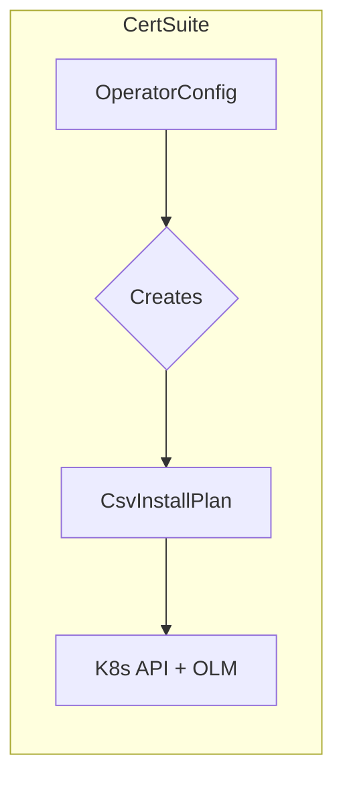

CsvInstallPlan` – Operator Install Plan Descriptor  

| Element | Details |
|---------|---------|
| **Package** | `github.com/redhat-best-practices-for-k8s/certsuite/pkg/provider` |
| **File / Line** | `/Users/deliedit/dev/certsuite/pkg/provider/operators.go:63` |
| **Exported** | ✅ |

---

### Purpose
`CsvInstallPlan` is a lightweight data structure that encapsulates the minimal information required to *install* an Operator in a Kubernetes cluster via its ClusterServiceVersion (CSV).  
In CertSuite, this struct is used by the provider layer when orchestrating the deployment of operators from an operator catalog.

| Field | Type | Meaning |
|-------|------|---------|
| `Name` | `string` | The CSV name (e.g., `"my-operator.v1.0.0"`). |
| `BundleImage` | `string` | Docker image that contains the Operator bundle – the source of CRDs, RBAC, and install logic. |
| `IndexImage` | `string` | Index image that hosts the CSV metadata (usually part of an OperatorHub or catalog). |

The struct has no methods; it is purely a data container.

---

### How It Is Used
1. **Operator Selection**  
   The provider package reads a list of operator configurations from a source such as a YAML file or Kubernetes custom resource. For each operator, a `CsvInstallPlan` instance is created with the corresponding images and CSV name.

2. **Deployment Pipeline**  
   During the *install* phase of CertSuite’s test run, the pipeline:
   - Pulls the `IndexImage`.
   - Extracts the CSV manifest.
   - Uses `BundleImage` to install the operator’s bundle (CRDs, roles, etc.).
   - Creates a Kubernetes `Subscription` or directly applies the CSV.

3. **Cleanup**  
   On test completion, the same struct can be referenced to delete the installed Operator by its name and image references.

---

### Key Dependencies
| Dependency | Relationship |
|------------|--------------|
| **Kubernetes client-go** | Used to apply/delete resources based on `CsvInstallPlan`. |
| **Container registry tooling** (`ctr`, `docker`) | Pulls `BundleImage`/`IndexImage`. |
| **Operator Lifecycle Manager (OLM)** | The CSV format and install logic are defined by OLM; this struct maps directly to OLM concepts. |

---

### Side‑Effects
- No direct side‑effects: the struct itself is immutable.
- Operations that consume it (install, delete) interact with the cluster and registry.

---

### Package Context
`CsvInstallPlan` sits in `pkg/provider/operators.go`, alongside other types such as `OperatorConfig` and helper functions for OLM interactions. It is the bridge between high‑level operator specifications and low‑level deployment actions.

---

#### Summary
`CsvInstallPlan` is a minimal, read‑only descriptor that tells the CertSuite provider *what* Operator to install and *where* its artifacts reside. It feeds into the deployment pipeline, enabling automated operator installation and cleanup during test runs.
