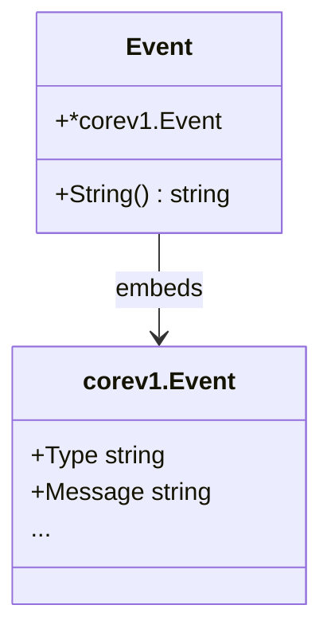

Event` – A Lightweight Wrapper Around Kubernetes Events

| Aspect | Details |
|--------|---------|
| **Package** | `github.com/redhat-best-practices-for-k8s/certsuite/pkg/provider` |
| **File** | `events.go` (lines 25‑35) |
| **Exported** | Yes (`Event`) |

## Purpose

`Event` is a thin wrapper around the Kubernetes API type `corev1.Event`.  
It exists to:

1. **Expose a convenient string representation** of an event for logging and diagnostics.
2. Provide a **factory function** (`NewEvent`) that converts a raw `*corev1.Event` into this wrapper without copying fields.

The struct is intentionally minimal – it only embeds the underlying Kubernetes type, allowing direct field access while adding package‑specific behaviour.

## Structure

```go
type Event struct {
    *corev1.Event  // embedded pointer to the real Kubernetes event object
}
```

- **Embedded Field**: By embedding `*corev1.Event`, all public fields and methods of the original type are promoted, so callers can use `Event` exactly like a `*corev1.Event`.

## Key Functions

| Function | Signature | Inputs | Outputs | Side Effects |
|----------|-----------|--------|---------|--------------|
| **NewEvent** | `func(*corev1.Event) Event` | A pointer to an existing Kubernetes event (`*corev1.Event`). | An `Event` value wrapping the same underlying object. | No mutation; simply wraps the passed pointer. |
| **String** | `(e Event) String() string` | Receives a copy of the wrapper (value receiver). | Human‑readable description of the event. | None. Only reads fields to format a string. |

### `Event.String`

Implementation:

```go
func (e Event) String() string {
    return fmt.Sprintf("%s: %s", e.Type, e.Message)
}
```

- **Inputs**: The `Event` value itself.
- **Outputs**: A formatted string combining the event’s type and message.
- **Dependencies**: Uses `fmt.Sprintf`; accesses promoted fields (`Type`, `Message`) from the embedded `*corev1.Event`.

### `NewEvent`

Implementation:

```go
func NewEvent(ev *corev1.Event) Event {
    return Event{ev}
}
```

- **Inputs**: A pointer to a Kubernetes event.
- **Outputs**: An `Event` wrapper containing that same pointer.
- **Dependencies**: None beyond the struct definition.

## Package Context

The `provider` package orchestrates interactions with a certification provider (e.g., Red‑Hat best practices). Events are part of its reporting mechanism:

- **Logging**: The custom `String()` method ensures consistent, concise logs.
- **Data Flow**: When events are generated or received from the Kubernetes API, they’re wrapped via `NewEvent` before being processed further.

## Mermaid Diagram (Optional)



This diagram shows `Event` embedding `corev1.Event` and adding the `String()` method.
