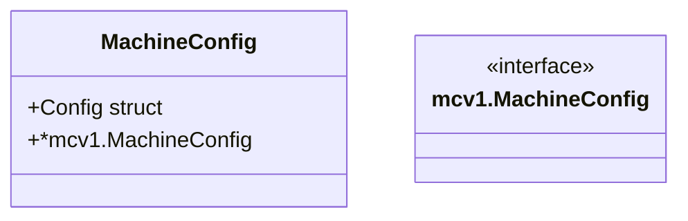

MachineConfig` – Overview

| Item | Details |
|------|---------|
| **File** | `pkg/provider/provider.go:150` |
| **Package** | `github.com/redhat-best-practices-for-k8s/certsuite/pkg/provider` |
| **Exported?** | Yes |

The `MachineConfig` type is a lightweight wrapper around the core OpenShift Machine Config API object (`mcv1.MachineConfig`). It exposes only the fields that are relevant to CertSuite’s validation logic while still keeping full access to the original object via embedding.

---

### Purpose

- **Bridge between Kubernetes and CertSuite** – The struct allows CertSuite to work with Machine Config objects without importing the entire OpenShift API machinery into its own public surface.
- **Selective serialization** – Only a minimal subset of fields (systemd unit configuration) is marshalled/unmarshalled when reading from or writing to YAML/JSON. This keeps the package lean and easier to test.

---

### Composition

```go
type MachineConfig struct {
    // Config holds only the systemd unit information that CertSuite cares about.
    Config struct {
        Systemd struct {
            Units []struct {
                Name     string
                Contents string
            }
        }
    }

    // Embedded OpenShift MachineConfig.  All fields and methods of *mcv1.MachineConfig
    // are directly accessible on a MachineConfig instance, e.g.
    //
    //   mc.ObjectMeta.Name
    //   mc.Spec.Configuration.Raw
    embedded *mcv1.MachineConfig
}
```

- **`Config`** – A shallow view used for unmarshalling YAML that contains only the `systemd.units` section.  
- **Embedded `*mcv1.MachineConfig`** – Provides full access to the OpenShift Machine Config API, enabling functions such as `getMachineConfig` to operate on the real resource.

---

### Key Dependencies

| Dependency | Role |
|------------|------|
| `github.com/openshift/api/machineconfiguration/v1` (`mcv1`) | Supplies the concrete `MachineConfig` type that is embedded. |
| `encoding/json`, `sigs.k8s.io/yaml` (indirect) | Used in `getMachineConfig` to unmarshal YAML into the `Config` field. |

The struct itself does **not** perform any I/O; all interactions happen through functions like `getMachineConfig`.

---

### Interaction with `getMachineConfig`

```go
func getMachineConfig(name string, mcs map[string]MachineConfig) (MachineConfig, error)
```

1. **Fetch the raw MachineConfig** from a Kubernetes client via `GetClientsHolder` → `Get`.
2. **Unmarshal** the YAML into the embedded `mcv1.MachineConfig`.
3. **Populate** the lightweight `Config` field with only the systemd unit data.
4. Return the enriched `MachineConfig`.

Thus, `MachineConfig` acts as a container that carries both the *raw* OpenShift object and the *filtered* configuration needed for CertSuite checks.

---

### Side‑Effects & Guarantees

- **No state mutation** – The struct is read‑only after creation; all updates happen in functions that construct or replace it.
- **Safe embedding** – Because only a pointer to `mcv1.MachineConfig` is embedded, the original object can be modified externally without affecting the wrapper’s internal `Config`.

---

### Diagram (suggested Mermaid)



This diagram shows the `MachineConfig` type containing a custom `Config` field and an embedded pointer to the full OpenShift API object.

---

### Summary

- **What it is** – A thin wrapper that exposes only systemd unit configuration while retaining full access to the underlying Machine Config resource.  
- **Why it matters** – Enables CertSuite to validate machine‑level configurations without pulling in the entire OpenShift client set into its public API.  
- **How it’s used** – Constructed and populated by `getMachineConfig` (and potentially other helper functions) for subsequent validation logic within the package.
