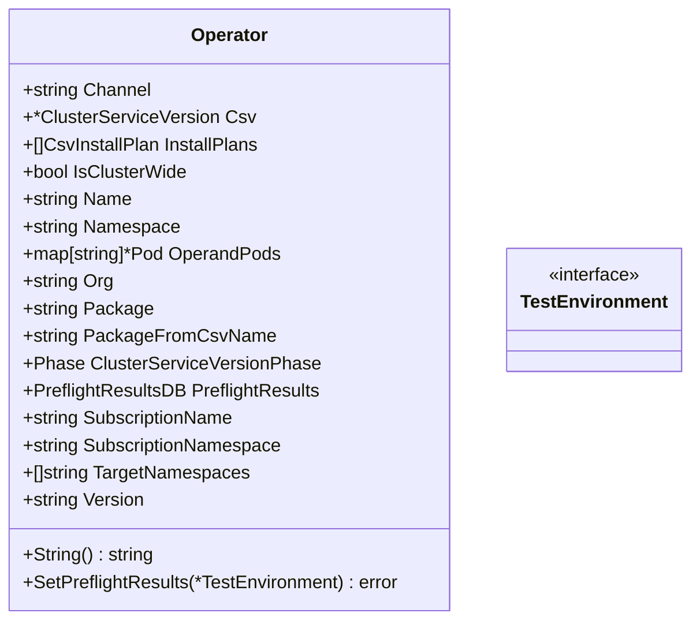

Operator` – Core representation of an OLM‑managed operator

The **`Operator`** type is the single source of truth for any operator that CertSuite
analyzes.  It encapsulates all metadata required to run pre‑flight checks,
query status and report results back to the test harness.

```go
type Operator struct {
    Channel            string                     // OLM channel (e.g., "stable", "beta")
    Csv                *olmv1Alpha.ClusterServiceVersion // the CSV that defines this operator
    InstallPlans       []CsvInstallPlan          // install‑plan objects applied to this operator
    IsClusterWide      bool                       // true if the operator runs cluster‑wide
    Name               string                     // human‑readable name of the operator
    Namespace          string                     // namespace where the CSV resides
    OperandPods        map[string]*Pod            // pods that belong to the operator
    Org                string                     // vendor or organization name
    Package            string                     // OLM package name
    PackageFromCsvName string                     // derived from CSV’s `package` field
    Phase              olmv1Alpha.ClusterServiceVersionPhase // current install phase
    PreflightResults   PreflightResultsDB          // results of pre‑flight checks
    SubscriptionName   string                      // subscription that triggered the installation
    SubscriptionNamespace string                   // namespace of the subscription
    TargetNamespaces   []string                    // namespaces targeted by this operator
    Version            string                      // CSV version (semver)
}
```

## Purpose

- **Bridge between OLM objects and CertSuite logic** – Each `Operator` is created from a
  combination of ClusterServiceVersion, Subscription, InstallPlan,
  PackageManifest and CatalogSource resources.  
- **Centralised state holder** – The struct keeps all information that subsequent
  functions (`SetPreflightResults`, `String`, etc.) need to run checks or report
  status.
- **Queryable API for the provider package** – Functions like `GetAllOperatorGroups`
  return slices of `*Operator` so callers can iterate over operators without
  re‑traversing the Kubernetes API.

## Key Dependencies

| Field | Related Types / Packages |
|-------|--------------------------|
| `Csv` | `olmv1Alpha.ClusterServiceVersion` (OLM v0.17) |
| `InstallPlans` | `CsvInstallPlan` (wrapper around OLM InstallPlan) |
| `OperandPods` | `Pod` (internal struct representing a Kubernetes pod) |
| `PreflightResults` | `PreflightResultsDB` (database of pre‑flight outcomes) |

The **provider** package imports the following OLM APIs:

```go
github.com/operator-framework/api/pkg/operators/v1alpha1   // olmv1Alpha
```

## Side Effects & Mutations

- The struct is *immutable* once constructed; however, its fields are pointers or
  slices/maps that can be mutated by other functions.  
- `SetPreflightResults` writes to the embedded `PreflightResultsDB`.  
- Functions that construct an `Operator` (e.g., `createOperators`) may log debug,
  warning and error messages but do not modify global state.

## Interaction with Package Functions

| Function | How it uses `Operator` |
|----------|------------------------|
| `GetAllOperatorGroups` | Calls `List()` on the operator‑group client, then filters/grouping logic that relies on `IsClusterWide`, `Namespace`, etc. |
| `SetPreflightResults` | Executes a pre‑flight command via an external tool and stores the result in `PreflightResults`. It also updates `OperandPods` and logs status. |
| `String` | Provides a concise string representation (`%s (%s)` → “Name (Namespace)”). |
| `createOperators` | Converts raw OLM resources into a slice of `Operator`, populating all fields. |
| `getAtLeastOneSubscription` / `getAtLeastOneInstallPlan` | Validate that each operator has at least one subscription or install plan; these functions read the `Csv`, `SubscriptionName`, and `InstallPlans`. |
| `getSummaryAllOperators` | Builds a human‑readable summary of all operators using fields such as `Name`, `Package`, `Version`, `Phase`. |

## Example Usage

```go
// In a test harness:
ops, err := provider.GetAllOperatorGroups()
if err != nil { log.Fatal(err) }

for _, op := range ops {
    // Run pre‑flight checks on each operator.
    if err := op.SetPreflightResults(env); err != nil {
        log.Printf("preflight failed for %s: %v", op, err)
    }
}
```

## Diagram (Suggested)



> **Note**: The struct does not directly expose any Kubernetes clients; it relies on helper functions (`GetClientsHolder`, `List`, etc.) that are defined elsewhere in the package.  All interactions with the cluster happen through those helpers, keeping `Operator` a pure data holder.
