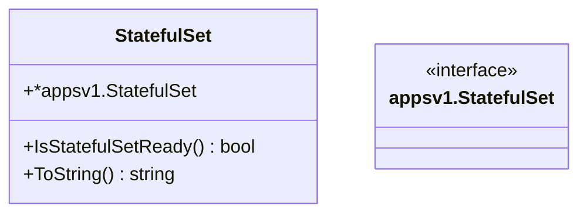

StatefulSet` – Lightweight Wrapper Around K8s StatefulSets

The **`StatefulSet`** type is a thin wrapper around the official Kubernetes API
object (`*appsv1.StatefulSet`).  
It exists to provide convenience methods that are used throughout the
`provider` package when working with stateful workloads.

| Aspect | Detail |
|--------|--------|
| **Purpose** | 1. Expose a single, easy‑to‑use type for callers that only need to query readiness or stringify a StatefulSet.<br>2. Keep a reference to the underlying `*appsv1.StatefulSet` so that all fields are still accessible if needed. |
| **Exported Fields** | *Embedded* – `*appsv1.StatefulSet`.  Because it is embedded, all fields and methods of the original struct are promoted (e.g., `.Name`, `.Namespace`, `.Status`, etc.). |
| **Key Methods** | • `IsStatefulSetReady() bool` – checks whether the StatefulSet has reached its desired replica count.<br>• `ToString() string` – returns a human‑readable representation of the StatefulSet (name, namespace, and ready status). |

### How It Is Used

1. **Creation**  
   The helper function `GetUpdatedStatefulset` retrieves an existing
   StatefulSet from a cluster and wraps it in this struct:

   ```go
   func GetUpdatedStatefulset(client appv1client.AppsV1Interface, ns, name string) (*StatefulSet, error) {
       ss, err := FindStatefulsetByNameByNamespace(client, ns, name)
       if err != nil { return nil, err }
       return &StatefulSet{ss}, nil
   }
   ```

2. **Readiness Check**  
   Callers frequently need to know whether a StatefulSet is fully operational.
   The method simply compares the `Desired` replica count with the current
   ready replicas:

   ```go
   func (s *StatefulSet) IsStatefulSetReady() bool {
       return s.Spec.Replicas != nil && s.Status.ReadyReplicas == *s.Spec.Replicas
   }
   ```

3. **Logging / Display**  
   When generating test reports or console output, `ToString` is used to
   produce a concise summary:

   ```go
   func (s *StatefulSet) ToString() string {
       return fmt.Sprintf("%s/%s Ready: %t",
           s.Namespace,
           s.Name,
           s.IsStatefulSetReady())
   }
   ```

### Dependencies

| Dependency | Role |
|------------|------|
| `appsv1.StatefulSet` (K8s API) | The underlying data model. |
| `fmt.Sprintf` | String formatting in `ToString`. |
| `GetUpdatedStatefulset` → `FindStatefulsetByNameByNamespace` | Provides the wrapped object. |

### Side Effects & Constraints

- **No side effects**: All methods are read‑only; they do not modify the
  StatefulSet or the cluster.
- **Nil checks**: `IsStatefulSetReady` assumes that `Spec.Replicas` is non‑nil;
  callers should handle nil pointers if they might occur.

### Relationship to Package

The `provider` package contains logic for interacting with various Kubernetes
resources.  
`StatefulSet` is the only struct in this file that provides state‑checking
capabilities specific to StatefulSets, complementing other resource wrappers
(e.g., Deployments, DaemonSets) elsewhere in the package.

---

#### Suggested Mermaid Diagram (optional)



This diagram shows the inheritance relationship and highlights the two
public methods that extend the base K8s type.
