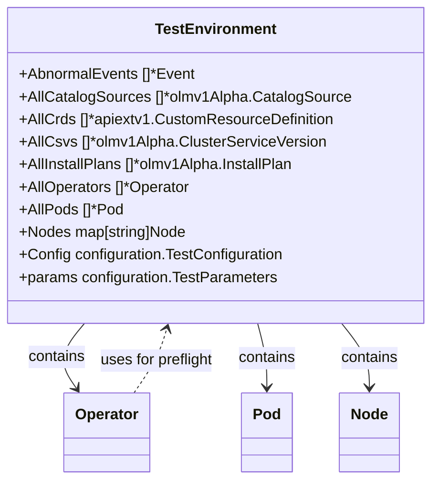

TestEnvironment` – Core test‑state container

| Field | Type | Purpose |
|-------|------|---------|
| **AbnormalEvents** | `[]*Event` | Events that failed health checks or were otherwise marked abnormal during a run. |
| **AllCatalogSources** | `[]*olmv1Alpha.CatalogSource` | Every catalog source discovered in the cluster. |
| **AllCrds** | `[]*apiextv1.CustomResourceDefinition` | All CRDs present at test start. |
| **AllCsvs** | `[]*olmv1Alpha.ClusterServiceVersion` | Every CSV object, useful for operator‑related checks. |
| **AllInstallPlans** | `[]*olmv1Alpha.InstallPlan` | Install plans for all operators. |
| **AllOperators** | `[]*Operator` | Operator objects wrapped with helper methods. |
| **AllOperatorsSummary** | `[]string` | Short textual summary of operator status. |
| **AllPackageManifests** | `[]*olmpkgv1.PackageManifest` | All package manifests (for catalog‑source analysis). |
| **AllPods** | `[]*Pod` | Snapshot of every pod when the environment was built. |
| **AllServiceAccounts** | `[]*corev1.ServiceAccount` | List of all service accounts. |
| **AllServiceAccountsMap** | `map[string]*corev1.ServiceAccount` | Quick lookup by name. |
| **AllServices** | `[]*corev1.Service` | All services in the cluster. |
| **AllSriovNetworkNodePolicies / AllSriovNetworks** | `[]unstructured.Unstructured` | SR‑IOV network policies and networks. |
| **AllSubscriptions** | `[]olmv1Alpha.Subscription` | Operator subscriptions. |
| **CSVToPodListMap** | `map[string][]*Pod` | Pods created by each CSV (operator). |
| **ClusterOperators** | `[]configv1.ClusterOperator` | Cluster‑level operators. |
| **ClusterRoleBindings** | `[]rbacv1.ClusterRoleBinding` | Global RBAC bindings. |
| **CollectorAppEndpoint / CollectorAppPassword** | `string` | Credentials for the test collector service. |
| **Config** | `configuration.TestConfiguration` | Raw configuration passed to CertSuite (e.g., `--skip-preflight`). |
| **ConnectAPI…** | various `string` | Settings for the optional Connect API integration. |
| **Containers** | `[]*Container` | Containers that were part of the environment snapshot. |
| **DaemonsetFailedToSpawn** | `bool` | Flag set if any daemonset could not be started during setup. |
| **Deployments** | `[]*Deployment` | All deployments in the cluster. |
| **ExecutedBy** | `string` | User or CI system that triggered the test run. |
| **HelmChartReleases** | `[]*release.Release` | Helm releases installed for operators. |
| **HorizontalScaler** | `[]*scalingv1.HorizontalPodAutoscaler` | HPA objects. |
| **IstioServiceMeshFound** | `bool` | Whether an Istio mesh was detected. |
| **K8sVersion / OpenshiftVersion** | `string` | Cluster version strings. |
| **Namespaces** | `[]string` | All namespace names in the environment. |
| **NetworkAttachmentDefinitions** | `[]nadClient.NetworkAttachmentDefinition` | CNI network attachment definitions. |
| **NetworkPolicies** | `[]networkingv1.NetworkPolicy` | Network policy objects. |
| **Nodes** | `map[string]Node` | Node descriptors keyed by name. |
| **OCPStatus** | `string` | Overall status of the OpenShift installation (e.g., “Ready”). |
| **OperatorGroups** | `[]*olmv1.OperatorGroup` | Operator groups in the cluster. |
| **PartnerName** | `string` | Name of the partner that provided the test environment. |
| **PersistentVolumeClaims / PersistentVolumes** | slices of PVC/ PV objects | Storage resources. |
| **PodDisruptionBudgets** | `[]policyv1.PodDisruptionBudget` | PDBs for each pod. |
| **PodStates** | `autodiscover.PodStates` | Auto‑discovery state machine results. |
| **Pods / ProbePods** | `[]*Pod`, `map[string]*corev1.Pod` | Live pods and probe‑pods used during checks. |
| **ResourceQuotas** | `[]corev1.ResourceQuota` | Resource quota objects. |
| **RoleBindings / Roles** | slices of RBAC objects | Namespace‑scoped roles & bindings. |
| **ScaleCrUnderTest** | `[]ScaleObject` | Scale objects that are being tested for scaling logic. |
| **Services** | `[]*corev1.Service` | (duplicate of AllServices – kept for compatibility). |
| **SkipPreflight** | `bool` | Whether pre‑flight checks were skipped (`--skip-preflight`). |
| **SriovNetworkNodePolicies / SriovNetworks** | duplicates of All… | For backward compatibility. |
| **StatefulSets** | `[]*StatefulSet` | StatefulSet objects. |
| **StorageClassList** | `[]storagev1.StorageClass` | Storage classes in the cluster. |
| **ValidProtocolNames** | `[]string` | Protocols that are considered valid for the test run. |
| **params** | `configuration.TestParameters` | Parsed command‑line parameters (e.g., timeout, debug). |

## Key behaviours

* **Construction** – `GetTestEnvironment()` calls `buildTestEnvironment()`, which queries the cluster via the client set and populates all slices/maps above.  
  * The build is idempotent: calling again will refresh state if `SetNeedsRefresh` was invoked.
* **Filtering helpers** – a number of methods (listed in `methodNames`) operate on these fields to return specific subsets, e.g., guaranteed pods or pods using SR‑IOV. They rely only on the snapshot data; no further API calls are made.
* **Pre‑flight integration** – `SetPreflightResults` for `Container` and `Operator` uses `TestEnvironment.IsPreflightInsecureAllowed()` to decide whether insecure connections are permitted, and writes results into the global DB.

## Dependencies

| Dependency | Why it matters |
|------------|----------------|
| `k8s.io/client-go`, `openshift/api`, `olmv1Alpha`, etc. | APIs used during environment construction. |
| `configuration.TestConfiguration` / `TestParameters` | Drive optional behaviours (e.g., skip‑preflight, proxy). |
| `logrus` | Logging inside helper methods. |

## Side effects

* No network traffic after initial build: all subsequent calls read from the in‑memory state.
* Writing pre‑flight results mutates the global DB; other packages must not assume immutability of this struct.

## Usage flow

1. **Build** – `GetTestEnvironment()` → populates fields.  
2. **Query** – tests call filtering helpers to get pods, nodes, operators, etc.  
3. **Act** – e.g., operator pre‑flight runs use the environment’s Docker config and security flags.  
4. **Refresh** – if needed, `SetNeedsRefresh()` triggers a rebuild before next query.

---

### Mermaid diagram (suggested)

This diagram visualises the core composition of `TestEnvironment` and its key relationships.
