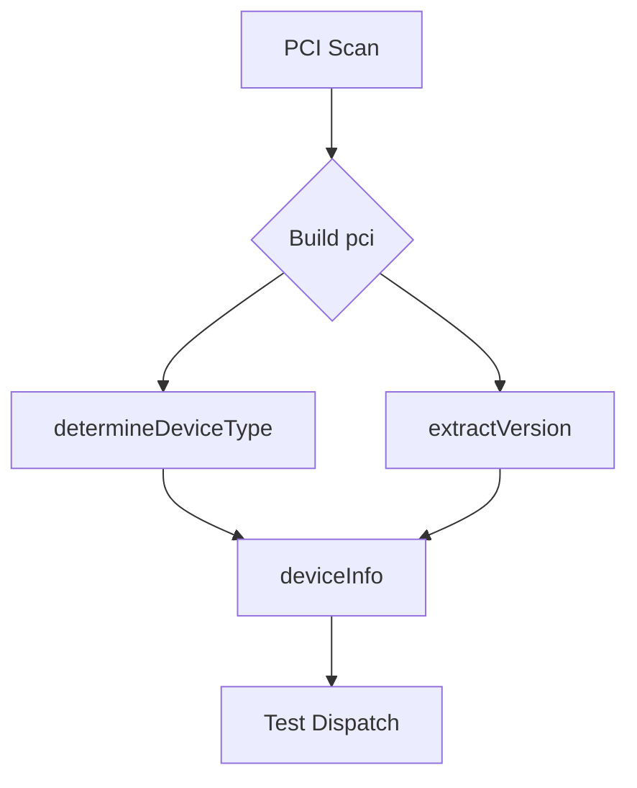

deviceInfo` – internal representation of a PCI device

| Field | Type   | Meaning |
|-------|--------|---------|
| `PCI`     | `pci`  | Low‑level PCI data structure (see the `pci` type in the same file). Holds raw bus/device/function identifiers, vendor & product IDs, and other descriptors. |
| `Type`    | `string` | Human‑readable device classification (e.g., `"network"`, `"storage"`). Used by the provider to decide which test suites apply. |
| `Version` | `string` | Optional version string extracted from the PCI data (e.g., firmware revision). Helps with version‑specific checks. |

## Purpose

The **`deviceInfo`** struct is a lightweight, read‑only snapshot of a detected hardware device that the *provider* package uses to:

1. **Identify the device type** – mapping raw PCI identifiers to a logical category.
2. **Pass contextual information** to higher‑level test functions (e.g., which tests to run for network cards).
3. **Record versioning metadata** that may affect test logic.

It is *not exported*, so only code within `pkg/provider` can instantiate or read it directly. External consumers interact with the provider’s public API, which internally builds and consumes these structs.

## Inputs / Construction

The struct is created by scanning PCI devices on a node. The provider:

1. Enumerates `/sys/bus/pci/devices/…` entries.
2. Parses vendor/product IDs and other attributes into a `pci` value.
3. Calls an internal helper (e.g., `determineDeviceType(pci)`) to set the `Type`.
4. Optionally extracts firmware or BIOS revision strings for `Version`.

No public functions touch this struct directly; it is built inside private provider helpers.

## Outputs / Usage

Once populated, a slice of `deviceInfo` instances is passed to test‑suite dispatchers. Test code may:

- Filter by `Type` to select relevant tests.
- Use `PCI` fields for detailed device checks (e.g., verifying driver binding).
- Log or report the `Version` as part of compliance audit output.

Because the struct contains no methods, it is immutable after construction—there are no side effects beyond its internal field values.

## Key Dependencies

| Dependency | Role |
|------------|------|
| `pci` type | Holds low‑level PCI data. Provides fields like `Bus`, `Device`, `VendorID`, etc. |
| Provider helpers (`determineDeviceType`, `extractVersion`) | Translate raw PCI data into the semantic fields of `deviceInfo`. |

## Integration in the Package

The *provider* package orchestrates end‑to‑end compliance checks on a Kubernetes node:

1. **Hardware discovery** – builds a list of `deviceInfo` structs.
2. **Test selection** – uses those structs to decide which test suites run.
3. **Result aggregation** – includes device metadata in the final report.

Thus, `deviceInfo` serves as the bridge between low‑level system introspection and high‑level compliance logic.

---

### Suggested Mermaid Diagram

This diagram illustrates the flow from raw PCI data to the populated `deviceInfo` struct and onward into test selection.
