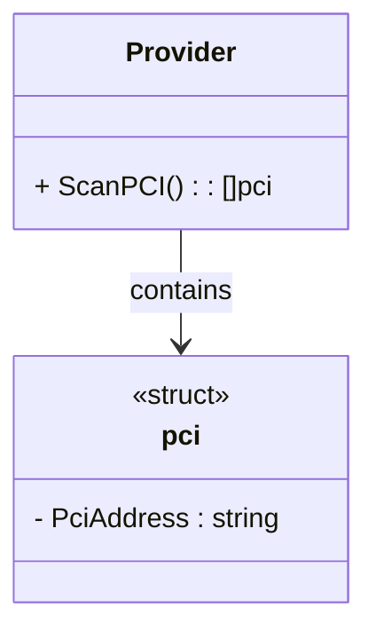

pci` (unexported) – Provider‑level PCI Device Descriptor  

| Item | Detail |
|------|--------|
| **Package** | `github.com/redhat-best-practices-for-k8s/certsuite/pkg/provider` |
| **File/Line** | `provider.go:182` |
| **Visibility** | Unexported – used only inside the `provider` package. |

## Purpose
The `pci` struct is a lightweight container that represents a PCI device by storing its bus‑device‑function (BDF) address as a string.  
It is primarily used to pass PCI identifiers into provider functions that need to reference or query hardware devices, such as:

* Enumerating GPU / NIC devices for compliance checks.
* Mapping driver bindings to specific physical adapters.

Because the struct is unexported, it is meant for internal bookkeeping only; callers interact with higher‑level abstractions (e.g., `Provider` methods) that accept or return more descriptive types.

## Fields

| Field | Type | Role |
|-------|------|------|
| `PciAddress` | `string` | The canonical BDF address (`<domain>:<bus>.<device>.<function>`). This is the only data required to identify a PCI device in most Linux sysfs queries. |

## Inputs / Outputs
- **Input** – A value of type `pci` is typically constructed when scanning `/sys/bus/pci/devices/`.  
- **Output** – The struct itself does not produce any output; it is consumed by provider routines that perform system calls or read sysfs entries based on the address.

## Dependencies & Side‑Effects
- Relies on standard library string handling; no external dependencies.  
- No side effects are caused by creating or copying a `pci` instance.  
- The real work (e.g., reading `/sys/bus/pci/...`) is performed elsewhere in the package; this struct merely carries the identifier.

## Package Context
Within the `provider` package, `pci` sits alongside other device descriptors (`cpu`, `memory`, etc.) that aggregate hardware metadata for compliance checks. It enables the provider to maintain a consistent representation of PCI devices while keeping the public API clean and type‑safe.

---

### Suggested Mermaid Diagram

This diagram illustrates that the `Provider` type (not shown in the snippet) owns or returns slices of `pci` structs, encapsulating PCI device information within the package.
