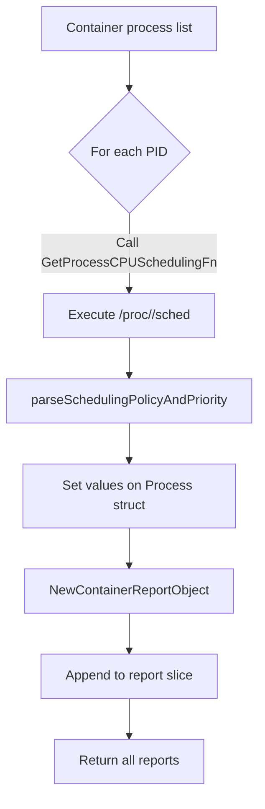
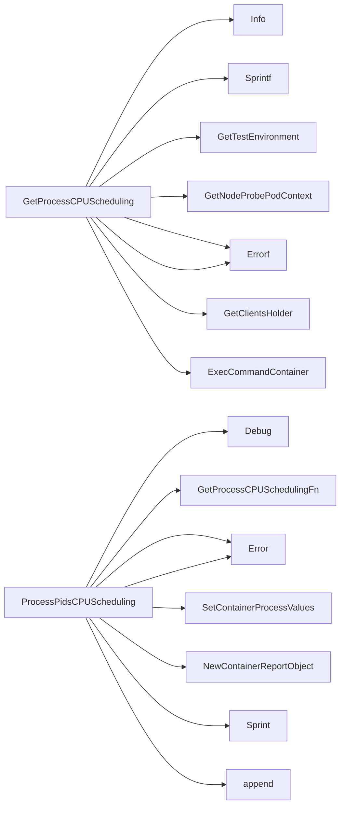

## Package scheduling (github.com/redhat-best-practices-for-k8s/certsuite/pkg/scheduling)

# Scheduling Package Overview  
*Location:* `github.com/redhat-best-practices-for-k8s/certsuite/pkg/scheduling`  

The package implements logic for inspecting and reporting CPU‑scheduling settings of processes running inside a container.  It is used by the test framework to verify that workloads honour required scheduling policies.

---

## Core concepts

| Concept | What it represents |
|---------|--------------------|
| **Scheduling policy** | The `SCHED_*` value (e.g., `SCHED_RR`, `SCHED_FIFO`) a process runs with. |
| **Scheduling priority** | Numerical priority associated with the policy. |
| **Requirements** | A set of policies/priority ranges that a test expects (stored in `schedulingRequirements`). |

---

## Key Types & Variables

```go
// exported constants for human‑readable names
const (
    CurrentSchedulingPolicy   = "current_scheduling_policy"
    CurrentSchedulingPriority = "current_scheduling_priority"

    // supported policies
    SharedCPUScheduling     = "SCHED_OTHER"
    ExclusiveCPUScheduling  = "SCHED_FIFO"
    IsolatedCPUScheduling   = "SCHED_RR"

    SchedulingRoundRobin    = "RR"
    SchedulingFirstInFirstOut = "FIFO"

    InvalidPriority         = -1
)

const newLineCharacter = "\n" // used for formatting report output
```

### Global function variables

| Name | Purpose |
|------|---------|
| `CrcClientExecCommandContainerNSEnter` | Function pointer that executes a command inside the container via the client holder.  It is set to `crclient.ExecCommandContainerNSenter` by default, but can be overridden for testing. |
| `GetProcessCPUSchedulingFn` | Helper function used by tests; points to `GetProcessCPUScheduling`. |
| `schedulingRequirements` | Slice of strings that specify the expected scheduling policies/priorities (e.g., `"SCHED_FIFO:1-99"`).  Populated elsewhere in the test suite. |

---

## Main Functions

### `GetProcessCPUScheduling(pid int, c *provider.Container) (string, int, error)`
* **Goal:** Query a process inside a container for its scheduling policy and priority.  
* **Workflow**  
  1. Log start of query.  
  2. Build the command to run in the container:  
     ```bash
     cat /proc/<pid>/sched | grep -i "policy:" | awk '{print $3}'
     cat /proc/<pid>/sched | grep -i "priority:" | awk '{print $2}'
     ```
  3. Execute the command via `CrcClientExecCommandContainerNSEnter`.  
  4. Parse output using `parseSchedulingPolicyAndPriority`.  
  5. Return policy string, priority int, or error.

### `ProcessPidsCPUScheduling(pids []*crclient.Process, c *provider.Container, podName string, logger *log.Logger) []*testhelper.ReportObject`
* **Goal:** For a list of processes, collect scheduling info and build a report slice.  
* **Workflow**  
  - Iterate over each process:  
    1. Call `GetProcessCPUSchedulingFn` (normally `GetProcessCPUScheduling`).  
    2. If error → log & continue.  
    3. Populate the process struct with policy/priority via `SetContainerProcessValues`.  
    4. Create a `testhelper.ReportObject` using `NewContainerReportObject`.  
  - Return slice of all report objects.

### `parseSchedulingPolicyAndPriority(output string) (string, int, error)`
* **Goal:** Convert the raw command output into usable values.  
* **Logic**  
  1. Split by newlines → two lines: policy and priority.  
  2. Extract tokens, validate length, ensure correct fields (`policy:` / `priority:`).  
  3. Convert priority string to int with `strconv.Atoi`.  
  4. Return parsed values or error.

### Helper: `PolicyIsRT(policy string) bool`
* **Simple check** – returns true if the policy is either `"SCHED_FIFO"` or `"SCHED_RR"`, i.e., a real‑time policy.

---

## How everything connects



1. **Process discovery** (`crclient.Process` list) comes from the container probe.  
2. `GetProcessCPUScheduling` reads `/proc/<pid>/sched`, parses it, and returns values.  
3. The caller (usually a test harness) updates the process struct and builds a human‑readable report.  
4. `PolicyIsRT` can be used by higher‑level logic to flag real‑time scheduling.

---

## Usage pattern in tests

```go
procs := client.ListProcesses(container)
reports := scheduling.ProcessPidsCPUScheduling(procs, container, podName, logger)

for _, r := range reports {
    if !scheduling.PolicyIsRT(r.SchedPolicy) {
        // test failure: expected RT policy
    }
}
```

The package is intentionally read‑only; all heavy lifting (client calls, logging) happens through the injected global function variables, making unit testing straightforward.

### Functions

- **GetProcessCPUScheduling** — func(int, *provider.Container)(string, int, error)
- **PolicyIsRT** — func(string)(bool)
- **ProcessPidsCPUScheduling** — func([]*crclient.Process, *provider.Container, string, *log.Logger)([]*testhelper.ReportObject)

### Globals

- **CrcClientExecCommandContainerNSEnter**: 
- **GetProcessCPUSchedulingFn**: 

### Call graph (exported symbols, partial)



### Symbol docs

- [function GetProcessCPUScheduling](symbols/function_GetProcessCPUScheduling.md)
- [function PolicyIsRT](symbols/function_PolicyIsRT.md)
- [function ProcessPidsCPUScheduling](symbols/function_ProcessPidsCPUScheduling.md)
