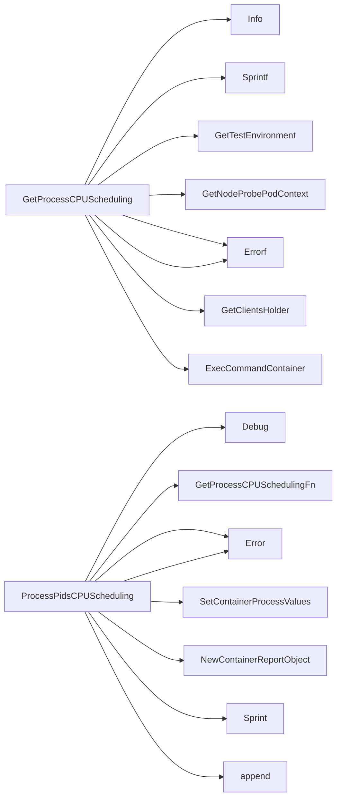

## Package scheduling (github.com/redhat-best-practices-for-k8s/certsuite/pkg/scheduling)

### Functions

- **GetProcessCPUScheduling** — func(int, *provider.Container)(string, int, error)
- **PolicyIsRT** — func(string)(bool)
- **ProcessPidsCPUScheduling** — func([]*crclient.Process, *provider.Container, string, *log.Logger)([]*testhelper.ReportObject)

### Globals

- **CrcClientExecCommandContainerNSEnter**: 
- **GetProcessCPUSchedulingFn**: 

### Call graph (exported symbols, partial)

### Symbol docs

- [function GetProcessCPUScheduling](symbols/function_GetProcessCPUScheduling.md)
- [function PolicyIsRT](symbols/function_PolicyIsRT.md)
- [function ProcessPidsCPUScheduling](symbols/function_ProcessPidsCPUScheduling.md)
