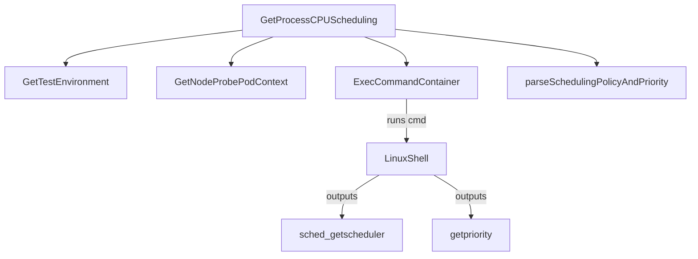

GetProcessCPUScheduling`

**Location**

`pkg/scheduling/scheduling.go:120`

| Attribute | Value |
|-----------|-------|
| Exported | ✅ |
| Signature | `func GetProcessCPUScheduling(pid int, c *provider.Container) (string, int, error)` |

### Purpose

Retrieve the CPU scheduling policy and priority for a process that is running inside a container.  
The function executes `sched_getscheduler` and `getpriority` via an exec command in the target pod’s probe container and parses their output.

### Parameters

| Name | Type | Description |
|------|------|-------------|
| `pid` | `int` | Process ID inside the container whose scheduling is being queried. |
| `c`   | `*provider.Container` | Container object that holds references to the pod, namespace and Kubernetes client set. |

### Return Values

| Position | Type | Meaning |
|----------|------|---------|
| 1 | `string` | The CPU scheduling policy name (e.g., `"SCHED_OTHER"`, `"SCHED_FIFO"`). |
| 2 | `int`    | The process priority value. |
| 3 | `error`  | Non‑nil if any step fails – includes failures to locate the pod, execute commands or parse output. |

### Key Dependencies & Side Effects

1. **Environment lookup**  
   *Calls* `GetTestEnvironment()` → obtains the test environment (e.g., namespace, K8s client).  
2. **Pod context resolution**  
   *Calls* `GetNodeProbePodContext(testEnv)` → resolves the probe pod that has access to the node where the container is running.  
3. **Command execution**  
   Executes a shell command in the probe pod’s container via `ExecCommandContainer`.  
   The command runs inside the node’s namespace (via `CrcClientExecCommandContainerNSEnter`) and calls the Linux utilities `sched_getscheduler` and `getpriority`.  
4. **Output parsing**  
   Uses helper `parseSchedulingPolicyAndPriority` to convert the raw string into a policy name and priority integer.  

No state is mutated outside of local variables; the function is pure except for the exec side‑effect.

### How it fits the package

The `scheduling` package provides utilities for inspecting CPU scheduling on Kubernetes nodes.  
`GetProcessCPUScheduling` is the core routine that reads a process’s policy/priority from the node, enabling higher‑level tests to assert correct configuration (e.g., verifying that a pod was scheduled with `SCHED_FIFO` and priority 99).  

### Summary

`GetProcessCPUScheduling(pid, c)`  
* **What** – reads a process’s CPU scheduling policy and priority.  
* **How** – execs two Linux commands inside the probe pod that has node‑level visibility.  
* **Why** – supplies the information needed by tests to validate correct CPU scheduling behavior on the target container.
