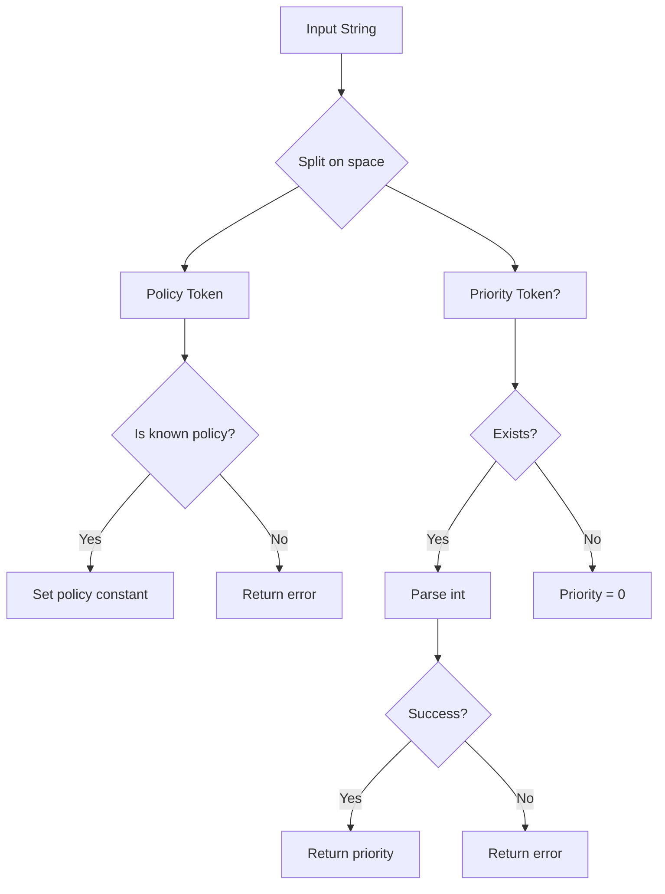

parseSchedulingPolicyAndPriority`

```go
func parseSchedulingPolicyAndPriority(input string) (policy string, priority int, err error)
```

### Purpose  
Converts a human‑readable scheduling description into the values used by the rest of the *scheduling* package.  
Typical input strings look like:

- `"exclusive"`  
- `"shared 0"`  
- `"isolated 2"`  

The function normalizes the policy name, extracts an optional priority integer, and validates that the pair is supported.

### Inputs

| Parameter | Type   | Description |
|-----------|--------|-------------|
| `input`   | `string` | The raw scheduling string supplied by a caller (e.g., from a configuration file or CLI flag). |

### Outputs

| Return | Type    | Description |
|--------|---------|-------------|
| `policy`  | `string` | One of the exported policy constants: `ExclusiveCPUScheduling`, `SharedCPUScheduling`, or `IsolatedCPUScheduling`. |
| `priority`| `int`   | The numeric priority if supplied; otherwise `0`. |
| `err`     | `error` | Non‑nil when the input is malformed or contains an unsupported policy/priority. |

### Key Steps & Dependencies

1. **Trim whitespace** – uses `strings.Fields` to collapse runs of spaces/newlines.
2. **Split on first space** – `strings.Split(input, " ")` separates the policy token from the optional priority string.
3. **Validate policy**  
   - Uses `strings.Contains` to check if the first token matches one of the known constants (`ExclusiveCPUScheduling`, `SharedCPUScheduling`, `IsolatedCPUScheduling`).  
4. **Parse priority (if present)** – `strconv.Atoi` converts the second token to an integer; any failure returns an error.
5. **Return values** – If parsing succeeds, it returns the canonical policy string and parsed priority.

The function does not modify any global state; it is pure aside from its return values.

### Side Effects

None – purely functional.

### How It Fits the Package

- **Configuration Parsing:**  
  The *scheduling* package exposes `CurrentSchedulingPolicy` and `CurrentSchedulingPriority`. Those globals are typically set during initialization by parsing a user‑supplied string via this helper.
- **Validation Layer:**  
  Other parts of the package assume that `policy` is one of the exported constants. By centralizing validation here, the rest of the code can rely on consistent values without reimplementing checks.

### Example Usage

```go
pol, prio, err := parseSchedulingPolicyAndPriority("isolated 3")
if err != nil {
    log.Fatalf("invalid scheduling spec: %v", err)
}
CurrentSchedulingPolicy = pol
CurrentSchedulingPriority = prio
```

---

**Mermaid Diagram (optional)** – A simple flow of parsing:



---
