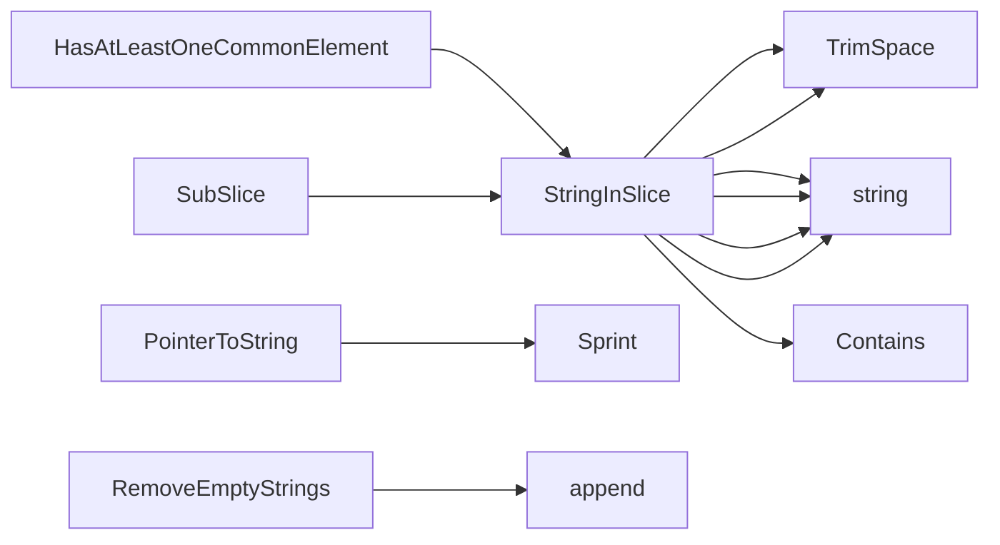

## Package stringhelper (github.com/redhat-best-practices-for-k8s/certsuite/pkg/stringhelper)

# stringhelper package – quick reference

The `stringhelper` package supplies small, reusable helpers that operate on strings and slices of strings.  
All utilities are pure functions (no global state) so they can be called from anywhere without side‑effects.

| Section | What it contains |
|---------|------------------|
| **Functions** | 5 exported helpers (`HasAtLeastOneCommonElement`, `PointerToString`, `RemoveEmptyStrings`, `StringInSlice`, `SubSlice`). |
| **No structs / globals / constants** | The package is intentionally minimal. |

---

## Core functions

### `StringInSlice[T any](slice []T, target T, caseInsensitive bool) bool`

*Checks whether *target* appears in *slice*.  
The generic type `T` allows the function to work with any comparable slice – usually `[]string`.  

| Step | Details |
|------|---------|
| 1. Trim spaces from `target`. | `strings.TrimSpace(targetString)` |
| 2. Convert both target and slice elements to strings using `fmt.Sprintf("%v", …)`. | Handles values that are not already string. |
| 3. If `caseInsensitive`, compare with `strings.EqualFold`. |
| 4. Return the first match, otherwise `false`. |

> **Why generics?**  
> The original code used a generic signature to avoid converting all callers to strings; internally it still casts everything to `string` for comparison.

---

### `SubSlice(a []string, b []string) bool`

*Determines whether every element of slice `a` can be found in slice `b`.*

```go
for _, s := range a {
    if !StringInSlice(b, s, false) { return false }
}
return true
```

It is essentially a subset check using the helper above.

---

### `HasAtLeastOneCommonElement(a []string, b []string) bool`

*Checks whether there exists **any** common element between two slices.*

```go
for _, s := range a {
    if StringInSlice(b, s, false) { return true }
}
return false
```

A lightweight version of set intersection.

---

### `RemoveEmptyStrings(s []string) []string`

*Filters out zero‑value or whitespace‑only strings from the input slice.*

```go
var r []string
for _, v := range s {
    if strings.TrimSpace(v) != "" { r = append(r, v) }
}
return r
```

Useful for normalising lists that may contain empty entries (e.g., from YAML parsing).

---

### `PointerToString[T any](p *T) string`

*Provides a safe string representation of a pointer value.*

```go
if p == nil { return "nil" }
return fmt.Sprint(*p)
```

- Works for any type `T`.  
- Used in log traces where k8s objects expose fields as pointers (e.g., `*bool`, `*int`).  

> **Examples**  
> ```go
> var b *bool
> fmt.Println(PointerToString(b)) // "nil"
> 
> x := true
> fmt.Println(PointerToString(&x)) // "true"
> ```

---

## How they connect

```mermaid
flowchart TD
    A[StringInSlice] --> B[SubSlice]
    A --> C[HasAtLeastOneCommonElement]
    D[RemoveEmptyStrings] --> E{Any slice?}
    F[PointerToString] -- log trace helper
```

- **`StringInSlice`** is the building block for all other helpers.  
- **`SubSlice`** and **`HasAtLeastOneCommonElement`** are higher‑level predicates that iterate over slices using `StringInSlice`.  
- **`RemoveEmptyStrings`** is a simple filter; it doesn’t depend on the others but shares similar string‑handling logic (trimming).  
- **`PointerToString`** stands apart – it deals with pointer dereferencing and safe printing.

---

## Typical usage pattern

```go
import "github.com/redhat-best-practices-for-k8s/certsuite/pkg/stringhelper"

labels := []string{"app", "env"}
required := []string{"app"}

if stringhelper.HasAtLeastOneCommonElement(labels, required) {
    // proceed
}

clean := stringhelper.RemoveEmptyStrings(labels)
fmt.Println(stringhelper.PointerToString(&someBool))
```

---

### Summary

The `stringhelper` package bundles a small set of pure utilities that make common string‑and‑slice operations straightforward.  
They are intentionally lightweight, dependency‑free, and type‑agnostic (via generics), which keeps them useful across the rest of the certsuite codebase.

### Functions

- **HasAtLeastOneCommonElement** — func([]string, []string)(bool)
- **PointerToString** — func(*T)(string)
- **RemoveEmptyStrings** — func([]string)([]string)
- **StringInSlice** — func([]T, T, bool)(bool)
- **SubSlice** — func([]string, []string)(bool)

### Call graph (exported symbols, partial)



### Symbol docs

- [function HasAtLeastOneCommonElement](symbols/function_HasAtLeastOneCommonElement.md)
- [function PointerToString](symbols/function_PointerToString.md)
- [function RemoveEmptyStrings](symbols/function_RemoveEmptyStrings.md)
- [function StringInSlice](symbols/function_StringInSlice.md)
- [function SubSlice](symbols/function_SubSlice.md)
