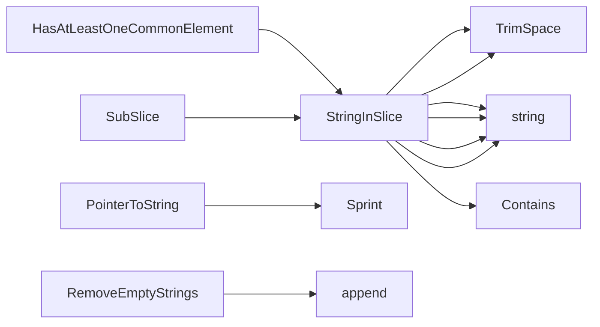

## Package stringhelper (github.com/redhat-best-practices-for-k8s/certsuite/pkg/stringhelper)

### Functions

- **HasAtLeastOneCommonElement** — func([]string, []string)(bool)
- **PointerToString** — func(*T)(string)
- **RemoveEmptyStrings** — func([]string)([]string)
- **StringInSlice** — func([]T, T, bool)(bool)
- **SubSlice** — func([]string, []string)(bool)

### Call graph (exported symbols, partial)

### Symbol docs

- [function HasAtLeastOneCommonElement](symbols/function_HasAtLeastOneCommonElement.md)
- [function PointerToString](symbols/function_PointerToString.md)
- [function RemoveEmptyStrings](symbols/function_RemoveEmptyStrings.md)
- [function StringInSlice](symbols/function_StringInSlice.md)
- [function SubSlice](symbols/function_SubSlice.md)
