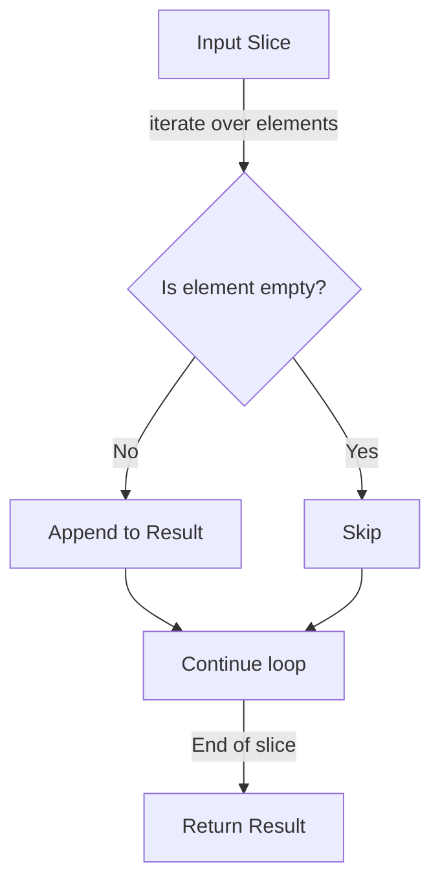

RemoveEmptyStrings`

**Package:** `github.com/redhat-best-practices-for-k8s/certsuite/pkg/stringhelper`  
**File:** `stringhelper.go` (line 60)  
**Signature:** `func RemoveEmptyStrings([]string) []string`

## Purpose
`RemoveEmptyStrings` takes a slice of strings and returns a new slice that contains only the non‑empty entries. It is used wherever callers need to filter out zero‑value or whitespace‑only strings before further processing (e.g., normalizing input lists, preparing command arguments, etc.).

## Inputs
| Parameter | Type | Description |
|-----------|------|-------------|
| `s` | `[]string` | The source slice that may contain empty (`""`) elements. |

> **Note:** The function does not modify the original slice; it constructs a new one.

## Outputs
| Return value | Type | Description |
|--------------|------|-------------|
| `[]string` | A slice containing all non‑empty strings from `s`, preserving their relative order. |

If the input contains no empty elements, the returned slice is identical in content to the input (though a new underlying array is allocated).

## Key Dependencies
- **Built‑in `append`.** The function iterates over `s` and appends each non‑empty element to an initially empty result slice.

No external packages or global state are referenced.

## Side Effects
- None. The function only reads from its argument and produces a new slice; no globals, I/O, or network interactions occur.

## Package Context
Within the **stringhelper** package, `RemoveEmptyStrings` is one of several small utility helpers that operate on string collections. It complements other functions such as `Join`, `Trim`, etc., providing a straightforward way to cleanse input before further manipulation. Its simplicity makes it suitable for use in higher‑level logic without imposing performance or memory overhead beyond the minimal allocation required for the result slice.

---

### Suggested Mermaid Diagram

This diagram illustrates the linear filtering process performed by `RemoveEmptyStrings`.
