## Package testhelper (github.com/redhat-best-practices-for-k8s/certsuite/pkg/testhelper)

### Structs

- **FailureReasonOut** (exported) — 2 fields, 1 methods
- **ReportObject** (exported) — 3 fields, 3 methods

### Functions

- **Equal** — func([]*ReportObject, []*ReportObject)(bool)
- **FailureReasonOut.Equal** — func(FailureReasonOut)(bool)
- **FailureReasonOutTestString** — func(FailureReasonOut)(string)
- **GetDaemonSetFailedToSpawnSkipFn** — func(*provider.TestEnvironment)(func() (bool, string))
- **GetNoAffinityRequiredPodsSkipFn** — func(*provider.TestEnvironment)(func() (bool, string))
- **GetNoBareMetalNodesSkipFn** — func(*provider.TestEnvironment)(func() (bool, string))
- **GetNoCPUPinningPodsSkipFn** — func(*provider.TestEnvironment)(func() (bool, string))
- **GetNoCatalogSourcesSkipFn** — func(*provider.TestEnvironment)(func() (bool, string))
- **GetNoContainersUnderTestSkipFn** — func(*provider.TestEnvironment)(func() (bool, string))
- **GetNoCrdsUnderTestSkipFn** — func(*provider.TestEnvironment)(func() (bool, string))
- **GetNoDeploymentsUnderTestSkipFn** — func(*provider.TestEnvironment)(func() (bool, string))
- **GetNoGuaranteedPodsWithExclusiveCPUsSkipFn** — func(*provider.TestEnvironment)(func() (bool, string))
- **GetNoHugepagesPodsSkipFn** — func(*provider.TestEnvironment)(func() (bool, string))
- **GetNoIstioSkipFn** — func(*provider.TestEnvironment)(func() (bool, string))
- **GetNoNamespacesSkipFn** — func(*provider.TestEnvironment)(func() (bool, string))
- **GetNoNodesWithRealtimeKernelSkipFn** — func(*provider.TestEnvironment)(func() (bool, string))
- **GetNoOperatorCrdsSkipFn** — func(*provider.TestEnvironment)(func() (bool, string))
- **GetNoOperatorPodsSkipFn** — func(*provider.TestEnvironment)(func() (bool, string))
- **GetNoOperatorsSkipFn** — func(*provider.TestEnvironment)(func() (bool, string))
- **GetNoPersistentVolumeClaimsSkipFn** — func(*provider.TestEnvironment)(func() (bool, string))
- **GetNoPersistentVolumesSkipFn** — func(*provider.TestEnvironment)(func() (bool, string))
- **GetNoPodsUnderTestSkipFn** — func(*provider.TestEnvironment)(func() (bool, string))
- **GetNoRolesSkipFn** — func(*provider.TestEnvironment)(func() (bool, string))
- **GetNoSRIOVPodsSkipFn** — func(*provider.TestEnvironment)(func() (bool, string))
- **GetNoServicesUnderTestSkipFn** — func(*provider.TestEnvironment)(func() (bool, string))
- **GetNoStatefulSetsUnderTestSkipFn** — func(*provider.TestEnvironment)(func() (bool, string))
- **GetNoStorageClassesSkipFn** — func(*provider.TestEnvironment)(func() (bool, string))
- **GetNonOCPClusterSkipFn** — func()(func() (bool, string))
- **GetNotEnoughWorkersSkipFn** — func(*provider.TestEnvironment, int)(func() (bool, string))
- **GetNotIntrusiveSkipFn** — func(*provider.TestEnvironment)(func() (bool, string))
- **GetPodsWithoutAffinityRequiredLabelSkipFn** — func(*provider.TestEnvironment)(func() (bool, string))
- **GetSharedProcessNamespacePodsSkipFn** — func(*provider.TestEnvironment)(func() (bool, string))
- **NewCatalogSourceReportObject** — func(string, string, string, bool)(*ReportObject)
- **NewCertifiedContainerReportObject** — func(provider.ContainerImageIdentifier, string, bool)(*ReportObject)
- **NewClusterOperatorReportObject** — func(string, string, bool)(*ReportObject)
- **NewClusterVersionReportObject** — func(string, string, bool)(*ReportObject)
- **NewContainerReportObject** — func(string, string, string, string, bool)(*ReportObject)
- **NewCrdReportObject** — func(string, string, string, bool)(*ReportObject)
- **NewDeploymentReportObject** — func(string, string, string, bool)(*ReportObject)
- **NewHelmChartReportObject** — func(string, string, string, bool)(*ReportObject)
- **NewNamespacedNamedReportObject** — func(string, string, bool, string, string)(*ReportObject)
- **NewNamespacedReportObject** — func(string, string, bool, string)(*ReportObject)
- **NewNodeReportObject** — func(string, string, bool)(*ReportObject)
- **NewOperatorReportObject** — func(string, string, string, bool)(*ReportObject)
- **NewPodReportObject** — func(string, string, string, bool)(*ReportObject)
- **NewReportObject** — func(string, string, bool)(*ReportObject)
- **NewStatefulSetReportObject** — func(string, string, string, bool)(*ReportObject)
- **NewTaintReportObject** — func(string, string, string, bool)(*ReportObject)
- **ReportObject.AddField** — func(string, string)(*ReportObject)
- **ReportObject.SetContainerProcessValues** — func(string, string, string)(*ReportObject)
- **ReportObject.SetType** — func(string)(*ReportObject)
- **ReportObjectTestString** — func([]*ReportObject)(string)
- **ReportObjectTestStringPointer** — func([]*ReportObject)(string)
- **ResultObjectsToString** — func([]*ReportObject, []*ReportObject)(string, error)
- **ResultToString** — func(int)(string)

### Globals

- **AbortTrigger**: string

### Call graph (exported symbols, partial)

```mermaid
graph LR
  Equal --> len
  Equal --> len
  Equal --> len
  Equal --> DeepEqual
  FailureReasonOut_Equal --> Equal
  FailureReasonOut_Equal --> Equal
  FailureReasonOutTestString --> Sprintf
  FailureReasonOutTestString --> ReportObjectTestStringPointer
  FailureReasonOutTestString --> Sprintf
  FailureReasonOutTestString --> ReportObjectTestStringPointer
  GetNoAffinityRequiredPodsSkipFn --> len
  GetNoAffinityRequiredPodsSkipFn --> GetAffinityRequiredPods
  GetNoBareMetalNodesSkipFn --> len
  GetNoBareMetalNodesSkipFn --> GetBaremetalNodes
  GetNoCPUPinningPodsSkipFn --> len
  GetNoCPUPinningPodsSkipFn --> GetCPUPinningPodsWithDpdk
  GetNoCatalogSourcesSkipFn --> len
  GetNoContainersUnderTestSkipFn --> len
  GetNoCrdsUnderTestSkipFn --> len
  GetNoDeploymentsUnderTestSkipFn --> len
  GetNoGuaranteedPodsWithExclusiveCPUsSkipFn --> len
  GetNoGuaranteedPodsWithExclusiveCPUsSkipFn --> GetGuaranteedPodsWithExclusiveCPUs
  GetNoHugepagesPodsSkipFn --> len
  GetNoHugepagesPodsSkipFn --> GetHugepagesPods
  GetNoNamespacesSkipFn --> len
  GetNoNodesWithRealtimeKernelSkipFn --> IsRTKernel
  GetNoOperatorCrdsSkipFn --> len
  GetNoOperatorPodsSkipFn --> len
  GetNoOperatorsSkipFn --> len
  GetNoPersistentVolumeClaimsSkipFn --> len
  GetNoPersistentVolumesSkipFn --> len
  GetNoPodsUnderTestSkipFn --> len
  GetNoRolesSkipFn --> len
  GetNoSRIOVPodsSkipFn --> GetPodsUsingSRIOV
  GetNoSRIOVPodsSkipFn --> Sprintf
  GetNoSRIOVPodsSkipFn --> len
  GetNoServicesUnderTestSkipFn --> len
  GetNoStatefulSetsUnderTestSkipFn --> len
  GetNoStorageClassesSkipFn --> len
  GetNonOCPClusterSkipFn --> IsOCPCluster
  GetNotEnoughWorkersSkipFn --> GetWorkerCount
  GetNotIntrusiveSkipFn --> IsIntrusive
  GetPodsWithoutAffinityRequiredLabelSkipFn --> len
  GetPodsWithoutAffinityRequiredLabelSkipFn --> GetPodsWithoutAffinityRequiredLabel
  GetSharedProcessNamespacePodsSkipFn --> len
  GetSharedProcessNamespacePodsSkipFn --> GetShareProcessNamespacePods
  NewCatalogSourceReportObject --> NewReportObject
  NewCatalogSourceReportObject --> AddField
  NewCatalogSourceReportObject --> AddField
  NewCertifiedContainerReportObject --> NewReportObject
  NewCertifiedContainerReportObject --> AddField
  NewCertifiedContainerReportObject --> AddField
  NewCertifiedContainerReportObject --> AddField
  NewCertifiedContainerReportObject --> AddField
  NewClusterOperatorReportObject --> NewReportObject
  NewClusterOperatorReportObject --> AddField
  NewClusterVersionReportObject --> NewReportObject
  NewClusterVersionReportObject --> AddField
  NewContainerReportObject --> NewReportObject
  NewContainerReportObject --> AddField
  NewContainerReportObject --> AddField
  NewContainerReportObject --> AddField
  NewCrdReportObject --> NewReportObject
  NewCrdReportObject --> AddField
  NewCrdReportObject --> AddField
  NewDeploymentReportObject --> NewReportObject
  NewDeploymentReportObject --> AddField
  NewDeploymentReportObject --> AddField
  NewHelmChartReportObject --> NewReportObject
  NewHelmChartReportObject --> AddField
  NewHelmChartReportObject --> AddField
  NewNamespacedNamedReportObject --> AddField
  NewNamespacedNamedReportObject --> AddField
  NewNamespacedNamedReportObject --> NewReportObject
  NewNamespacedReportObject --> AddField
  NewNamespacedReportObject --> NewReportObject
  NewNodeReportObject --> NewReportObject
  NewNodeReportObject --> AddField
  NewOperatorReportObject --> NewReportObject
  NewOperatorReportObject --> AddField
  NewOperatorReportObject --> AddField
  NewPodReportObject --> NewReportObject
  NewPodReportObject --> AddField
  NewPodReportObject --> AddField
  NewReportObject --> AddField
  NewReportObject --> AddField
  NewStatefulSetReportObject --> NewReportObject
  NewStatefulSetReportObject --> AddField
  NewStatefulSetReportObject --> AddField
  NewTaintReportObject --> NewReportObject
  NewTaintReportObject --> AddField
  NewTaintReportObject --> AddField
  ReportObject_AddField --> append
  ReportObject_AddField --> append
  ReportObject_SetContainerProcessValues --> AddField
  ReportObject_SetContainerProcessValues --> AddField
  ReportObject_SetContainerProcessValues --> AddField
  ReportObjectTestString --> Sprintf
  ReportObjectTestStringPointer --> Sprintf
  ResultObjectsToString --> Marshal
  ResultObjectsToString --> Errorf
  ResultObjectsToString --> string
```

### Symbol docs

- [struct FailureReasonOut](symbols/struct_FailureReasonOut.md)
- [struct ReportObject](symbols/struct_ReportObject.md)
- [function Equal](symbols/function_Equal.md)
- [function FailureReasonOut.Equal](symbols/function_FailureReasonOut_Equal.md)
- [function FailureReasonOutTestString](symbols/function_FailureReasonOutTestString.md)
- [function GetDaemonSetFailedToSpawnSkipFn](symbols/function_GetDaemonSetFailedToSpawnSkipFn.md)
- [function GetNoAffinityRequiredPodsSkipFn](symbols/function_GetNoAffinityRequiredPodsSkipFn.md)
- [function GetNoBareMetalNodesSkipFn](symbols/function_GetNoBareMetalNodesSkipFn.md)
- [function GetNoCPUPinningPodsSkipFn](symbols/function_GetNoCPUPinningPodsSkipFn.md)
- [function GetNoCatalogSourcesSkipFn](symbols/function_GetNoCatalogSourcesSkipFn.md)
- [function GetNoContainersUnderTestSkipFn](symbols/function_GetNoContainersUnderTestSkipFn.md)
- [function GetNoCrdsUnderTestSkipFn](symbols/function_GetNoCrdsUnderTestSkipFn.md)
- [function GetNoDeploymentsUnderTestSkipFn](symbols/function_GetNoDeploymentsUnderTestSkipFn.md)
- [function GetNoGuaranteedPodsWithExclusiveCPUsSkipFn](symbols/function_GetNoGuaranteedPodsWithExclusiveCPUsSkipFn.md)
- [function GetNoHugepagesPodsSkipFn](symbols/function_GetNoHugepagesPodsSkipFn.md)
- [function GetNoIstioSkipFn](symbols/function_GetNoIstioSkipFn.md)
- [function GetNoNamespacesSkipFn](symbols/function_GetNoNamespacesSkipFn.md)
- [function GetNoNodesWithRealtimeKernelSkipFn](symbols/function_GetNoNodesWithRealtimeKernelSkipFn.md)
- [function GetNoOperatorCrdsSkipFn](symbols/function_GetNoOperatorCrdsSkipFn.md)
- [function GetNoOperatorPodsSkipFn](symbols/function_GetNoOperatorPodsSkipFn.md)
- [function GetNoOperatorsSkipFn](symbols/function_GetNoOperatorsSkipFn.md)
- [function GetNoPersistentVolumeClaimsSkipFn](symbols/function_GetNoPersistentVolumeClaimsSkipFn.md)
- [function GetNoPersistentVolumesSkipFn](symbols/function_GetNoPersistentVolumesSkipFn.md)
- [function GetNoPodsUnderTestSkipFn](symbols/function_GetNoPodsUnderTestSkipFn.md)
- [function GetNoRolesSkipFn](symbols/function_GetNoRolesSkipFn.md)
- [function GetNoSRIOVPodsSkipFn](symbols/function_GetNoSRIOVPodsSkipFn.md)
- [function GetNoServicesUnderTestSkipFn](symbols/function_GetNoServicesUnderTestSkipFn.md)
- [function GetNoStatefulSetsUnderTestSkipFn](symbols/function_GetNoStatefulSetsUnderTestSkipFn.md)
- [function GetNoStorageClassesSkipFn](symbols/function_GetNoStorageClassesSkipFn.md)
- [function GetNonOCPClusterSkipFn](symbols/function_GetNonOCPClusterSkipFn.md)
- [function GetNotEnoughWorkersSkipFn](symbols/function_GetNotEnoughWorkersSkipFn.md)
- [function GetNotIntrusiveSkipFn](symbols/function_GetNotIntrusiveSkipFn.md)
- [function GetPodsWithoutAffinityRequiredLabelSkipFn](symbols/function_GetPodsWithoutAffinityRequiredLabelSkipFn.md)
- [function GetSharedProcessNamespacePodsSkipFn](symbols/function_GetSharedProcessNamespacePodsSkipFn.md)
- [function NewCatalogSourceReportObject](symbols/function_NewCatalogSourceReportObject.md)
- [function NewCertifiedContainerReportObject](symbols/function_NewCertifiedContainerReportObject.md)
- [function NewClusterOperatorReportObject](symbols/function_NewClusterOperatorReportObject.md)
- [function NewClusterVersionReportObject](symbols/function_NewClusterVersionReportObject.md)
- [function NewContainerReportObject](symbols/function_NewContainerReportObject.md)
- [function NewCrdReportObject](symbols/function_NewCrdReportObject.md)
- [function NewDeploymentReportObject](symbols/function_NewDeploymentReportObject.md)
- [function NewHelmChartReportObject](symbols/function_NewHelmChartReportObject.md)
- [function NewNamespacedNamedReportObject](symbols/function_NewNamespacedNamedReportObject.md)
- [function NewNamespacedReportObject](symbols/function_NewNamespacedReportObject.md)
- [function NewNodeReportObject](symbols/function_NewNodeReportObject.md)
- [function NewOperatorReportObject](symbols/function_NewOperatorReportObject.md)
- [function NewPodReportObject](symbols/function_NewPodReportObject.md)
- [function NewReportObject](symbols/function_NewReportObject.md)
- [function NewStatefulSetReportObject](symbols/function_NewStatefulSetReportObject.md)
- [function NewTaintReportObject](symbols/function_NewTaintReportObject.md)
- [function ReportObject.AddField](symbols/function_ReportObject_AddField.md)
- [function ReportObject.SetContainerProcessValues](symbols/function_ReportObject_SetContainerProcessValues.md)
- [function ReportObject.SetType](symbols/function_ReportObject_SetType.md)
- [function ReportObjectTestString](symbols/function_ReportObjectTestString.md)
- [function ReportObjectTestStringPointer](symbols/function_ReportObjectTestStringPointer.md)
- [function ResultObjectsToString](symbols/function_ResultObjectsToString.md)
- [function ResultToString](symbols/function_ResultToString.md)
