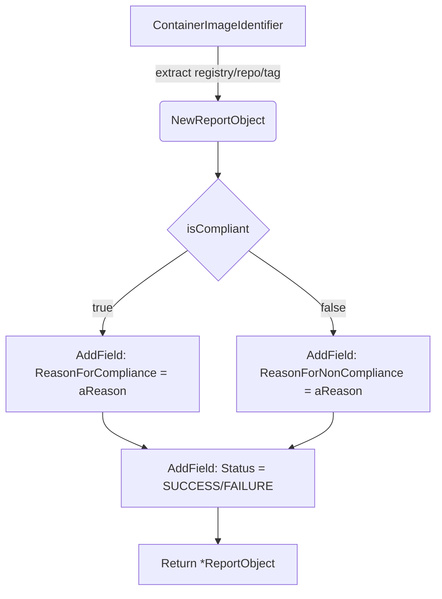

NewCertifiedContainerReportObject`

| Aspect | Detail |
|--------|--------|
| **Purpose** | Creates a fully‑populated report object that represents the result of running a compliance check against a *certified* container image. The helper packages the image metadata, reason text and compliance flag into a `ReportObject` that can be serialized or logged by the test harness. |
| **Signature** | `func NewCertifiedContainerReportObject(id provider.ContainerImageIdentifier, aReason string, isCompliant bool) *ReportObject` |
| **Parameters** | - `id`: A value of type `provider.ContainerImageIdentifier`.  It contains the image’s registry, repository and tag (or digest).  The function uses this to fill the report fields that identify the container. <br> - `aReason`: Human‑readable text explaining why the check passed or failed.  This is stored in the report for diagnostics.<br> - `isCompliant`: Boolean flag indicating whether the container met all compliance requirements. |
| **Return value** | A pointer to a freshly allocated `ReportObject` populated with:<br> * The image identifier fields (`ImageRegistry`, `ImageRepo`, `ImageTag`).<br> * The `ReasonForCompliance` or `ReasonForNonCompliance` field, chosen based on the boolean.<br> * The `Status` field set to one of the exported constants (`SUCCESS`/`FAILURE`) and the corresponding `Error` if not compliant. |
| **Key dependencies** | - `NewReportObject`: Helper that creates an empty report skeleton. <br>- `AddField`: Methods on `*ReportObject` used to inject each field into the underlying data structure.  These calls populate the fields defined in the constants list (e.g., `ImageRegistry`, `ReasonForCompliance`). |
| **Side effects** | No global state is modified; only the newly created object is returned. The function may log or panic if any of the `AddField` calls fail internally, but that behaviour depends on the implementation of `ReportObject`. |
| **Package context** | Part of the `testhelper` package in `github.com/redhat-best-practices-for-k8s/certsuite/pkg/testhelper`.  It is intended for use by unit and integration tests that validate compliance rules against container images. The report object produced can be consumed by other test helpers or persisted to a file/console for audit purposes. |

#### Flow of data



#### Usage example

```go
id := provider.ContainerImageIdentifier{
    Registry: "quay.io",
    Repo:     "myorg/myapp",
    Tag:      "v1.2.3",
}
report := testhelper.NewCertifiedContainerReportObject(id, "All checks passed", true)
// report can now be marshalled to JSON or logged
```

This function centralises the logic for turning compliance results into a structured report, ensuring consistency across all tests that involve certified container images.
