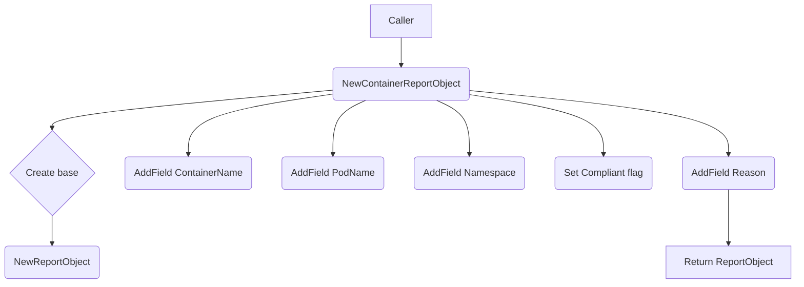

NewContainerReportObject`

**Package**  
`github.com/redhat‑best‑practices‑for‑k8s/certsuite/pkg/testhelper`

### Purpose
Creates a fully‑populated `ReportObject` that represents the result of a compliance check performed on a **container**.  
The object contains all fields required by the reporting subsystem to identify the container, describe the test outcome, and embed any explanatory text.

### Signature

```go
func NewContainerReportObject(
    namespace string,
    podName string,
    containerName string,
    reason string,
    compliant bool,
) *ReportObject
```

| Parameter | Type   | Meaning |
|-----------|--------|---------|
| `namespace`      | `string` | Kubernetes namespace that holds the pod. |
| `podName`        | `string` | Name of the pod containing the container. |
| `containerName`  | `string` | Name of the container being reported on. |
| `reason`         | `string` | Human‑readable description of why the test passed or failed. |
| `compliant`      | `bool`   | Flag indicating if the container satisfies the policy (true = compliant). |

### Implementation Flow

1. **Create base object**  
   Calls `NewReportObject()` to obtain a fresh `ReportObject`.  
   *This function initializes common fields such as ID, timestamps, and an empty field map.*

2. **Populate container‑specific fields**  
   Uses three calls to `AddField` (inherited from `ReportObject`) to insert:
   - `ContainerName`  – the name of the container.
   - `PodName`        – the pod that hosts it.
   - `Namespace`      – the namespace in which the pod lives.

3. **Set compliance status**  
   The returned object’s `Compliant` field is set to the value of `compliant`.

4. **Attach reason**  
   Adds a final field using `AddField` with key `ReasonForCompliance` or `ReasonForNonCompliance`
   depending on the boolean flag.  The `reason` string supplied by the caller becomes the
   value.

5. **Return**  
   A pointer to the fully‑populated `ReportObject`.

### Dependencies

| Dependency | Role |
|------------|------|
| `NewReportObject()` | Provides a baseline `ReportObject`. |
| `AddField()` | Appends key/value pairs into the report’s internal map. |

These helpers are defined elsewhere in the same package and operate on the `ReportObject` struct.

### Side Effects & Constraints

* **No I/O** – purely in‑memory construction; no external calls or state changes.
* **Thread safety** – each invocation creates a new object, so concurrent usage is safe.
* **Field names** are constants defined in the package (`ContainerName`, `PodName`, etc.), ensuring consistency across reports.

### Package Context

`testhelper` supplies utilities for generating structured compliance reports that are later serialized to JSON or other formats.  
`NewContainerReportObject` is used by test cases that evaluate container policies (e.g., image digests, port exposure) and need a convenient way to record results with all required metadata.

--- 

**Mermaid diagram suggestion**



This diagram shows the high‑level steps performed by `NewContainerReportObject`.
