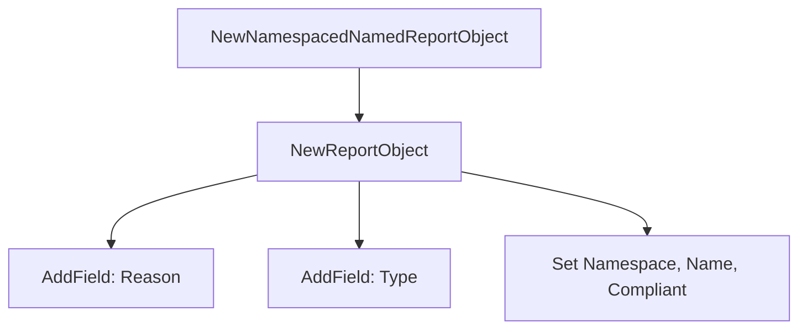

NewNamespacedNamedReportObject`

| Item | Detail |
|------|--------|
| **Package** | `testhelper` (`github.com/redhat-best-practices-for-k8s/certsuite/pkg/testhelper`) |
| **Signature** | `func NewNamespacedNamedReportObject(reason, reportType string, compliant bool, namespace, name string) *ReportObject` |
| **Exported** | ✅ |

### Purpose
Creates a single *named* report object that lives inside a specific Kubernetes namespace.  
It is used by the test‑suite when reporting on a particular resource (e.g., a Pod or Deployment).  

The function builds a `ReportObject` with the following fields set:

| Field | Value supplied |
|-------|----------------|
| `ReasonForCompliance` / `ReasonForNonCompliance` | `reason` |
| `Type` | `reportType` |
| `Compliant` | `compliant` |
| `Namespace` | `namespace` |
| `Name` | `name` |

All other fields are left unset (zero value).  
The object is returned by reference, so callers can mutate it further if needed.

### Parameters
| Name | Type | Description |
|------|------|-------------|
| `reason` | `string` | Text explaining why the resource is compliant or not. |
| `reportType` | `string` | The category of report (e.g., `"Compliance"`, `"NonCompliance"`). |
| `compliant` | `bool` | `true` if the resource meets expectations; otherwise `false`. |
| `namespace` | `string` | Kubernetes namespace that contains the resource. |
| `name` | `string` | Name of the resource being reported on. |

### Return Value
* `*ReportObject` – a pointer to the newly created report object.

### Dependencies & Side‑Effects

| Called Function | Effect |
|-----------------|--------|
| `NewReportObject()` | Instantiates an empty `ReportObject`. |
| `AddField()` (twice) | Sets the `ReasonForCompliance` / `ReasonForNonCompliance` and `Type` fields. |

No global state is modified, no I/O occurs; the function is pure aside from allocating a new struct.

### Usage in the Package
`NewNamespacedNamedReportObject` is typically called inside test helpers that generate compliance reports for resources that are scoped to a namespace:

```go
// Example usage in a test helper
report := NewNamespacedNamedReportObject(
    "Pod has no privileged containers",
    "NonCompliance",
    false,
    "default",
    "nginx-pod")
```

The returned `ReportObject` can then be added to a report list or written to a file.

### Diagram (optional)



This function is a small convenience wrapper that reduces boilerplate when constructing report objects for namespaced resources.
