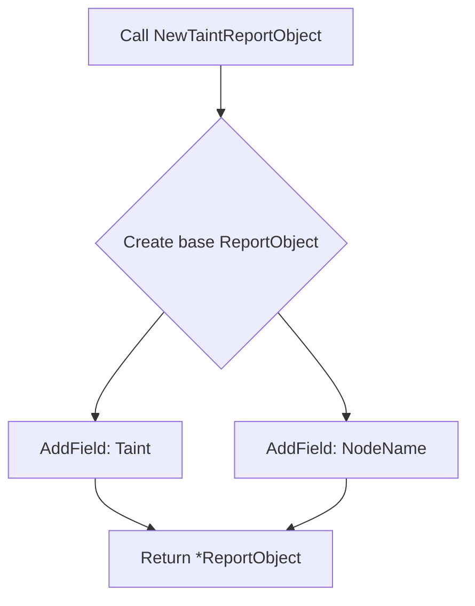

NewTaintReportObject`

| | |
|-|-|
| **Package** | `testhelper` |
| **Signature** | `func NewTaintReportObject(taintBit, nodeName, aReason string, isCompliant bool) *ReportObject` |
| **Exported** | ✅ |

### Purpose
Creates a ready‑to‑use `ReportObject` that describes the compliance status of a single Kubernetes taint on a node.  
The function encapsulates the common pattern used throughout the test suite when reporting taint checks:

1. A generic report object is created via `NewReportObject()`.
2. Two domain‑specific fields are added:
   * **Taint** – the bit value that identifies the taint (e.g., `"NoSchedule"`).
   * **NodeName** – the name of the node on which the taint was evaluated.
3. The object is returned for further enrichment or direct emission.

### Parameters

| Name | Type | Description |
|------|------|-------------|
| `taintBit` | `string` | Identifier of the taint bit (e.g., `"NoSchedule"`, `"PreferNoSchedule"`). |
| `nodeName` | `string` | The Kubernetes node name being evaluated. |
| `aReason` | `string` | Human‑readable reason for compliance or non‑compliance. |
| `isCompliant` | `bool` | Flag indicating whether the taint state meets the policy requirement. |

> **Note** – The `aReason`, `isCompliant`, and any other metadata are handled by `NewReportObject`; this function only attaches the taint‑specific fields.

### Returns

| Type | Description |
|------|-------------|
| `*ReportObject` | Pointer to a fully populated report object. The caller can further customize it or write it to a test output file. |

### Dependencies & Side Effects

| Dependency | Role |
|------------|------|
| `NewReportObject()` | Provides the base `ReportObject` structure, sets common fields (timestamp, test name, etc.). |
| `AddField()` (called twice) | Adds two key/value pairs (`Taint`, `NodeName`) to the report object. |

No global state is modified; the function operates purely on its arguments and returns a new object.

### Usage Context

`NewTaintReportObject` is used by test cases that validate node taint policies (e.g., ensuring critical nodes are not marked with `NoExecute`). The returned `ReportObject` can be passed to:

```go
report := NewTaintReportObject(bit, nodeName, reason, compliant)
WriteReport(report) // e.g. marshal to JSON and write to file
```

It keeps the test code DRY by centralizing taint‑specific field creation.

### Example

```go
taintBit   := "NoSchedule"
nodeName   := "worker-1"
reason     := "Node should not allow scheduling of privileged pods."
compliant  := false

reportObj := NewTaintReportObject(taintBit, nodeName, reason, compliant)
// reportObj now contains:
//   - Taint:   "NoSchedule"
//   - NodeName:"worker-1"
//   - other common fields from NewReportObject
```

### Related Items

* `NewReportObject` – base constructor for all test reports.
* `AddField` – helper to add custom key/value pairs to a report.
* Other *ReportObject* constructors in the same package (`NewPodReportObject`, `NewContainerReportObject`, etc.) follow the same pattern.

--- 

**Mermaid diagram (optional)**



This diagram visualizes the simple two‑step enrichment of a generic report into a taint‑specific one.
