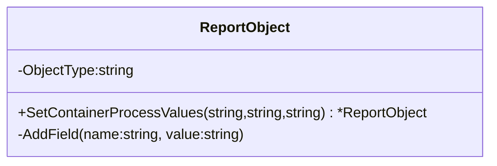

ReportObject.SetContainerProcessValues`

| Feature | Description |
|---------|-------------|
| **Signature** | `func (ro *ReportObject) SetContainerProcessValues(schedulingPolicy, schedulingPriority, commandLine string) *ReportObject` |
| **Exported?** | Yes (`SetContainerProcessValues`) |

### Purpose
Adds container‑process related data to a `ReportObject`.  
The method records three pieces of information that describe how a process is scheduled inside a container:

1. **Command line** – the exact command executed by the process.  
2. **Scheduling policy** – e.g., “BestEffort”, “Burstable”.  
3. **Scheduling priority** – numeric value or textual representation.

After populating these fields it tags the report entry as a *ContainerProcess* (`ContainerProcessType`).

### Parameters
| Name | Type | Role |
|------|------|------|
| `schedulingPolicy` | `string` | The scheduling policy string. |
| `schedulingPriority` | `string` | The scheduling priority value. |
| `commandLine` | `string` | The full command line of the process. |

### Return Value
*Returns a pointer to the same `ReportObject` instance*, enabling method chaining.

```go
ro := &ReportObject{}
ro.SetContainerProcessValues("BestEffort", "10", "/usr/bin/mycmd -v")
```

### Key Dependencies
- **`AddField(name, value)`** – A helper that appends a named field to the report object's internal map.  
  The method calls `AddField` three times:
  1. `"ProcessCommandLine"` → `commandLine`
  2. `"SchedulingPolicy"`   → `schedulingPolicy`
  3. `"SchedulingPriority"`→ `schedulingPriority`

- **`ContainerProcessType`** – A constant string (defined in the same package) used to set the report object's type.

### Side‑Effects
1. Mutates the receiver’s internal field map by adding three new entries.
2. Sets `ro.ObjectType = ContainerProcessType`.
3. No external I/O or state changes beyond the object itself.

### How It Fits the Package
`testhelper` is a collection of utilities that construct test data for CertSuite.  
`ReportObject` represents a generic compliance report entry; different methods populate it with specific resource details (pods, containers, processes, etc.).  
`SetContainerProcessValues` is part of the “container process” branch of this API and is typically called after discovering a process inside a container during test execution.

#### Usage Flow
```go
// 1. Discover process information from the cluster.
policy := "BestEffort"
priority := "10"
cmdLine := "/usr/bin/mycmd -v"

// 2. Create or reuse a ReportObject for this process.
ro := NewReportObject()
ro.SetContainerProcessValues(policy, priority, cmdLine)

// 3. Append `ro` to the report collection.
report.Add(ro)
```

This method keeps the construction logic encapsulated and allows fluent test code that reads naturally.

--- 

**Mermaid suggestion (optional)**



This diagram visualizes the method as part of `ReportObject` and its reliance on the internal `AddField` helper.
