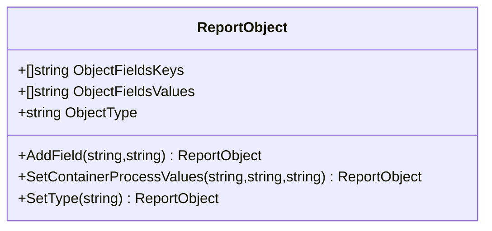

ReportObject` – a lightweight key/value container for test reports

| Item | Details |
|------|---------|
| **Package** | `github.com/redhat-best-practices-for-k8s/certsuite/pkg/testhelper` |
| **Location** | `testhelper.go:33` |
| **Exported** | ✅ |

### Purpose
`ReportObject` is a minimal, serialisable container used throughout the *certsuite* test‑helper package to build structured reports about Kubernetes objects (pods, nodes, operators, etc.).  
It holds:

1. **Key/value pairs** – arbitrary attributes that describe an object or a compliance check.
2. **A type label** – the semantic category of the report (`ContainerProcessType`, `ClusterOperatorType`, etc.).

The helper functions in the package (e.g., `NewPodReportObject`, `NewNodeReportObject`) all create and populate a `ReportObject`. The resulting slice of objects is then compared or marshalled by other test helpers.

### Fields

| Field | Type | Description |
|-------|------|-------------|
| `ObjectFieldsKeys`   | `[]string` | Ordered list of field names. Maintained in the same order as `ObjectFieldsValues`. |
| `ObjectFieldsValues` | `[]string` | Ordered list of field values. Each index corresponds to a key at the same position in `ObjectFieldsKeys`. |
| `ObjectType`         | `string`   | Semantic type of the report object (e.g., `"Pod"`, `"Node"`). Set by `NewReportObject` or overridden with `SetType`. |

### Methods

| Method | Signature | Purpose & Side‑Effects |
|--------|-----------|------------------------|
| `AddField(key, value string) *ReportObject` | Adds a key/value pair to the object. Appends to both slices and returns the modified object (allows chaining). No external side effects. |
| `SetContainerProcessValues(policy, priority, cmd string) *ReportObject` | Convenience for container‑process reports: adds three fields (`cmd`, `policy`, `priority`) and sets `ObjectType` to `ContainerProcessType`. Returns the updated object. |
| `SetType(aType string) *ReportObject` | Overwrites `ObjectType` with a new value. No other side effects. |

### Interaction with Package Functions

All constructor helpers (`NewCatalogSourceReportObject`, `NewDeploymentReportObject`, etc.) call:

1. `NewReportObject(reason, type, isCompliant)` – creates the base object and injects a compliance reason field.
2. One or more `AddField` calls to add entity‑specific data (namespace, name, version, etc.).

Because `AddField` mutates the slices directly, the order of fields is deterministic, which simplifies equality checks (`Equal`) and string formatting (`ReportObjectTestString*`).  

The `ResultObjectsToString` helper serialises a pair of report slices to JSON for diffing. It relies on `Marshal`, so the struct must be JSON‑serialisable; the simple field layout ensures that.

### Mermaid diagram (suggestion)

### Summary

`ReportObject` is a thin, order‑preserving container that:

- **Encapsulates** arbitrary attributes of test subjects.
- **Carries** a type label for semantic grouping.
- **Provides** mutating helpers used by the package’s constructors.

Its simplicity keeps the test helper lightweight while enabling structured comparison and JSON serialization of compliance results.
