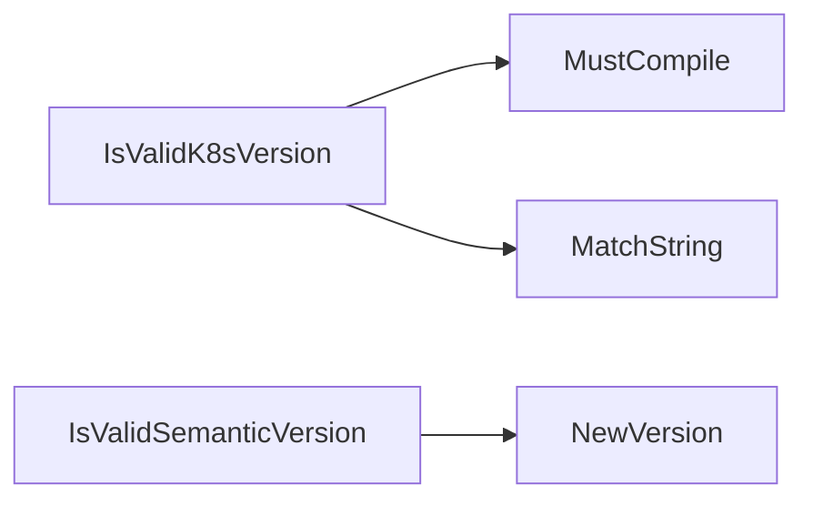

## Package versions (github.com/redhat-best-practices-for-k8s/certsuite/pkg/versions)

### Functions

- **GitVersion** — func()(string)
- **IsValidK8sVersion** — func(string)(bool)
- **IsValidSemanticVersion** — func(string)(bool)

### Globals

- **ClaimFormatVersion**: string
- **GitCommit**: string
- **GitDisplayRelease**: string
- **GitPreviousRelease**: string
- **GitRelease**: string

### Call graph (exported symbols, partial)

### Symbol docs

- [function GitVersion](symbols/function_GitVersion.md)
- [function IsValidK8sVersion](symbols/function_IsValidK8sVersion.md)
- [function IsValidSemanticVersion](symbols/function_IsValidSemanticVersion.md)
