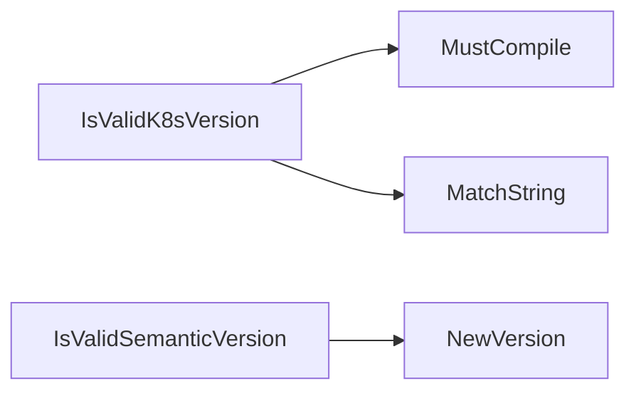

## Package versions (github.com/redhat-best-practices-for-k8s/certsuite/pkg/versions)

# `github.com/redhat-best-practices-for-k8s/certsuite/pkg/versions`

The **`versions`** package provides a small, self‑contained API for exposing build‑time metadata and performing basic semantic version checks.

> *All functions are read‑only; the package does not modify global state.*

---

## Global variables (build‑time values)

| Variable | Type   | Exported? | Typical usage |
|----------|--------|-----------|---------------|
| `GitCommit`          | `string` | ✅ | The Git commit hash that produced the binary. Populated by the build system (`-ldflags`). |
| `GitRelease`         | `string` | ✅ | Full release string (e.g., `"v1.2.3"`). |
| `GitPreviousRelease` | `string` | ✅ | Previous release tag, used as a fallback when the current binary is not a formal release. |
| `GitDisplayRelease`  | `string` | ✅ | Human‑friendly display string (may be a pre‑release or branch name). |
| `ClaimFormatVersion` | `string` | ✅ | A constant that indicates the format version for claims; not used in this file but exported for other packages. |

These variables are intended to be injected at compile time, allowing runtime code to report its exact build information without hard‑coding values.

---

## Key functions

| Function | Signature | Purpose | How it works |
|----------|-----------|---------|--------------|
| `GitVersion()` | `func() string` | Returns the version that should be shown to a user. | 1. If the binary was built from a released tag (`GitRelease != ""`) and the current commit matches that release, return `GitDisplayRelease`. <br>2. Otherwise, fall back to `GitPreviousRelease` (the most recent known release). |
| `IsValidSemanticVersion(v string) bool` | `func(string) bool` | Checks whether a string is a valid [semantic version](https://semver.org/). | Calls `semver.NewVersion(v)`; if no error, the string parses as a semantic version. |
| `IsValidK8sVersion(v string) bool` | `func(string) bool` | Validates that a string matches the Kubernetes‑style version pattern (`v1.x.y`). | Uses a regular expression: `^v\d+\.\d+(\.\d+)?$`. Returns true if the regex matches. |

> **Note**: The functions perform only lightweight checks; they do not compare against any internal list of supported versions.

---

## How the pieces connect

```mermaid
graph LR
  GitCommit -->|build flag| GitRelease
  GitCommit -->|build flag| GitPreviousRelease
  GitCommit -->|build flag| GitDisplayRelease
  subgraph UserInterface
    GitVersion() -- shows version --> UI
  end
  IsValidSemanticVersion(v) -- validates semantic string --> ValidationLayer
  IsValidK8sVersion(v) -- validates k8s style string --> ValidationLayer
```

1. **Build phase**: The CI pipeline injects values into the globals via `-ldflags`.  
2. **Runtime**: When a user queries the version (e.g., via `--version` flag), `GitVersion()` decides which value to expose.  
3. **Validation helpers** (`IsValidSemanticVersion`, `IsValidK8sVersion`) are used by other packages that need to confirm that input strings conform to expected formats.

---

## Usage example

```go
import "github.com/redhat-best-practices-for-k8s/certsuite/pkg/versions"

func main() {
    fmt.Println("Certsuite", versions.GitVersion())

    if !versions.IsValidSemanticVersion(versions.GitRelease) {
        log.Fatal("Invalid release version")
    }
}
```

---

### Summary

- **Globals** hold build metadata, injected at compile time.  
- `GitVersion()` provides a user‑facing string that chooses between the current or previous release.  
- Two lightweight validators ensure strings follow semantic or Kubernetes version conventions.  

These utilities keep the rest of the codebase agnostic to how version information is supplied while still allowing precise reporting and basic validation.

### Functions

- **GitVersion** — func()(string)
- **IsValidK8sVersion** — func(string)(bool)
- **IsValidSemanticVersion** — func(string)(bool)

### Globals

- **ClaimFormatVersion**: string
- **GitCommit**: string
- **GitDisplayRelease**: string
- **GitPreviousRelease**: string
- **GitRelease**: string

### Call graph (exported symbols, partial)



### Symbol docs

- [function GitVersion](symbols/function_GitVersion.md)
- [function IsValidK8sVersion](symbols/function_IsValidK8sVersion.md)
- [function IsValidSemanticVersion](symbols/function_IsValidSemanticVersion.md)
