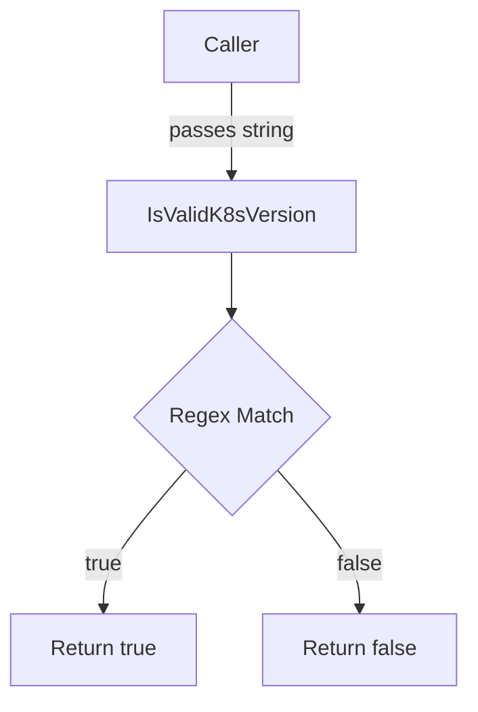

IsValidK8sVersion`

> **Location**: `pkg/versions/versions.go:43`  
> **Signature**: `func IsValidK8sVersion(version string) bool`

## Purpose
Validate that a given Kubernetes version string follows the expected semantic‑versioning pattern used by CertSuite. The function is part of the public API of the `versions` package, enabling callers (e.g., command‑line tools, controllers, or tests) to confirm whether an input can be safely treated as a legitimate Kubernetes release.

## Inputs & Outputs
| Parameter | Type   | Description |
|-----------|--------|-------------|
| `version` | `string` | The version string to validate. Expected format: `v<major>.<minor>` or `v<major>.<minor>.<patch>` where each component is a non‑negative integer (e.g., `"v1.22"`, `"v1.22.3"`). |

| Return | Type   | Description |
|--------|--------|-------------|
| `bool` | `true` if the string matches the pattern, otherwise `false`. |

## Implementation Details
```go
func IsValidK8sVersion(v string) bool {
    // The regular expression is compiled once at runtime. It matches:
    //   - a leading 'v'
    //   - one or more digits for major
    //   - a dot
    //   - one or more digits for minor
    //   - optional: dot + one or more digits (patch)
    re := regexp.MustCompile(`^v\d+\.\d+(\.\d+)?$`)
    return re.MatchString(v)
}
```
* **Dependencies**  
  * `regexp.MustCompile` – compiles the regex at call time. Since it is called on every invocation, the compiled pattern is discarded afterward; this keeps the function side‑effect free but slightly less efficient than caching the regex.
  * `regexp.MatchString` – performs the actual match.

* **Side Effects**  
  The function has no observable side effects: it does not modify global state, write to files, or perform I/O. It is pure and deterministic.

## Role in the Package
The `versions` package centralizes all build‑time metadata (Git commit, release tags) and runtime utilities for handling version strings.  
* **Validation** – `IsValidK8sVersion` ensures that user input or configuration values are well‑formed before further processing.  
* **Consistency** – By using a single regex throughout the project, the package guarantees consistent interpretation of Kubernetes versions across components.

## Usage Example
```go
if !versions.IsValidK8sVersion(userInput) {
    log.Fatalf("invalid Kubernetes version: %q", userInput)
}
```

---

### Mermaid Diagram (Optional)



This diagram illustrates the simple control flow of the validation function.
