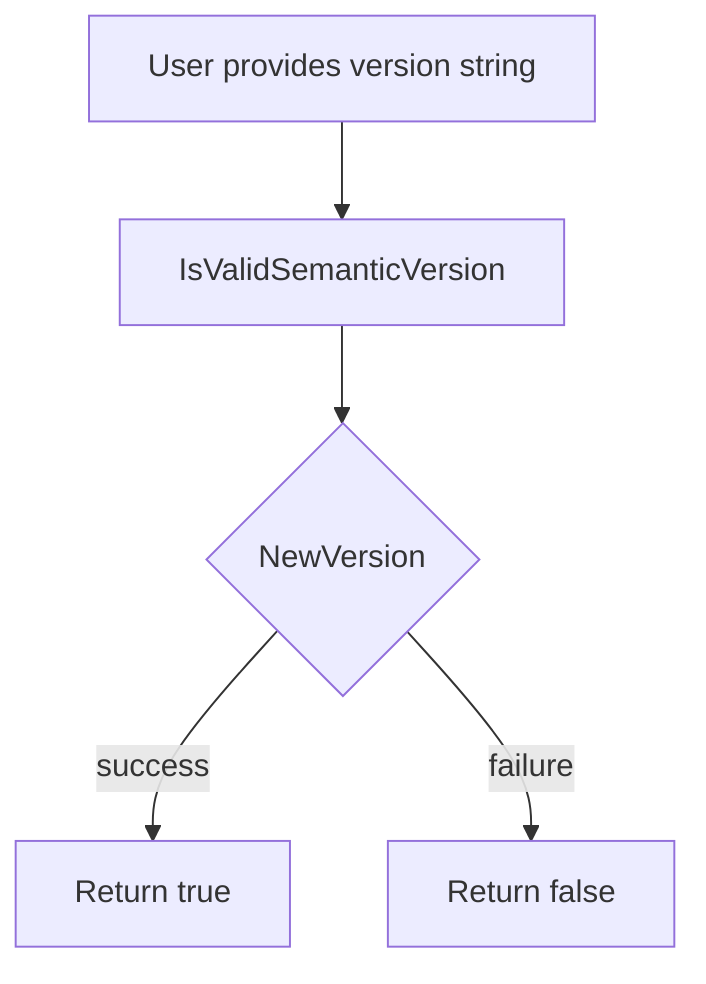

IsValidSemanticVersion` – Package **versions**

> **File:** `pkg/versions/versions.go`

---

## Overview

`IsValidSemanticVersion` is a small helper that validates whether a supplied string conforms to the Semantic‑Versioning 2.0.0 format (e.g., `"1.2.3"` or `"v1.2.3-alpha+001"`).  
It delegates parsing to `NewVersion`, which performs the actual syntax check and returns a `semver.Version` object when successful.

The function is part of the **versions** package, which holds build‑time metadata (Git commit hash, release tags, etc.) and utilities for working with version strings across CertSuite. It is exported so callers can quickly guard against malformed input before further processing or display.

---

## Signature

```go
func IsValidSemanticVersion(version string) bool
```

| Parameter | Type   | Description |
|-----------|--------|-------------|
| `version` | `string` | A raw version string to validate. |

| Return | Type   | Description |
|--------|--------|-------------|
| `bool` | `true` if the input is a valid Semantic‑Version, otherwise `false`. |

---

## Dependencies & Side Effects

- **Calls**: `NewVersion(version)` – the parser that implements the semantic‑version rules.  
  - If parsing succeeds, `IsValidSemanticVersion` returns `true`.
  - If parsing fails (returns an error), it returns `false`.

- **No global state is modified.** The function is purely functional.

---

## How It Fits Into the Package

| Global | Role |
|--------|------|
| `GitCommit`, `GitRelease`, `GitPreviousRelease`, `GitDisplayRelease` | Build‑time constants injected during CI, used for displaying version information in CLI or logs. |
| `ClaimFormatVersion` | The version string that must be validated against Semantic Versioning before it is stored in a claim. |

The package’s public API typically looks like:

```go
func NewVersion(v string) (*semver.Version, error)
func IsValidSemanticVersion(v string) bool // this function
```

`IsValidSemanticVersion` provides a convenient boolean interface for callers that only need to check validity (e.g., input validation in HTTP handlers or CLI flags). It keeps the caller free from error handling boilerplate.

---

## Usage Example

```go
if !versions.IsValidSemanticVersion(userInput) {
    log.Fatalf("invalid semantic version: %s", userInput)
}
```

This ensures that downstream logic (e.g., storing a claim or printing release info) receives a well‑formed version string.

---

## Suggested Diagram

A small flowchart illustrating the call chain:



---

**Key Takeaway:**  
`IsValidSemanticVersion` is a thin, read‑only wrapper that turns the result of `NewVersion` into a simple boolean flag, making it easy to guard against malformed version strings throughout the CertSuite codebase.
