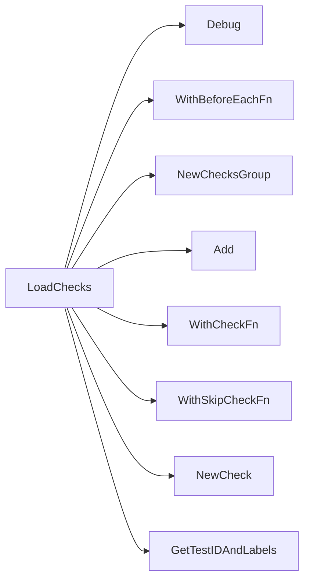

## Package accesscontrol (github.com/redhat-best-practices-for-k8s/certsuite/tests/accesscontrol)

# Access‑Control Test Suite – High‑level Overview

The **accesscontrol** package implements a large collection of compliance checks that are executed against a Kubernetes cluster during CertSuite runs.  
All checks live in `suite.go`; helper logic is split into small files (`pidshelper.go`, sub‑packages such as `namespace`, `resources`, etc.).

> **Key take‑away:** the suite builds a list of *check groups* (one per namespace or cluster‑wide category). Each group contains many *checks*.  
> A check receives a `*checksdb.Check` and a `*provider.TestEnvironment`. It populates report objects (pods, containers, namespaced resources) and sets a final result (`Pass/Fail`).  

---

## Global state

| Variable | Type | Purpose |
|----------|------|---------|
| `env *provider.TestEnvironment` | Holds the current test environment – contains API clients, context, cluster info. It is set by `BeforeEach`. | Used by every check via `GetLogger`, `GetClientsHolder`, etc. |
| `beforeEachFn func()` | A closure that runs before each group; currently it just logs a message. | Passed to `WithBeforeEachFn` when building groups. |
| `invalidNamespacePrefixes []string` | List of namespace prefixes considered invalid (e.g., “kube‑”, “openshift‑”). | Used by the *namespace* check. |
| `knownContainersToSkip []string` | Names of containers that should be ignored by certain checks (e.g., Istio sidecar). | Passed to skip functions like `GetNoContainersUnderTestSkipFn`. |

> No exported globals; all data is encapsulated inside the test environment.

---

## Core types

| Type | File | Role |
|------|------|------|
| `provider.TestEnvironment` | internal | Holds Kubernetes clients, namespace lists, and configuration for a test run. |
| `checksdb.Check` | pkg/checksdb | Represents a single compliance check: ID, title, description, tags, status, and result data. |
| `testhelper.ReportObject` | pkg/testhelper | Encapsulates the outcome of an individual *subject* (pod/namespace/container).  It can be a container report (`NewContainerReportObject`) or pod/namespaced object. |

The package does not define new structs; it relies on the above shared types.

---

## How checks are assembled

```go
func LoadChecks() () {
    // 1. Create a group for namespace‑level checks
    nsGroup := NewChecksGroup("namespace")
    nsGroup.Add(NewCheck(
        "CND-001",
        "Namespace prefix check",
        testNamespace,
        GetTestIDAndLabels(),
        GetNoContainersUnderTestSkipFn(knownContainersToSkip),
    ))

    // 2. Create a group for pod‑level checks
    podGroup := NewChecksGroup("pod")
    podGroup.Add(NewCheck(
        "CND-002",
        "Host network usage",
        testPodHostNetwork,
        GetTestIDAndLabels(),
        GetNoContainersUnderTestSkipFn(knownContainersToSkip),
    ))
    // … many more checks added in the same pattern …

    // 3. Add groups to the global registry
    RegisterGroup(nsGroup)
    RegisterGroup(podGroup)

    // 4. Attach a BeforeEach hook (logs test start)
    WithBeforeEachFn(beforeEachFn)
}
```

* `NewChecksGroup(name)` creates an empty group.
* `NewCheck(id, title, fn, getIDAndLabels, skipFn)` builds a check with metadata and the function that will be executed.
* `WithBeforeEachFn(fn)` registers a hook that runs before each check; it is used to set up context or log entry points.

---

## Typical check flow

1. **Entry point** – a test function such as `testPodHostNetwork` receives the shared `Check` and `TestEnvironment`.
2. **Gather data** – uses helper functions (`GetClientsHolder`, `GetLogger`, etc.) to fetch pods, containers, or resources.
3. **Evaluation loop** – iterates over each object, applies a rule, and creates a report object via `NewPodReportObject`, `NewContainerReportObject`, etc.
4. **Result aggregation** – calls `SetResult` on the check after all objects are processed.

Example: `testPodHostNetwork`

```go
func testPodHostNetwork(c *checksdb.Check, env *provider.TestEnvironment) {
    for _, pod := range GetPods(env) {
        if pod.Spec.HostNetwork {
            obj := NewPodReportObject(pod)
            obj.AddField("hostNetwork", true)
            c.SetResult(testhelper.Fail, append(...))
        } else {
            // compliant
        }
    }
}
```

---

## Helper functions

| Function | File | What it does |
|----------|------|--------------|
| `checkForbiddenCapability(containers []*provider.Container, cap string, log *log.Logger)` | suite.go | Checks whether any container uses a forbidden capability (e.g., SYS_ADMIN). Returns compliant/non‑compliant slices. |
| `isContainerCapabilitySet(cap *corev1.Capabilities, name string)` | suite.go | Helper that checks if a specific capability is listed in `cap.Add`. |
| `getNbOfProcessesInPidNamespace(ctx clientsholder.Context, pid int, cmd clientsholder.Command)` | pidshelper.go | Executes `ps -p <pid> -o nlwp=` inside the container and parses number of processes. |
| `isCSVAndClusterWide(name, ns string, env *provider.TestEnvironment)` | suite.go | Determines if a CSV (ClusterServiceVersion) is cluster‑wide by inspecting install modes. |
| `ownedByClusterWideOperator(owners map[string]podhelper.TopOwner, env *provider.TestEnvironment)` | suite.go | Checks if any owner is a cluster‑wide CSV. |

All helpers return simple values; they are used inside the checks to keep business logic readable.

---

## Example: Capability checks

The package contains several capability checks that share the same pattern:

```go
func testSysAdminCapability(c *checksdb.Check, env *provider.TestEnvironment) {
    compliant, nonCompliant := checkForbiddenCapability(GetContainers(env), "SYS_ADMIN", GetLogger(env))
    c.SetResult(aggregate(compliant, nonCompliant))
}
```

`checkForbiddenCapability` iterates over containers, looks for the capability via `isContainerCapabilitySet`, and builds report objects with an additional field `capability`.

---

## Namespace validation

The *namespace* check (`testNamespace`) ensures:

1. No namespace starts with a prefix from `invalidNamespacePrefixes`.
2. All Custom Resources (CRs) belong to namespaces under test.

It uses helpers from the sub‑package `namespace` and `resources` for CR enumeration, and the `GetInvalidCRsNum` function to count mismatches.

---

## Summary diagram

```mermaid
graph TD;
    LoadChecks-->Group[Checks Group];
    Group-->Check1[NewCheck(id,title,fn)];
    Check1-->|execute|fn(testhelper.ReportObject);
    fn-->|uses|HelperFunctions;
    HelperFunctions-->checkForbiddenCapability;
    HelperFunctions-->isContainerCapabilitySet;
    HelperFunctions-->pidshelper;
```

---

## Final remarks

* **No exported structs** – the package relies on shared types (`provider`, `checksdb`, `testhelper`).
* **All state is read‑only** – globals are only for configuration; the test environment carries mutable data.
* **Extensibility** – adding a new check simply means creating a function with the same signature and registering it via `NewCheck`.

This structure keeps each check focused, reuses common helpers, and provides clear reporting per object.

### Functions

- **LoadChecks** — func()()

### Globals


### Call graph (exported symbols, partial)



### Symbol docs

- [function LoadChecks](symbols/function_LoadChecks.md)
