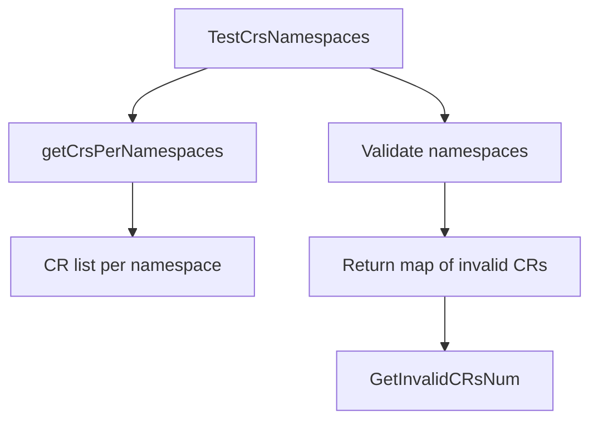
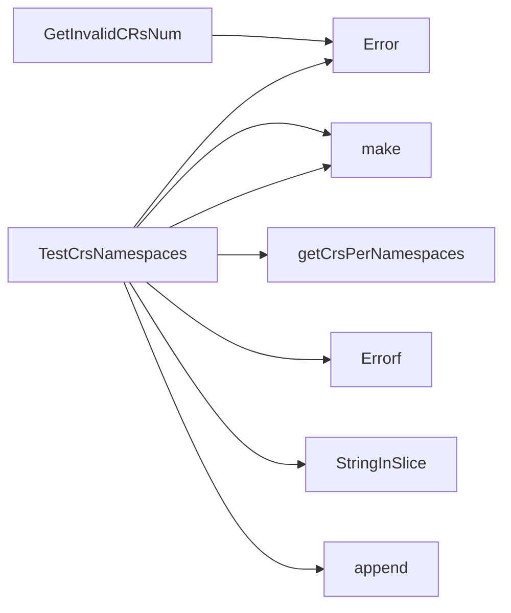

## Package namespace (github.com/redhat-best-practices-for-k8s/certsuite/tests/accesscontrol/namespace)

## Package Overview – `github.com/redhat-best-practices-for-k8s/certsuite/tests/accesscontrol/namespace`

| Component | Purpose |
|-----------|---------|
| **Functions** | *`TestCrsNamespaces`* (public) – verifies that a set of CustomResourceDefinitions (CRDs) have all their instances (Custom Resources, CRs) confined to a supplied list of namespaces.<br>*`getCrsPerNamespaces`* (private) – queries the cluster for all CR objects belonging to a given CRD and returns them grouped by namespace.<br>*`GetInvalidCRsNum`* (public) – counts how many CRs are reported as “invalid” in the map returned by `TestCrsNamespaces`. |
| **Data Structures** | The package works only with native Go maps:<br>```go
map[string]map[string][]string   // namespace → CRD name → list of CR names
```
The outer key is a namespace, the inner key is the CRD’s full name (`<group>/<kind>`), and the slice holds the names of individual CR instances that failed the check.<br>There are no custom structs or interfaces defined in this file. |
| **Global Variables** | None. The package relies solely on local variables and the external `log.Logger` passed by callers. |
| **External Dependencies** | *Kubernetes API machinery* (`k8s.io/...`) for discovering CRDs and listing their instances.<br>*Internal helpers* – `clientsholder`, `log`, and `stringhelper`. |

---

### How the Functions Connect



1. **`TestCrsNamespaces(crds, nsList, logger)`**  
   * Iterates over each supplied CRD.  
   * Calls `getCrsPerNamespaces` to obtain all instances of that CRD grouped by namespace.  
   * For every namespace found in the cluster, checks whether it is present in `nsList`. If not, records the CRs under this namespace as *invalid* in a nested map.  
   * Returns the populated map and any error encountered.

2. **`getCrsPerNamespaces(crd)`**  
   * Uses the Kubernetes client (via `clientsholder.GetClientsHolder`) to build an unstructured list request for the CRD’s resource (`apiextv1.CustomResourceDefinition`).  
   * Executes a `List` call, collects each item’s namespace and name.  
   * Builds and returns a map of `<namespace> → []<CR‑name>`.

3. **`GetInvalidCRsNum(invalidMap, logger)`**  
   * Traverses the nested map produced by `TestCrsNamespaces`.  
   * Counts every CR name stored in any namespace (i.e., all values in the inner slices).  
   * Logs a warning if no invalid CRs are found. Returns the total count.

---

### Typical Usage Pattern

```go
crds, _ := fetchCRDs()                // []apiextv1.CustomResourceDefinition
allowedNS := []string{"prod", "dev"}  // namespaces that should contain the CRs
logger := log.New()

invalidMap, err := namespace.TestCrsNamespaces(crds, allowedNS, logger)
if err != nil { /* handle error */ }

count := namespace.GetInvalidCRsNum(invalidMap, logger)
fmt.Printf("%d custom resources are outside permitted namespaces\n", count)
```

---

### Key Points & Design Notes

* **No state is kept** – all data flows through function parameters and return values.  
* The package focuses on *validation* rather than mutation; it only reads cluster state.  
* Error handling is minimal: if a `List` call fails, the error bubbles up immediately.  
* Logging is performed at various levels (`Debug`, `Error`, `Warn`) to aid diagnostics without affecting test flow.

This concise design makes the package easy to unit‑test (by mocking the Kubernetes client) and straightforward to integrate into larger access‑control validation suites.

### Functions

- **GetInvalidCRsNum** — func(map[string]map[string][]string, *log.Logger)(int)
- **TestCrsNamespaces** — func([]*apiextv1.CustomResourceDefinition, []string, *log.Logger)(map[string]map[string][]string, error)

### Call graph (exported symbols, partial)



### Symbol docs

- [function GetInvalidCRsNum](symbols/function_GetInvalidCRsNum.md)
- [function TestCrsNamespaces](symbols/function_TestCrsNamespaces.md)
