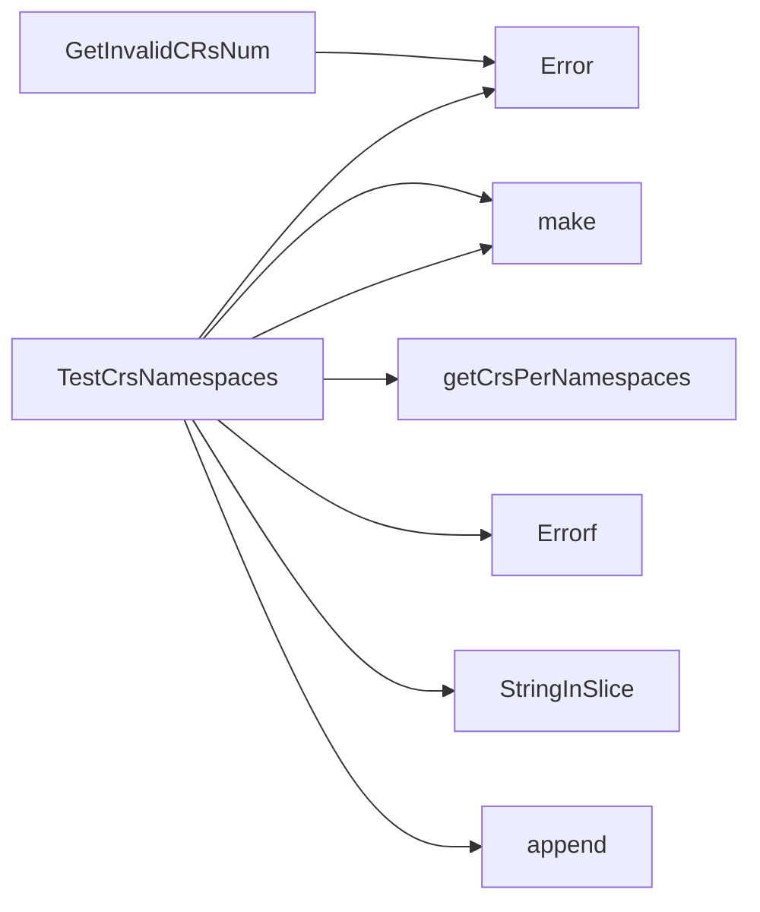

## Package namespace (github.com/redhat-best-practices-for-k8s/certsuite/tests/accesscontrol/namespace)

### Functions

- **GetInvalidCRsNum** — func(map[string]map[string][]string, *log.Logger)(int)
- **TestCrsNamespaces** — func([]*apiextv1.CustomResourceDefinition, []string, *log.Logger)(map[string]map[string][]string, error)

### Call graph (exported symbols, partial)

### Symbol docs

- [function GetInvalidCRsNum](symbols/function_GetInvalidCRsNum.md)
- [function TestCrsNamespaces](symbols/function_TestCrsNamespaces.md)
