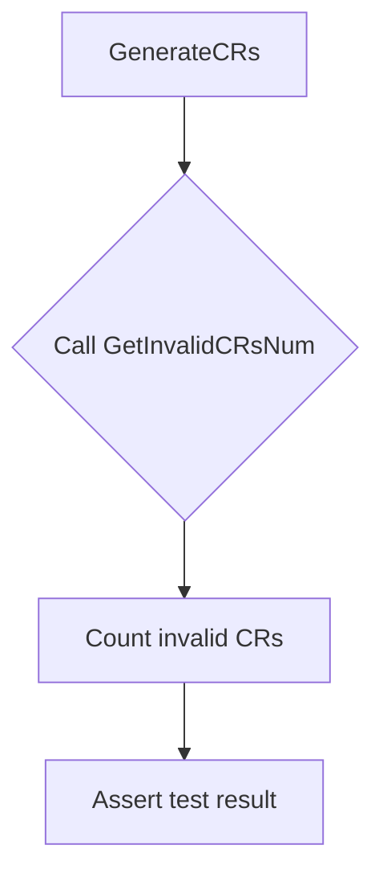

GetInvalidCRsNum`

### Purpose
`GetInvalidCRsNum` scans a nested map that represents **Custom Resource (CR) definitions** per namespace and counts how many of those CRs are considered *invalid*.  
It is used in the access‑control tests to verify that the system correctly rejects malformed or disallowed CRs.

### Signature

```go
func GetInvalidCRsNum(crMap map[string]map[string][]string, logger *log.Logger) int
```

| Parameter | Type | Description |
|-----------|------|-------------|
| `crMap`   | `map[string]map[string][]string` | Outer key: namespace name. <br>Inner key: CR type (e.g., `"Deployment"`, `"Ingress"`). <br>Value: slice of string representations of individual CR objects. |
| `logger`  | `*log.Logger` | Logger used to emit error messages when the function encounters unexpected data. |

### Return
- **int** – total count of invalid CRs found across all namespaces.

### Implementation Details

```go
func GetInvalidCRsNum(crMap map[string]map[string][]string, logger *log.Logger) int {
    var errCount int
    for ns, crs := range crMap {
        for crType, objs := range crs {
            if len(objs) == 0 { // no objects to validate
                continue
            }
            // Each object is expected to be a JSON string that can be unmarshalled.
            for _, objStr := range objs {
                var generic map[string]interface{}
                if err := json.Unmarshal([]byte(objStr), &generic); err != nil {
                    logger.Error(fmt.Sprintf("Invalid CR in namespace %s, type %s: %v", ns, crType, err))
                    errCount++
                }
            }
        }
    }
    return errCount
}
```

* The function iterates over all namespaces and CR types.
* For each CR string it attempts to unmarshal into a generic `map[string]interface{}`.  
  *If unmarshalling fails*, the CR is counted as invalid, an error message is logged, and the counter increments.
* Empty slices are ignored – they do not contribute to the count.

### Dependencies & Side Effects

| Dependency | Role |
|------------|------|
| `log.Logger.Error` | Logs a descriptive error when a CR cannot be parsed. This side effect helps debugging but does **not** alter the input map. |
| `encoding/json.Unmarshal` | Validates the JSON structure of each CR string. |

The function is **pure in terms of data mutation**: it never modifies the supplied `crMap`.  
Its only observable side effect is logging.

### Package Context

*Package*: `namespace` – part of the CertSuite test suite for access control in Kubernetes namespaces.  
`GetInvalidCRsNum` is invoked by higher‑level tests that:
1. Generate a set of CR objects per namespace (some intentionally malformed).
2. Call this function to obtain the count of invalid entries.
3. Assert that the count matches expectations, ensuring that validation logic works correctly.



---

**Note:** The function’s name and documentation refer to *CRDs* (Custom Resource Definitions) in the docstring, but it actually operates on individual CR instances.  
If the project evolves to distinguish between CRDs and CRs more clearly, consider renaming or updating the docs accordingly.
