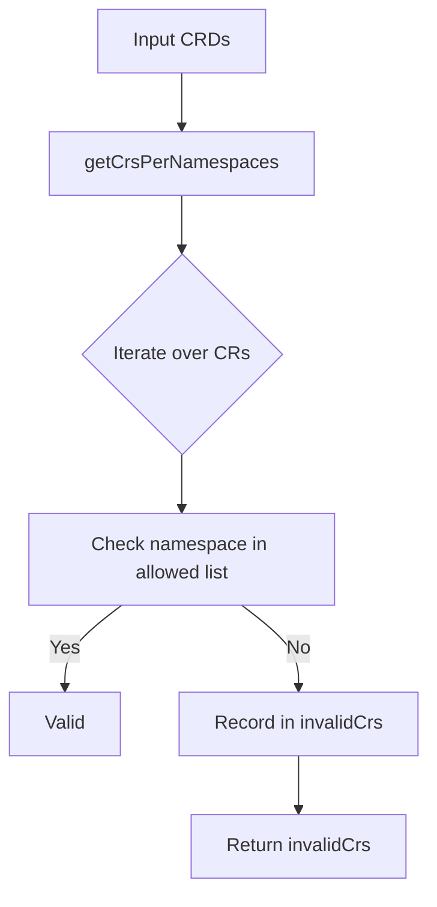

TestCrsNamespaces`

**Package:** `github.com/redhat-best-practices-for-k8s/certsuite/tests/accesscontrol/namespace`  
**File:** `tests/accesscontrol/namespace/namespace.go` (line 35)  

## Purpose

`TestCrsNamespaces` validates that all instances of a set of CustomResourceDefinitions (CRDs) belong only to a specified list of namespaces.  
It is used in the access‑control test suite to verify namespace isolation for CRs.

---

## Signature

```go
func TestCrsNamespaces(
    crds []*apiextv1.CustomResourceDefinition,
    ns []string,
    log *log.Logger,
) (map[string]map[string][]string, error)
```

| Parameter | Type | Description |
|-----------|------|-------------|
| `crds` | `[]*apiextv1.CustomResourceDefinition` | The CRDs to inspect. |
| `ns` | `[]string` | Namespaces that are allowed to contain the CRs. |
| `log` | `*log.Logger` | Logger for debug output (optional). |

| Return | Type | Description |
|--------|------|-------------|
| `invalidCrs` | `map[string]map[string][]string` | Map of **CRD name → namespace → list of CR names** that are *not* in the allowed namespaces. |
| `err` | `error` | Non‑nil if an unexpected error occurs while enumerating or filtering CRs. |

---

## Algorithm Overview

1. **Create result container**  
   ```go
   invalidCrs := make(map[string]map[string][]string)
   ```
2. **Retrieve all CR instances per namespace** by calling the helper `getCrsPerNamespaces(crds)`.  
   This returns a nested map: `crdName → namespace → []CRName`.
3. **Validate each instance**  
   * For every CR name in each namespace, check if that namespace is in the allowed list (`ns`) using `StringInSlice(ns, nsToCheck)`.
   * If the namespace is not allowed, record the CR under its CRD and namespace in `invalidCrs`.  
     ```go
     if !StringInSlice(ns, crdNs) {
         // ensure nested map exists
         if _, ok := invalidCrs[crdName]; !ok {
             invalidCrs[crdName] = make(map[string][]string)
         }
         invalidCrs[crdName][crdNs] = append(invalidCrs[crdName][crdNs], crName)
     }
     ```
4. **Return**  
   * If `invalidCrs` is empty, the function still returns it (no error).  
   * Any failure in step 2 results in an error wrapped with context (`Errorf`).  

---

## Dependencies

| Dependency | Role |
|-------------|------|
| `make`, `append` | Standard Go functions to allocate and grow slices/maps. |
| `getCrsPerNamespaces` | Helper that lists all CR instances per namespace for the supplied CRDs. |
| `StringInSlice` | Utility that checks membership of a string in a slice. |
| `Errorf`, `Error` | Standard error constructors from the `errors` package (or a custom wrapper). |

---

## Side Effects

* No global state is modified; all data structures are local to the function.
* The supplied `log` may be used by called helpers for debugging but is not altered here.

---

## Usage Context

Within the *access‑control* tests, this function is invoked after creating a set of CRDs and populating them across various namespaces.  
Its output (`invalidCrs`) is inspected to confirm that no CR instance exists outside the intended namespace scope; any non‑empty map indicates a failure in namespace isolation.

```go
invalid, err := TestCrsNamespaces(crds, allowedNSs, logger)
if err != nil {
    t.Fatalf("validation failed: %v", err)
}
if len(invalid) > 0 {
    t.Errorf("CRs found outside allowed namespaces: %+v", invalid)
}
```

---

## Mermaid Diagram (Suggested)



This diagram visualizes the decision flow from input CRDs to the final `invalidCrs` map.
