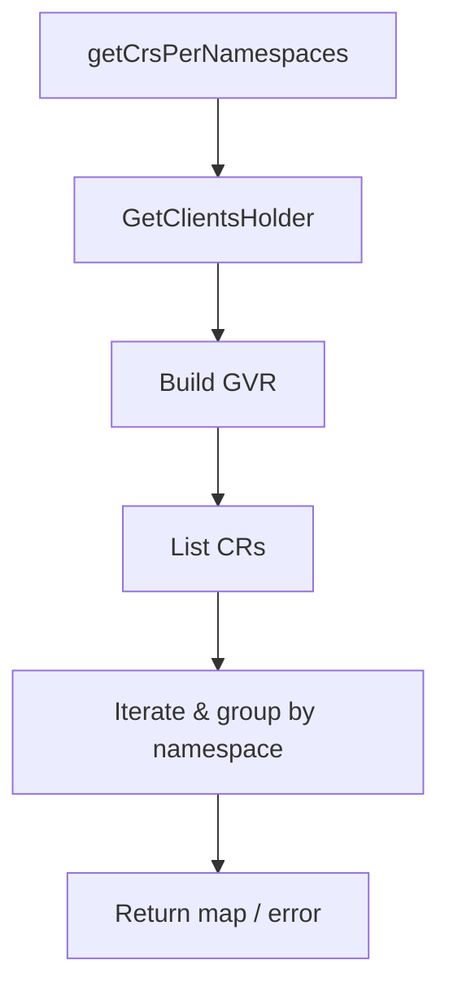

getCrsPerNamespaces`

**Location**

`github.com/redhat‑best‑practices‑for‑k8s/certsuite/tests/accesscontrol/namespace/namespace.go:62`

---

## Purpose

Collects all Custom Resources (CRs) that have been instantiated in the Kubernetes cluster **per namespace** for a given `CustomResourceDefinition` (CRD).  
The function returns:

| Return value | Meaning |
|--------------|---------|
| `map[string][]string` | Keys are namespace names; values are slices of CR *names* that exist in that namespace. |
| `error` | Non‑nil if any step fails (client acquisition, list operation, etc.). |

This helper is used by tests to verify that certain CRs are present or absent in particular namespaces.

---

## Signature

```go
func getCrsPerNamespaces(crd *apiextv1.CustomResourceDefinition) (map[string][]string, error)
```

* `crd`: The CustomResourceDefinition whose instances should be listed.  
  Only its Group/Version and Kind are used to build the resource interface.

---

## Key Steps & Dependencies

| Step | What happens | Dependencies |
|------|--------------|--------------|
| **1. Get Kubernetes client** | Calls `GetClientsHolder()` (from a shared test‑framework package) to obtain an authenticated client set. | `GetClientsHolder` function, `logrus.Debug` for tracing. |
| **2. Build the GVR** | Uses `Resource(crd.Spec.Group + "/" + crd.Spec.Versions[0].Name, crd.Spec.Names.Kind)` from controller‑runtime to create a *GroupVersionResource* that represents the CR’s API endpoint. | `controller-runtime` package (`client.New`) and the `apiextv1` types. |
| **3. List all instances** | Calls `client.List(ctx, &unstructured.UnstructuredList{}, client.InNamespace(""))`, which returns every CR of this type in **all namespaces**. | `client.List`, context, `logrus.Debug`. |
| **4. Organise by namespace** | Iterates over the returned objects, extracts each object's namespace and name (`obj.GetNamespace()`, `obj.GetName()`), and appends the name to a slice keyed by that namespace in the result map. | Standard Go `append` and `make` for maps/slices. |
| **5. Return** | Returns the populated map or an error if any step fails. | Logging via `logrus.Error` on failures. |

---

## Side‑Effects & Error Handling

* No state is mutated outside of local variables; the function is pure from a test‑suite perspective.
* Errors are surfaced immediately:  
  * If obtaining the client fails → returned error.  
  * If listing CRs fails → returned error.  
* All debug and error messages use `logrus` for visibility during test runs.

---

## How It Fits the Package

The `namespace` package contains tests that validate access‑control policies by inspecting which namespaces contain specific CRs.  
`getCrsPerNamespaces` is a small utility that abstracts away the Kubernetes API interactions, letting higher‑level tests focus on policy logic rather than client plumbing.



---

### Summary

- **What**: Builds a per‑namespace list of Custom Resource names for a given CRD.  
- **Why**: Enables tests to assert that specific CR instances exist in expected namespaces.  
- **How**: Uses controller‑runtime client, unstructured objects, and simple Go maps/slices.  
- **Side‑effects**: Only logs; otherwise read‑only operations.

---
