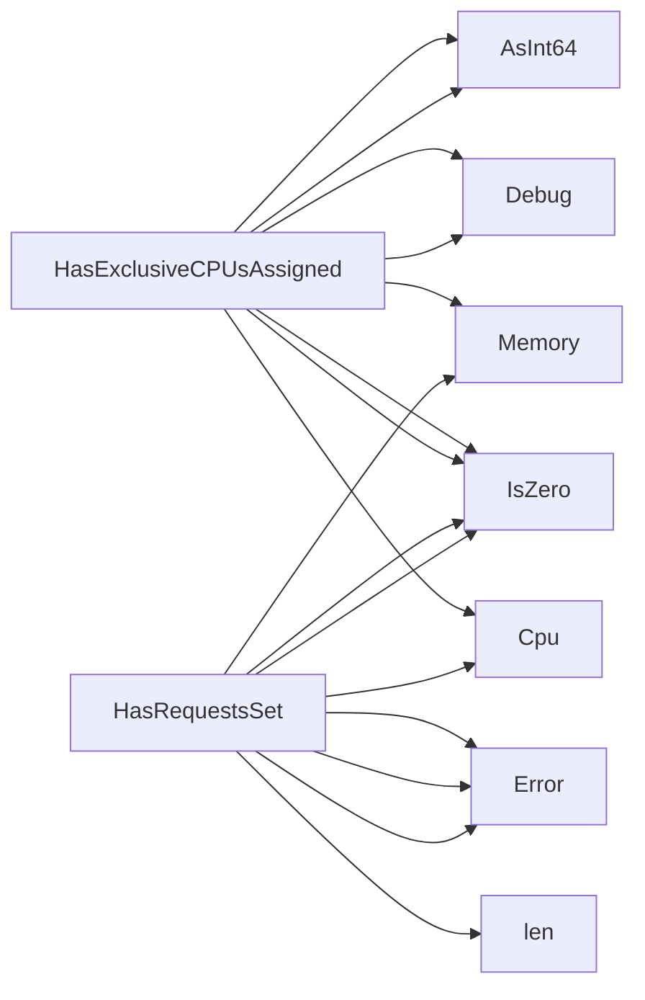

## Package resources (github.com/redhat-best-practices-for-k8s/certsuite/tests/accesscontrol/resources)

### Functions

- **HasExclusiveCPUsAssigned** — func(*provider.Container, *log.Logger)(bool)
- **HasRequestsSet** — func(*provider.Container, *log.Logger)(bool)

### Call graph (exported symbols, partial)

### Symbol docs

- [function HasExclusiveCPUsAssigned](symbols/function_HasExclusiveCPUsAssigned.md)
- [function HasRequestsSet](symbols/function_HasRequestsSet.md)
