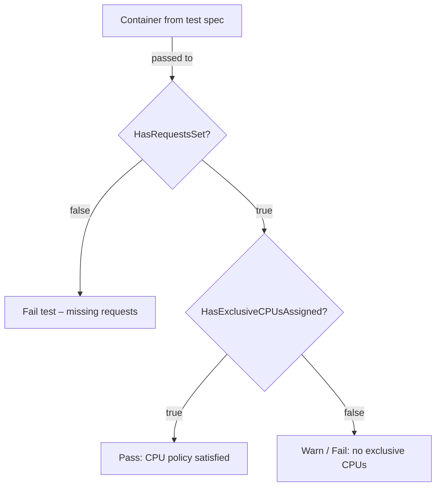
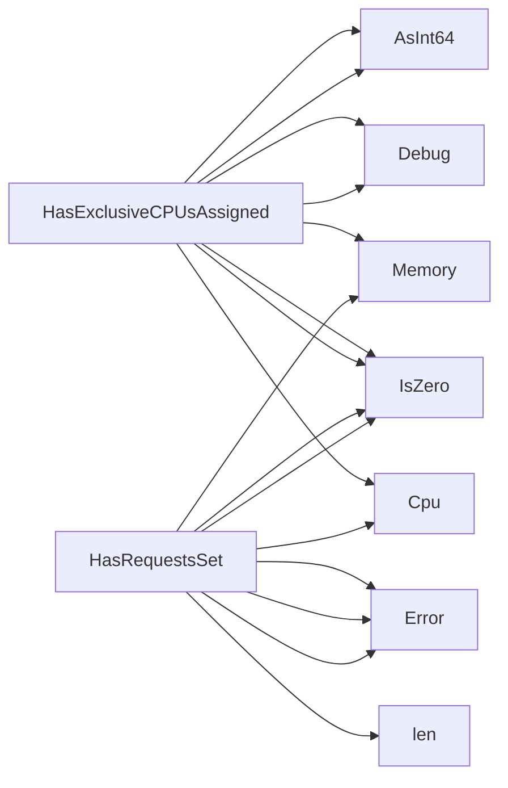

## Package resources (github.com/redhat-best-practices-for-k8s/certsuite/tests/accesscontrol/resources)

## Overview – `resources` package (accesscontrol tests)

| Item | Details |
|------|---------|
| **Purpose** | Helper utilities that inspect the resource section (`requests`, `limits`, CPU‑affinity) of a container definition in the test framework. They are used by access‑control tests to validate that a container follows best‑practice policies. |
| **Key types** | *`provider.Container`* – a wrapper around Kubernetes `corev1.Container`.  It exposes helper methods (`Cpu()`, `Memory()`, etc.) that return a type capable of checking if the value is set, converting it to an int64, and retrieving the underlying quantity. |
| **Key functions** | `HasRequestsSet` & `HasExclusiveCPUsAssigned` (both exported).  No global state or constants – everything is passed in as arguments. |

---

## Function Details

### `HasRequestsSet(c *provider.Container, logger *log.Logger) bool`

1. **What it checks**  
   - Determines whether the container has *any* resource requests defined (`cpu` or `memory`).  
   - It does **not** verify limits – only requests.

2. **How it works**  
   ```text
   if len(c.Requests()) == 0 { return false }
   // otherwise inspect each request:
   //   Cpu() -> IsZero()
   //   Memory() -> IsZero()
   // If either is non‑zero, we have a request.
   ```
3. **Logging**  
   - Uses `logger.Error` to report when the container has no requests or if an unexpected value appears.

4. **Return**  
   - `true`  → at least one request present.  
   - `false` → no requests defined.

---

### `HasExclusiveCPUsAssigned(c *provider.Container, logger *log.Logger) bool`

1. **What it checks**  
   - Whether the container is assigned *exclusive* CPUs via the Kubernetes CPU‑affinity annotation (`cpu`) or the pod spec’s `CPUManagerPolicy: "static"`.

2. **How it works**  
   ```text
   // 1. Inspect CPU request value:
   if !c.Cpu().IsZero() {
       logger.Debug(...)
       return true
   }
   // 2. Inspect memory request as a secondary sanity check (to avoid false positives)
   if c.Memory().AsInt64() > 0 { … }
   // 3. Re‑check CPU again after converting to int64 for safety.
   ```
3. **Logging**  
   - Uses `logger.Debug` to emit the raw values and conversion results, helping debugging test failures.

4. **Return**  
   - `true` if a non‑zero CPU request (or equivalent annotation) is detected.  
   - `false` otherwise.

---

## How the two functions are used together



- **Pre‑condition** for `HasExclusiveCPUsAssigned` is that the container has requests set; otherwise it would be meaningless to check for exclusivity.
- The functions rely solely on methods provided by `provider.Container`, keeping the logic decoupled from Kubernetes API objects.

---

## Summary

The `resources` package supplies two small, pure‑function utilities that validate resource request presence and CPU‑affinity configuration in container definitions. They are stateless, use only passed parameters, and provide diagnostic logs via `log.Logger`. These helpers enable higher‑level access‑control tests to assert compliance with CPU‑management best practices without duplicating logic.

### Functions

- **HasExclusiveCPUsAssigned** — func(*provider.Container, *log.Logger)(bool)
- **HasRequestsSet** — func(*provider.Container, *log.Logger)(bool)

### Call graph (exported symbols, partial)



### Symbol docs

- [function HasExclusiveCPUsAssigned](symbols/function_HasExclusiveCPUsAssigned.md)
- [function HasRequestsSet](symbols/function_HasRequestsSet.md)
