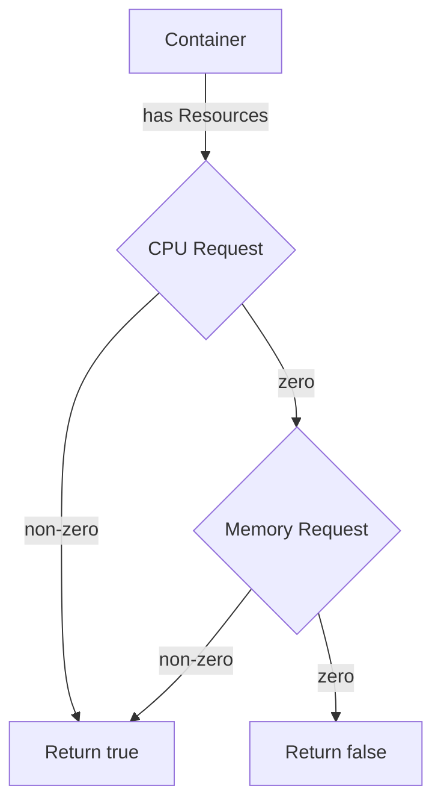

HasRequestsSet`

| Item | Details |
|------|---------|
| **Package** | `github.com/redhat-best-practices-for-k8s/certsuite/tests/accesscontrol/resources` |
| **Signature** | `func HasRequestsSet(container *provider.Container, logger *log.Logger) bool` |
| **Exported** | ✅ |

### Purpose
`HasRequestsSet` determines whether a Kubernetes container definition has any resource *requests* specified.  
In the context of access‑control tests this check is used to decide if a pod should be considered “resource‑constrained” and therefore eligible for certain policy evaluations.

### Parameters
| Name | Type | Role |
|------|------|------|
| `container` | `*provider.Container` | The container spec to inspect. It comes from the test harness that constructs Kubernetes pod definitions. |
| `logger` | `*log.Logger` | Optional logger used to emit debug information when requests are missing or malformed. |

### Return Value
- `bool`:  
  * `true` – at least one request (CPU or memory) is set and non‑zero.  
  * `false` – no requests, or all requests are zero/empty.

### Key Logic & Dependencies

1. **Check for CPU request**  
   ```go
   if !container.Resources.Requests.Cpu().IsZero() {
       logger.Error("CPU request set")
       return true
   }
   ```
   * Calls `Cpu()` on the resource quantity map, then checks `IsZero()`.

2. **Check for Memory request**  
   Similar to CPU; uses `Memory()` and `IsZero()`.

3. **Fallback** – if neither CPU nor memory requests are present or both are zero, return `false`.

The function relies on the Kubernetes API types (`resource.Quantity`) through the provider’s container struct, and on Go’s standard library for logging.

### Side Effects
- Emits an error log via `logger.Error` when a request is detected.  
- Does **not** modify the container or any global state; purely read‑only analysis.

### How It Fits the Package
The `resources` package supplies helper utilities used by access‑control tests to inspect pod definitions.  
`HasRequestsSet` is one of several predicates that determine if a pod meets certain resource constraints, which in turn influence whether it should be allowed or denied under specific policy scenarios.

---

#### Suggested Mermaid Diagram (Optional)



This diagram visualises the decision path of `HasRequestsSet`.
