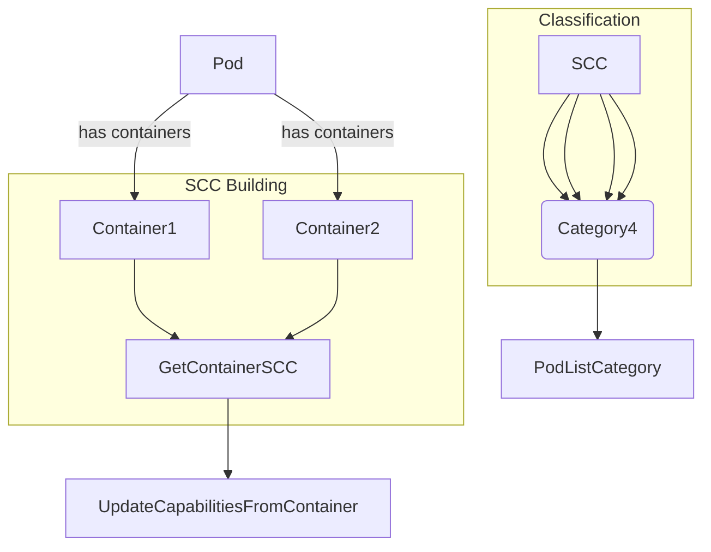
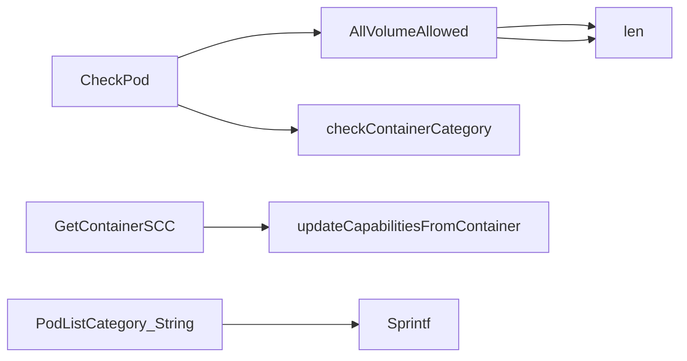

## Package securitycontextcontainer (github.com/redhat-best-practices-for-k8s/certsuite/tests/accesscontrol/securitycontextcontainer)

# securitycontextcontainer – A high‑level walk‑through

`securitycontextcontainer` is a unit test helper that classifies the *SecurityContext* of each container in a pod into one of four predefined “categories”.  
The categories capture common patterns of permissive or restrictive configurations (e.g. privileged, host‑network, root‑fs).  
The package exposes only three public functions (`AllVolumeAllowed`, `CheckPod`, `GetContainerSCC`) and two data structures (`ContainerSCC`, `PodListCategory`).  

Below is a concise explanation of the key pieces and how they interact.

---

## 1. Core Data Structures

| Type | Purpose | Key Fields |
|------|---------|------------|
| **`OkNok`** (alias for `int`) | Simple result indicator – OK or NOK. | N/A |
| **`CategoryID`** (alias for `int`) | Enumerates the four categories plus an undefined sentinel. | N/A |
| **`ContainerSCC`** | Holds booleans that describe a container’s security posture.  Each field corresponds to a Kubernetes SecurityContext attribute or derived rule. | <ul><li>`AllVolumeAllowed`</li><li>`CapabilitiesCategory` (the `CategoryID`) </li> … and others such as `HostNetwork`, `PrivilegedContainer`, `RunAsNonRoot`, etc.</ul> |
| **`PodListCategory`** | Result of classifying a container.  Holds the category, container name and pod/namespace identifiers. | `<Category CategoryID; Containername string; NameSpace string; Podname string>` |

---

## 2. Global Configuration

The package defines four *reference* categories (`Category1 … Category4`) that are built from a set of boolean rules and capability lists.

```go
var (
    // Category1 – most restrictive
    Category1 = ContainerSCC{ ... }
    // Category1NoUID0 – same as Category1 but without UID check
    Category1NoUID0 = ContainerSCC{ ... }

    // Category2 – less restrictive than Category1
    Category2 = ContainerSCC{ ... }

    // Category3 – more permissive (e.g. host network, privileged)
    Category3 = ContainerSCC{ ... }
)

var (
    dropAll                  = []string{"ALL"}
    requiredDropCapabilities = []string{"CHOWN", "DAC_OVERRIDE", "SETUID", "SETGID"}

    category2AddCapabilities = []string{"NET_BIND_SERVICE"}
    category3AddCapabilities = []string{"SYS_ADMIN"}
)
```

These variables act as *templates* that the comparison logic uses to decide a container’s final category.

---

## 3. Public API

### `AllVolumeAllowed(volumes []corev1.Volume) OkNok`

Checks whether all volumes referenced by a pod are allowed.

| Return | Meaning |
|--------|---------|
| `OK`   | No hostPath volumes, and at least one volume is present. |
| `NOK`  | Either no volumes or any hostPath detected. |

It’s used in `CheckPod` to set the `AllVolumeAllowed` field of each container’s SCC.

---

### `GetContainerSCC(container *provider.Container, base ContainerSCC) ContainerSCC`

Takes a single Kubernetes container object and a *base* `ContainerSCC` (normally one of the global categories).  
It updates that base with any capability information defined at the container level (`addCapabilities`, `dropCapabilities`).  

The helper called inside it is:

```go
updateCapabilitiesFromContainer(container, &scc)
```

which merges the container’s capabilities into the SCC according to the rules in the global variables.

---

### `CheckPod(pod *provider.Pod) []PodListCategory`

* **Step 1 – Apply pod‑level security context**  
  The function starts by creating a copy of the reference categories and overriding any fields that are defined at the pod level (e.g. `RunAsUser`, `FSGroup`).

* **Step 2 – Override with container‑level values**  
  For each container, `GetContainerSCC` is called to apply container‑specific overrides.

* **Step 3 – Classify**  
  Each container’s SCC is compared against the four reference categories using `compareCategory`.  
  The first matching category determines the container’s label.  
  If none match, the container is marked as `Undefined`.

* **Result**  
  Returns a slice of `PodListCategory` structs that can be printed or used in assertions.

---

## 4. Internal Logic

### `checkContainerCategory`

Iterates over all containers in a pod and builds the result list:

```go
for _, c := range containers {
    scc := GetContainerSCC(&c, base)
    cat := compareCategory(&scc, &refCat, CategoryID1)   // etc.
    categories = append(categories, PodListCategory{...})
}
```

`compareCategory` performs a field‑by‑field boolean check:

```go
func compareCategory(a, b *ContainerSCC, id CategoryID) bool {
    return a.AllVolumeAllowed == b.AllVolumeAllowed &&
           a.HostNetwork == b.HostNetwork && ...
}
```

If the SCC matches one of the reference categories, that category is returned.

### `updateCapabilitiesFromContainer`

Merges capability lists from the container into the SCC:

1. Convert `addCapabilities` and `dropCapabilities` to string slices.
2. Append them to the SCC’s existing lists if they’re not already present.
3. Remove any capabilities that are in both add‑ and drop‑lists (conflict resolution).

The helper uses standard library functions (`strings`, `slices.SubSlice`) for list manipulation.

---

## 5. Usage Pattern

```go
pod := provider.GetPod(...)        // from test harness
results := securitycontextcontainer.CheckPod(pod)

for _, r := range results {
    fmt.Printf("Container %s in pod %s/%s: category=%s\n",
               r.Containername, r.NameSpace, r.Podname, r.Category)
}
```

The output can be fed into test assertions or logged for debugging.

---

## 6. Suggested Mermaid Diagram



This diagram captures the flow from a pod to per‑container SCCs, capability merging, and final categorization.

---

## 7. Summary

* **Goal** – Classify containers in a pod according to their SecurityContext into four predefined categories.
* **Mechanism** – Combine pod‑level defaults with container overrides, merge capabilities, then compare against reference SCC templates.
* **Output** – `[]PodListCategory` giving each container’s category and identifiers.

The package is intentionally read‑only (no exported state mutation) and relies only on the Kubernetes API objects provided by the test harness.

### Structs

- **ContainerSCC** (exported) — 15 fields, 0 methods
- **PodListCategory** (exported) — 4 fields, 1 methods

### Functions

- **AllVolumeAllowed** — func([]corev1.Volume)(OkNok)
- **CategoryID.String** — func()(string)
- **CheckPod** — func(*provider.Pod)([]PodListCategory)
- **GetContainerSCC** — func(*provider.Container, ContainerSCC)(ContainerSCC)
- **OkNok.String** — func()(string)
- **PodListCategory.String** — func()(string)

### Globals

- **Category1**: 
- **Category1NoUID0**: 
- **Category2**: 
- **Category3**: 

### Call graph (exported symbols, partial)



### Symbol docs

- [struct ContainerSCC](symbols/struct_ContainerSCC.md)
- [struct PodListCategory](symbols/struct_PodListCategory.md)
- [function AllVolumeAllowed](symbols/function_AllVolumeAllowed.md)
- [function CategoryID.String](symbols/function_CategoryID_String.md)
- [function CheckPod](symbols/function_CheckPod.md)
- [function GetContainerSCC](symbols/function_GetContainerSCC.md)
- [function OkNok.String](symbols/function_OkNok_String.md)
- [function PodListCategory.String](symbols/function_PodListCategory_String.md)
