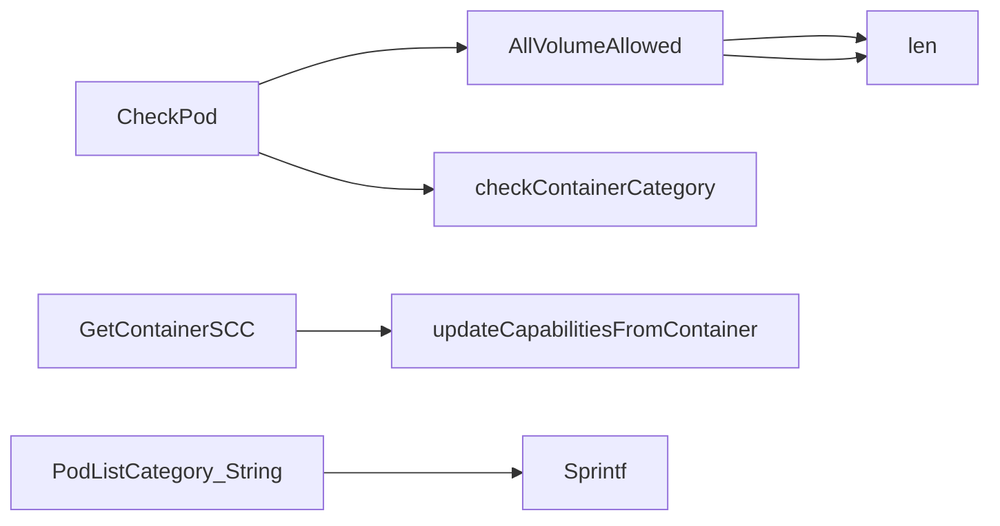

## Package securitycontextcontainer (github.com/redhat-best-practices-for-k8s/certsuite/tests/accesscontrol/securitycontextcontainer)

### Structs

- **ContainerSCC** (exported) — 15 fields, 0 methods
- **PodListCategory** (exported) — 4 fields, 1 methods

### Functions

- **AllVolumeAllowed** — func([]corev1.Volume)(OkNok)
- **CategoryID.String** — func()(string)
- **CheckPod** — func(*provider.Pod)([]PodListCategory)
- **GetContainerSCC** — func(*provider.Container, ContainerSCC)(ContainerSCC)
- **OkNok.String** — func()(string)
- **PodListCategory.String** — func()(string)

### Globals

- **Category1**: 
- **Category1NoUID0**: 
- **Category2**: 
- **Category3**: 

### Call graph (exported symbols, partial)

### Symbol docs

- [struct ContainerSCC](symbols/struct_ContainerSCC.md)
- [struct PodListCategory](symbols/struct_PodListCategory.md)
- [function AllVolumeAllowed](symbols/function_AllVolumeAllowed.md)
- [function CategoryID.String](symbols/function_CategoryID_String.md)
- [function CheckPod](symbols/function_CheckPod.md)
- [function GetContainerSCC](symbols/function_GetContainerSCC.md)
- [function OkNok.String](symbols/function_OkNok_String.md)
- [function PodListCategory.String](symbols/function_PodListCategory_String.md)
