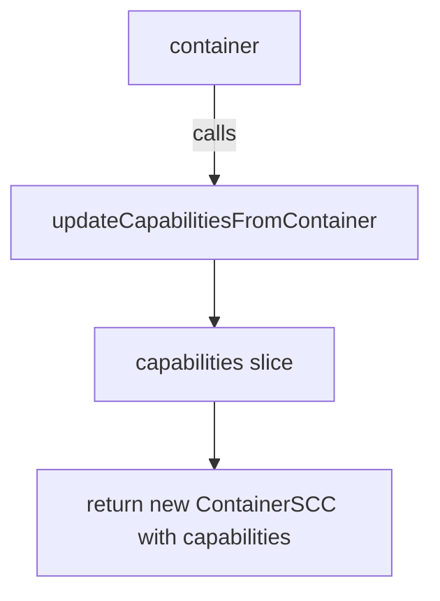

GetContainerSCC`

```go
func GetContainerSCC(container *provider.Container, containerSCC ContainerSCC) ContainerSCC
```

### Purpose
`GetContainerSCC` produces a **Security Context Constraints** (SCC) object that reflects the capabilities of a given Kubernetes container (`cut`).  
The function does not modify the original `containerSCC`; instead it returns a new SCC with updated capability fields derived from the container’s configuration.

> *Why?*  
> In the test suite this helper is used to assert that a container’s security settings (e.g., added or dropped capabilities) are correctly reflected in its SCC representation.

### Parameters
| Name          | Type                          | Description |
|---------------|------------------------------|-------------|
| `container`   | `*provider.Container`        | The Kubernetes container whose capability set should be examined.  The provider type is defined elsewhere in the test package. |
| `containerSCC` | `ContainerSCC` (value) | A base SCC structure that will be enriched with capability data from `container`. |

### Return
- **`ContainerSCC`** – a new SCC instance that contains all fields of the input `containerSCC`, but with the `Capabilities` field updated to match the container’s capabilities.

### Key Dependencies & Calls
| Dependency | Role |
|------------|------|
| `updateCapabilitiesFromContainer` | The only helper called inside `GetContainerSCC`. It inspects the container’s spec and returns a slice of capability strings that should be added or dropped. This slice is then stored in the returned SCC. |

### Side‑Effects
* No global state is mutated.
* The function reads from the passed container but does not modify it.

### How it Fits the Package
The package `securitycontextcontainer` defines various constant categories (`CategoryID1`, …) and a set of category structures (`Category1`, `Category2`, etc.) that describe expected SCCs for different test scenarios.  
`GetContainerSCC` is a utility that, given an actual container instance from the test harness, derives its real SCC so that tests can compare it against these predefined categories.



### Example Usage (in test)
```go
scc := GetContainerSCC(container, baseSCC)
// scc now contains the container's capabilities and can be compared to expected SCC.
```

---
