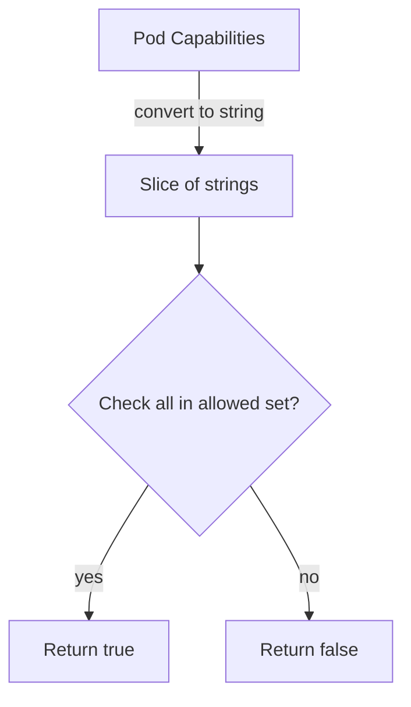

checkContainCategory`

```go
func checkContainCategory(addCapability []corev1.Capability, referenceCategoryAddCapabilities []string) bool
```

### Purpose  
`checkContainCategory` verifies that **every** capability listed in `addCapability`
is also present in the `referenceCategoryAddCapabilities` slice.  
It is used by the test suite to validate that a given *security context* contains
only allowed capabilities for a specific category.

> **Why this function exists**  
> In the security‑context container tests each “category” (e.g., Category1,
> Category2…) defines an expected set of `ADD` capabilities. When a pod is
> created, its `capabilities.add` list is compared against that expected set.
> The helper returns `true` only if *all* declared capabilities are permitted.

### Parameters

| Name | Type | Description |
|------|------|-------------|
| `addCapability` | `[]corev1.Capability` | Capabilities requested by the pod’s security context. |
| `referenceCategoryAddCapabilities` | `[]string` | The list of allowed capability names for the current category. |

### Return Value

* **`bool`** –  
  *`true`* if every element in `addCapability` can be found (case‑insensitively)
  inside `referenceCategoryAddCapabilities`.  
  Otherwise, *`false`*.

### Key Dependencies & Calls
| Dependency | How it’s used |
|------------|---------------|
| `StringInSlice` | Helper that checks if a string is present in a slice of strings. It performs a case‑sensitive comparison. |
| `string()` | Converts a `corev1.Capability` (which is an alias for `string`) to the underlying string before passing it to `StringInSlice`. |

### Side Effects

The function is **pure**:  
* No global state is read or modified.  
* It only inspects its arguments and returns a boolean.

### How It Fits Into the Package

| Related Piece | Connection |
|---------------|------------|
| `Category1`, `Category2`, … | These globals hold the expected capability sets for each category; `checkContainCategory` compares pod capabilities against them. |
| Test cases in this package | Each test calls `checkContainCategory` to assert that a pod’s security context is compliant with its category’s rules. |

### Usage Example (in tests)

```go
if !checkContainCategory(pod.Spec.SecurityContext.Capabilities.Add,
                         Category1AddCapabilities) {
    t.Errorf("pod contains disallowed capabilities for Category1")
}
```

---

#### Mermaid Flow (Optional)



This function is a small but essential guard that ensures the tests only pass when
the pod’s capabilities strictly match the pre‑defined category rules.
