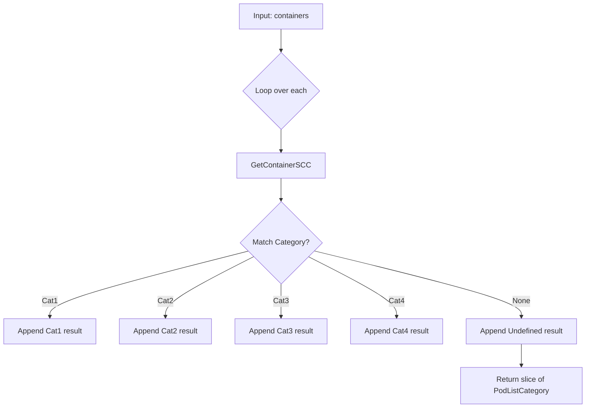

checkContainerCategory` – Container Security‑Context Classification

**Package:**  
`github.com/redhat-best-practices-for-k8s/certsuite/tests/accesscontrol/securitycontextcontainer`

The function is an internal helper used by the test suite to verify that each container in a pod
is classified into one of four *security context* categories.  
These categories are defined by the `CategoryID` constants (`Undefined`, `OK`, `NOK`,
and the four concrete category IDs) and the corresponding string helpers.

---

## Purpose

For every container passed in, `checkContainerCategory`:

1. **Determines** which security‑context rules (SCC – *Security Context Constraints*) are applied.
2. **Compares** that set of rules against a pre‑defined list of rule combinations for each category.
3. **Builds** a slice of `PodListCategory` structs, one per container, containing:
   - The container name,
   - Its actual SCC,
   - The category ID and human‑readable string.

The result is used by the tests to assert that containers are correctly classified.

---

## Signature

```go
func checkContainerCategory(
    containers []corev1.Container,
    scc ContainerSCC, // the SCC set for this pod
    podName string,
    namespace string) []PodListCategory
```

* `containers` – list of containers defined in a pod spec.
* `scc` – aggregated security context constraints that apply to the pod.
* `podName`, `namespace` – identifiers used when building the result.

---

## Key Steps & Dependencies

| Step | Action | Called Function | Notes |
|------|--------|-----------------|-------|
| 1 | Iterate over each container. | `len(containers)` | Standard slice loop. |
| 2 | Retrieve the SCC that applies to this container. | `GetContainerSCC(scc, c.Name)` | Returns a `ContainerSCC` object. |
| 3‑6 | Compare the retrieved SCC against four category rule sets: <br>• Category1<br>• Category2 (with add‑capabilities)<br>• Category3 (with drop‑all)<br>• Category4 (no UID0) | `compareCategory(scc, categoryX)` | Each call returns a `bool` indicating match. |
| 7 | Append a new `PodListCategory{}` to the result slice with the appropriate fields set based on the matched category. | `append(result, ...)` | The struct includes `ContainerName`, `SCC`, `CategoryID`, and `CategoryString`. |

The function uses only internal helpers (`GetContainerSCC`, `compareCategory`) and no external state,
so it has **no side effects** beyond building its return slice.

---

## How It Fits the Package

* The test suite defines a set of *expected* security‑context categories for various pod scenarios.
* `checkContainerCategory` is called by the high‑level test logic to map each container to one of those categories.
* The resulting slice is then compared against expected values, enabling the test harness to detect
  misconfigurations or regressions in SCC handling.

---

## Suggested Mermaid Diagram



---

**Bottom line:**  
`checkContainerCategory` is a pure, deterministic mapping function that turns raw container definitions
into structured category data for the test harness to validate.
