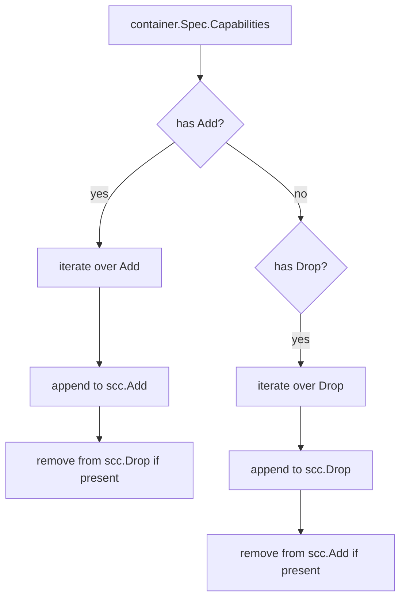

updateCapabilitiesFromContainer`

```
func updateCapabilitiesFromContainer(container *provider.Container, scc *ContainerSCC)
```

| Aspect | Details |
|--------|---------|
| **Purpose** | Propagates the capabilities that are defined at the container level to the per‑container security context (`ContainerSCC`). The function mutates `scc` by adding or removing capabilities based on the container’s `Capabilities` field. |
| **Inputs** | * `container`: the Kubernetes pod container whose spec is being evaluated.<br>* `scc`: a mutable representation of the security context that will be used for policy checks. |
| **Outputs** | None – side‑effect only. `scc` is updated in place. |
| **Key operations** | 1. If the container has a non‑nil `Capabilities` field, it iterates over its `Add` slice.<br>2. For each capability string:<br>   * It appends the value to `scc.Capabilities.Add`. <br>3. It then removes that capability from `scc.Capabilities.Drop` if present (ensuring an “add” overrides a “drop”).<br>4. If the container has a non‑nil `Drop` slice, it iterates over its `Drop` values and performs the inverse: appends to `scc.Capabilities.Drop` and removes from `scc.Capabilities.Add`. |
| **Dependencies** | * Standard library: `append`, `strings`, `sort.Strings` (implicitly via helper functions).<br>* Helper functions in the same package: `checkContainCategory`, `SubSlice`, `Equal`. These are used to verify whether a capability string belongs to a specific category and to manipulate slices safely. |
| **Side effects** | * Mutates `scc.Capabilities.Add` and `scc.Capabilities.Drop`.<br>* Relies on the global lists of categories (`Category1`, `Category2`, …) when calling `checkContainCategory`. The function does not modify the original container object. |
| **How it fits the package** | The package implements a test harness for Kubernetes security context constraints (SCC). Each pod spec is parsed into an internal representation (`ContainerSCC`). Before policy evaluation, per‑container capability overrides must be applied to that representation – this function performs that step. It is called from higher‑level functions that walk the pod’s containers and assemble the full SCC. |

### Example Flow

```go
// pSpec contains a container with Capabilities: Add=["NET_ADMIN"], Drop=[]
for _, c := range pSpec.Spec.Containers {
    scc := &ContainerSCC{Capabilities: CapabilitySet{}}
    updateCapabilitiesFromContainer(&c, scc)
    // scc.Capabilities.Add now includes "NET_ADMIN"
}
```

### Mermaid Diagram (suggested)



This succinctly shows the two mutually exclusive paths for adding and dropping capabilities.
