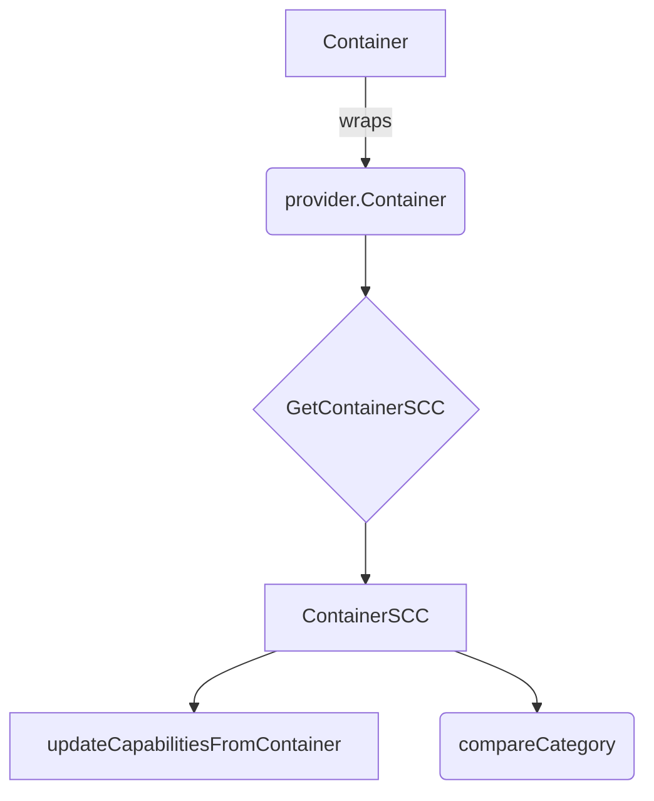

ContainerSCC` – Security Context Compliance Snapshot

The **`ContainerSCC`** type is a *snapshot* of how a single container’s security‑context settings compare against the requirements encoded in an OpenShift/SecurityContextConstraints (SCC) policy.  
It lives in the `securitycontextcontainer` package, which implements helper logic for evaluating containers during tests that verify SCC enforcement.

| Field | Type | Meaning |
|-------|------|---------|
| `AllVolumeAllowed` | `OkNok` | Indicates whether *any* volume type used by the container is allowed (`Ok`) or disallowed (`Nok`).  |
| `CapabilitiesCategory` | `CategoryID` | A categorisation value that groups together capabilities, drop lists, and run‑as‑user settings.  It tells which SCC “bucket” this container belongs to. |
| `FsGroupPresent` | `OkNok` | Whether the container defines an `fsGroup`. |
| `HostDirVolumePluginPresent` | `OkNok` | Whether a host directory volume plugin is used. |
| `HostIPC` | `OkNok` | Whether the container requests `hostIPC`. |
| `HostNetwork` | `OkNok` | Whether the container requests `hostNetwork`. |
| `HostPID` | `OkNok` | Whether the container requests `hostPID`. |
| `HostPorts` | `OkNok` | Whether any host port is exposed. |
| `PrivilegeEscalation` | `OkNok` | Whether the container allows privilege escalation. |
| `PrivilegedContainer` | `OkNok` | Whether the container runs in privileged mode. |
| `ReadOnlyRootFilesystem` | `OkNok` | Whether the root filesystem is mounted read‑only. |
| `RequiredDropCapabilitiesPresent` | `OkNok` | Whether all required capabilities are dropped. |
| `RunAsNonRoot` | `OkNok` | Whether the container specifies `runAsNonRoot`. |
| `RunAsUserPresent` | `OkNok` | Whether a user ID is set (`runAsUser`). |
| `SeLinuxContextPresent` | `OkNok` | Whether SELinux context information is present. |

### Purpose & Flow

1. **Construction**  
   * A container’s raw Kubernetes spec (`corev1.Container`) is wrapped in the helper type `provider.Container`.  
   * The package functions call `GetContainerSCC(container, refCategory)` to create an initial `ContainerSCC` that reflects the container's settings.

2. **Capability Normalisation**  
   `updateCapabilitiesFromContainer` adjusts the capability lists of a `ContainerSCC` so that they match the per‑container capabilities defined in the Kubernetes spec (e.g., `capabilities.add`, `capabilities.drop`).  

3. **Category Comparison**  
   `compareCategory` compares two `ContainerSCC`s field‑by‑field to decide whether a container’s security context matches a particular SCC category (`refCategory`).  The comparison logic is used by `checkContainerCategory` when building a list of `PodListCategory` entries.

4. **Result**  
   A fully populated `ContainerSCC` instance represents the *evaluation result* for one container: each field tells whether that part of the security context satisfies the SCC rule (`Ok`) or violates it (`Nok`).  

### Key Dependencies

| Dependency | Role |
|------------|------|
| `provider.Container` | Source of container attributes (e.g., capabilities, runAsUser). |
| `CategoryID`, `OkNok` | Enumerated types used for classification and result status. |
| `checkContainCategory` | Helper that verifies if a given capability is part of the allowed list. |

### Side‑Effects

* No state is mutated outside the returned struct; all operations are pure with respect to the input container.
* Logging (`Debug`) occurs inside `compareCategory`, but this does not alter any fields.

---

#### Suggested Mermaid diagram (optional)

This diagram visualises how a Kubernetes container is turned into a `ContainerSCC` and subsequently used for category comparison.
