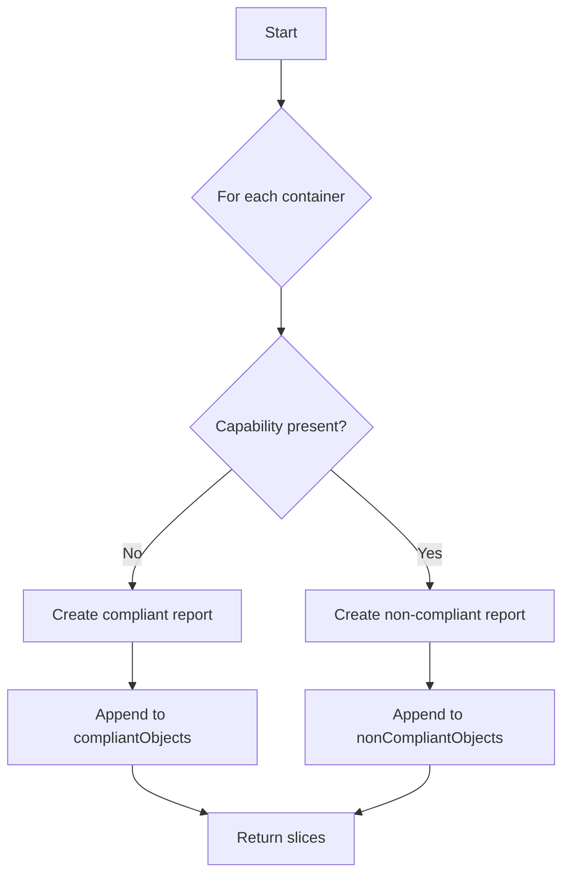

checkForbiddenCapability`

### Overview
`checkForbiddenCapability` evaluates a collection of Kubernetes containers against the **capability restrictions** defined by the test suite.  
For each container it determines whether any *forbidden* Linux capabilities are present in its specification.  The function returns two slices:

| Slice | Meaning |
|-------|---------|
| `compliantObjects` | Report objects for containers that **do not** contain forbidden capabilities. |
| `nonCompliantObjects` | Report objects for containers that **do** contain forbidden capabilities. |

The report objects are instances of `testhelper.ReportObject` (created via `NewContainerReportObject`) and include additional fields describing the violation.

### Signature
```go
func checkForbiddenCapability(
    containers []*provider.Container,
    capability string,
    logger *log.Logger,
) []*testhelper.ReportObject
```

| Parameter | Type | Description |
|-----------|------|-------------|
| `containers` | `[]*provider.Container` | List of containers to audit. |
| `capability` | `string` | Name of the forbidden capability being checked (e.g., `"SYS_ADMIN"`). |
| `logger` | `*log.Logger` | Logger used for debug‑level tracing inside the function. |

### Key Steps & Dependencies
1. **Iterate over containers** – For each container, log its name and namespace.
2. **Capability check**  
   * Calls `isContainerCapabilitySet(container, capability)` to determine if the capability is present in the container’s spec.  
   * This helper inspects the container’s security context (`Capabilities.Add`).
3. **Report creation** –  
   * If the capability is found:  
     * Create a new report object with `NewContainerReportObject`, add a field `"ForbiddenCapability"` via `AddField`, and append to `nonCompliantObjects`.  
     * Log an error‑level message.
   * Otherwise: create a compliant report object and append to `compliantObjects`.
4. **Return** – The function returns only the non‑compliant slice (the caller merges it with other reports).  

### Side Effects
- Emits log entries at `Info` or `Error` level; does not modify container objects.
- No global state is mutated.

### Package Context
`checkForbiddenCapability` lives in the **accesscontrol** test package.  
It is invoked by the suite’s *capability‑restriction* tests to verify that no container in a namespace (or across all namespaces) is granted forbidden Linux capabilities, thereby ensuring Kubernetes security hardening compliance.

---

#### Suggested Mermaid Flow Diagram


---
