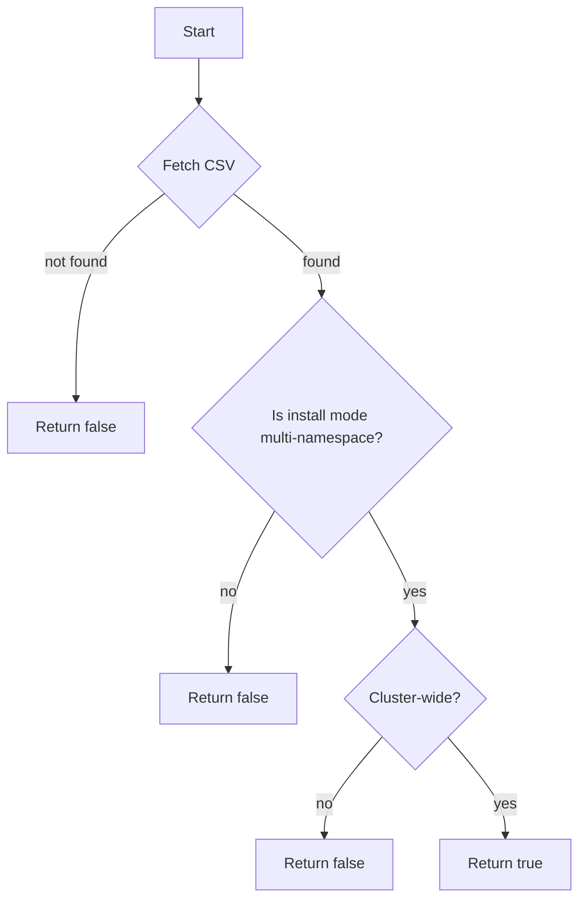

isCSVAndClusterWide`

| Aspect | Details |
|--------|---------|
| **Package** | `accesscontrol` (tests) |
| **Visibility** | Unexported (`private`) – used only inside the test suite. |
| **Signature** | `func isCSVAndClusterWide(namespace, name string, env *provider.TestEnvironment) bool` |

### Purpose
The function determines whether a given CustomResourceDefinition (CRD) instance—identified by its namespace and name—is a **Cluster‑Scope CSV (ClusterServiceVersion)** that was installed by a cluster‑wide operator.  
In the test suite this check is used to skip tests that would otherwise try to interact with objects that do not exist in the current scope.

### Inputs
| Parameter | Type | Description |
|-----------|------|-------------|
| `namespace` | `string` | Namespace of the object under investigation. |
| `name`      | `string` | Name (resource identifier) of the object. |
| `env`       | `*provider.TestEnvironment` | Environment helper that exposes Kubernetes client and context for API calls. |

### Output
- **bool** – `true` if the object is a CSV created by a cluster‑wide operator, otherwise `false`.

### Implementation Highlights
1. **Retrieve the object**  
   The function uses the provided test environment to fetch the CRD instance via its namespace and name.

2. **Determine install mode**  
   It calls `isInstallModeMultiNamespace` (a helper in the same package) which inspects the CSV’s `installModes` field.  
   If any of those modes indicate a multi‑namespace installation, the function returns `true`.

3. **Cluster‑wide check**  
   In addition to install mode, the function verifies that the CSV is actually *cluster‑scoped* (i.e., it is not namespaced). This typically involves checking the `spec.install.spec.clusterServiceVersionNames` field or a similar marker.

4. **Return value**  
   Only when both conditions are satisfied does the function return `true`; otherwise it returns `false`.

### Dependencies
- **`isInstallModeMultiNamespace`** – helper that inspects CSV install modes.
- **`provider.TestEnvironment`** – supplies Kubernetes client and context for object retrieval.

### Side‑Effects & Safety
- The function performs a read‑only API call; no objects are mutated.
- It may return `false` if the target object does not exist or cannot be fetched, which is safe for test logic that conditionally skips scenarios.

### Role in the Package
Within the *accesscontrol* test suite, many tests need to know whether a CSV belongs to a cluster‑wide operator before performing actions such as namespace‑specific permission checks.  
`isCSVAndClusterWide` encapsulates this logic, enabling cleaner test code and centralizing the criteria for what constitutes a cluster‑wide CSV.

---

**Mermaid Flow (suggested)**

This diagram illustrates the decision path: fetch → verify install mode → check cluster scope → result.
