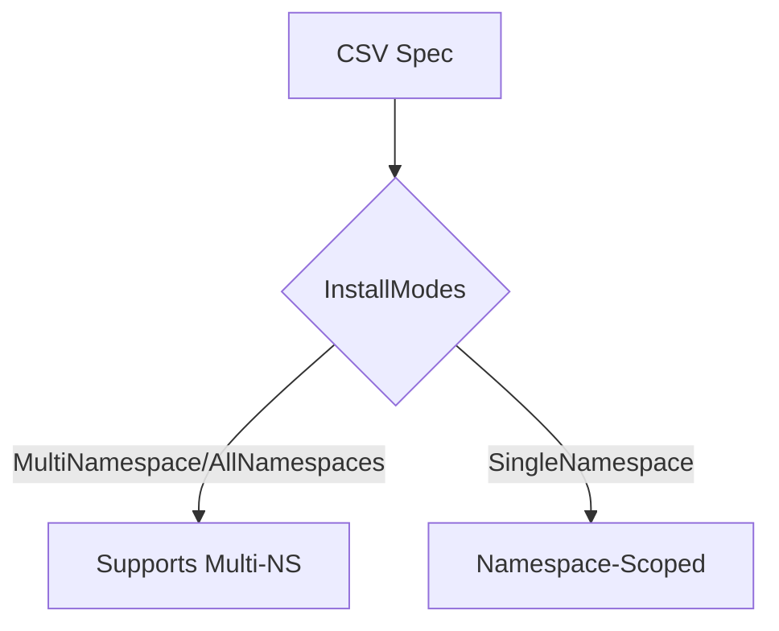

isInstallModeMultiNamespace`

| | |
|---|---|
| **Package** | `accesscontrol` (`github.com/redhat-best-practices-for-k8s/certsuite/tests/accesscontrol`) |
| **Visibility** | unexported (private to the package) |
| **Signature** | `func isInstallModeMultiNamespace(modes []v1alpha1.InstallMode) bool` |

## Purpose
Determines whether a CustomResourceDefinition (CRD) is intended to be installed in multiple namespaces.  
The function inspects the slice of `v1alpha1.InstallMode` values that are part of a ClusterServiceVersion (CSV).  
If any entry indicates either **MultiNamespace** or **AllNamespaces**, the CRD can operate across many namespaces, and the helper returns `true`.  
Otherwise it is considered namespace‑scoped (`SingleNamespace`) and the function returns `false`.

## Parameters
| Name | Type | Description |
|------|------|-------------|
| `modes` | `[]v1alpha1.InstallMode` | A slice of install mode objects from a CSV. Each element contains an `InstallModeType` field that can be one of: `SingleNamespace`, `MultiNamespace`, or `AllNamespaces`. |

## Return value
* **bool** –  
  * `true` if at least one mode in the slice has type `MultiNamespace` or `AllNamespaces`.  
  * `false` otherwise (e.g., only `SingleNamespace` entries are present).

## Implementation details
```go
func isInstallModeMultiNamespace(modes []v1alpha1.InstallMode) bool {
    for _, m := range modes {
        if m.Type == v1alpha1.InstallModeTypeMultiNamespace ||
           m.Type == v1alpha1.InstallModeTypeAllNamespaces {
            return true
        }
    }
    return false
}
```
* The function uses only the `len` built‑in indirectly via the loop, but no other external packages are referenced.  
* No global variables or side effects; it is a pure utility.

## Dependencies
- **v1alpha1** – the operator framework API that defines `InstallMode` and its constants (`InstallModeTypeMultiNamespace`, `InstallModeTypeAllNamespaces`).  
- Standard Go functions (loop, comparison).

## Usage context
The helper appears in test suites that verify whether a CSV’s install mode is multi‑namespace capable.  
Typical call sites:
```go
if !isInstallModeMultiNamespace(csv.Spec.InstallModes) {
    t.Fatalf("CSV %s does not support multi‑namespace installs", csv.Name)
}
```
It enables tests to conditionally skip or adapt their expectations based on the CSV’s intended scope.

## Side effects
None. The function is deterministic and side‑effect free, making it safe for use in parallel test executions.

--- 

### Suggested Mermaid diagram (optional)



This visualizes how the helper classifies a CSV’s install mode.
